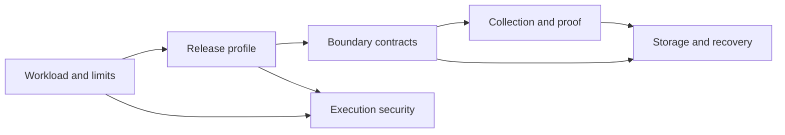

# Six resolved deployment contracts · RC01–RC06

Luke requested resolution of RC01–RC06 and later authorized consolidation and evidence-backed plan revision. Revision 3 preserves the selected design and moves full 280-task benchmark materialization to T12 before tuning or comparison; T01 freezes policy/schema and the first immutable workload/oracle. This convention itself grants no coding authority, qualification, admission, spending, deployment or score promotion.

[Adopted readiness requirements and evidence roadmap](obsidian://open?vault=herdr-engineering-engine-v3.vault&file=Delivery%2FReadiness%2FIndex) · [Codebase readiness plan](file:///var/home/herdr-engineering-engine-v3/docs/readiness-plan.md) · [Six resolved design contracts](obsidian://open?vault=herdr-engineering-engine-v3.vault&file=Delivery%2FContracts%2FIndex) · [Concrete contract decisions](file:///var/home/herdr-engineering-engine-v3/docs/contract-decisions.md) ↔ [Vault master](obsidian://open?vault=herdr-engineering-engine-v3.vault&file=00%20-%20Master%20Index) ↔ [Ultra map](obsidian://open?vault=herdr-engineering-engine-v3.vault&file=Ultra%20Map%2FIndex) ↔ [Atlas master](file:///var/home/Louranicas/planning/herdr-engine-vision-20260915/MASTER_INDEX_habitat_engine.md) ↔ [Codebase master](file:///var/home/herdr-engineering-engine-v3/README.md)

All six architecture decisions are selected. Their implementation/qualification receipts remain pending. Numeric values are policy limits or acceptance objectives, never fabricated measurements. No source fixture, future package, migration or runtime hash is invented. Historical recommendation defaults REC-D1/REC-D2 are superseded for design selection by RC01–RC03; their requirement for evidence still applies. REC-D3/D4 authority gates and REC-D5 optional-scope gate remain.

| Decision | Owner | Selected contract | Qualification |
| --- | --- | --- | --- |
| [RC01 · First workload, numeric limits and evidence policy](obsidian://open?vault=herdr-engineering-engine-v3.vault&file=Delivery%2FContracts%2FRC01) | task | One offline small Rust library change, zero external spend, one candidate, three attempts, 20-minute task bound, explicit oracle/split, cancellation and recovery objectives. | pending original task evidence; no admission |
| [RC02 · Pinned release profile and deployment custody](obsidian://open?vault=herdr-engineering-engine-v3.vault&file=Delivery%2FContracts%2FRC02) | app | Fedora44 x86_64 host runtime; Rust1.98.0, Julia1.12.7, Node24.21.0, Pi0.85.1 and private static SQLite3.53.4; Toolbx for authoring/build only. | pending original task evidence; no admission |
| [RC03 · Versioned control and Rust–Julia contracts](obsidian://open?vault=herdr-engineering-engine-v3.vault&file=Delivery%2FContracts%2FRC03) | contracts | HEE3-Control/1 LF JSON and HEE3-Analysis/1 EOF JSON, exact-byte SHA256, peer-bound grants, durable idempotency/readback, explicit numeric shapes/tolerances. | pending original task evidence; no admission |
| [RC04 · Protected collection, receipts and independent oracles](obsidian://open?vault=herdr-engineering-engine-v3.vault&file=Delivery%2FContracts%2FRC04) | check | One check-owned collector, protected raw evidence and immutable exact-byte manifests; qualified independent oracles, explicit non-pass outcomes and separate admission. | pending original task evidence; no admission |
| [RC05 · Trusted and adversarial execution profiles](obsidian://open?vault=herdr-engineering-engine-v3.vault&file=Delivery%2FContracts%2FRC05) | worker | TH-DEV explicitly lacks hostile isolation; ADV-BWRAP uses ephemeral namespaces and transient cgroup custody, offline grants, fixed RC01 bounds and hostile/benign qualification. | pending original task evidence; no admission |
| [RC06 · SQLite, migration freeze and recovery](obsidian://open?vault=herdr-engineering-engine-v3.vault&file=Delivery%2FContracts%2FRC06) | store | One store-owned WAL/FULL ledger, frozen whole-file migration checksum, durable artifacts before atomic ledger/outbox commit, verified quiesced backups and preserved-state reconciliation. | pending original task evidence; no admission |



Arrows show contract inputs, not new engine task dependencies. Original task IDs and DAG remain controlling.

## RC01 · First workload, numeric limits and evidence policy

**Design resolved; runtime proof pending.** Owner: [task](obsidian://open?vault=herdr-engineering-engine-v3.vault&file=Ultra%20Map%2FModules%2FUM-task). Original tasks: [T01](obsidian://open?vault=herdr-engineering-engine-v3.vault&file=Delivery%2FTasks%2FTASK-T01), [T12](obsidian://open?vault=herdr-engineering-engine-v3.vault&file=Delivery%2FTasks%2FTASK-T12), [T19](obsidian://open?vault=herdr-engineering-engine-v3.vault&file=Delivery%2FTasks%2FTASK-T19).

One offline small Rust library change, zero external spend, one candidate, three attempts, 20-minute task bound, explicit oracle/split, cancellation and recovery objectives.

## Selected scope

The first release supports `rust-library-change/1`: a bounded change to one offline Rust library in an immutable repository snapshot. Its product is a patch, explanation, and independently collected behavioral evidence. The output remains a candidate until `check` and the parent admission process accept it. It does not merge, deploy, contact providers, change dependencies, modify the verifier, or gain authority from its own test report.

The first task is `WL-U64-PARSE-001/v1`: add a strict ASCII decimal-to-u64 parser to a disposable, dependency-free reference library. Input is a borrowed UTF-8 string; success is a u64. Accept `0` or `[1-9][0-9]*` only when the value is at most 18446744073709551615. Distinguish empty input, noncanonical leading zero, invalid character, and overflow. Precedence is empty, invalid character anywhere, leading zero, overflow; no trimming, signs, separators or Unicode digits. Valid input must round-trip to the same canonical decimal text. The task tests a real control-contract need without modifying engine stubs now. The code fixture and patch do not yet exist.

Oracle specification `ORACLE-U64-001/v1` uses independently reviewed boundary expectations plus arbitrary-precision integer arithmetic for valid ASCII candidates; it must not copy the candidate's checked-multiply loop. Include exact zero/max/one-past-max, all ten single digits, internal zero, long leading zero, whitespace/sign/non-ASCII/NUL, mixed invalid+overflow and round-trip properties. A second source review confirms oracle precedence and distinguishes meaningful behaviors from parameterized repetitions. Every accepted engine module still needs at least 50 distinct primary-owned cases; this workload does not confer those credits.

## Workload freeze and split

Freeze the **specification IDs and policy** now: suite `WL-RUST-SMALL-001/v1`, oracle `ORACLE-RUST-SMALL-001/v1`, strata `parse`, `ordering`, `state-transition`, `bounded-resource`. Each task stays within one library, at most three authored source/test files and 200 changed logical lines; candidate changes to policy, harness, lockfiles, build hooks, or public scope refuse the task. Exceeding a bound requires a new reviewed task profile, not silent expansion.

T01 freezes the suite/oracle identities, four strata, 80-development/200-held-out cardinalities, family-disjoint split policy, numeric limits and manifest schema. It materializes the first immutable development workload and independent oracle with exact source/fixture/oracle byte hashes before that workload is used; the strict-u64 task is reserved for development. T12 materializes the full protected manifest before any routing-policy training, empirical tuning or held-out comparison: 80 development tasks and 200 distinct held-out tasks, balanced equally across the four strata, all unique by source/specification family. The builder fixes exact repo/tree/fixture/oracle byte hashes and split membership; related variants stay in one split. Hidden expectations are inaccessible to candidates. A maintainer who authors holdout cases must not tune the challenger using their outcomes. Earlier tasks may implement the fixed contract-defined deterministic router and exercise independently fixed development/collector fixtures; they may not tune routing from benchmark outcomes before this freeze. No frozen full-dataset checksum or unobserved oracle execution is claimed by this revision. The original task DAG and all acceptance requirements remain; only full benchmark materialization moves to its comparison owner.

Data classes: public synthetic fixtures and operator-owned source explicitly classified `local_private`; credentials and personal diary/vault contents are excluded from candidate context by default. Local-private data cannot be sent to a provider under the initial profile. Later provider use requires a scoped data grant and the existing D07 spending authority.

## Numeric policy values

These are conservative **admission limits and acceptance objectives**, selected using the recorded 16-logical-CPU, approximately 94-GiB RAM host and available local storage. They are not measured engine performance. A failure to meet a target is reported and investigated; targets cannot be widened after seeing a run to manufacture success.

| Contract field | Fixed initial value and meaning |
| --- | --- |
| Concurrent candidate tasks | 1; no speculative duplicate agents. Roster may contain more records; only one candidate lease is active. |
| Attempts and loop | At most 3 attempts and 1,200 seconds total monotonic elapsed per task; same deadline across retry. Reserve final 300 seconds for verification/cleanup; never start new candidate work inside this reserve. |
| No-progress stop | Stop after 2 consecutive attempts without a new independently satisfied criterion, or immediately on an unresolvable authority/effect boundary. Text volume is not progress. |
| Cost mode | `offline_fixture`; external currency spend cap exactly 0, external request cap 0. Capture local CPU/wall/resource costs. A later paid profile must bind provider/model/prices/currency and a finite authorized cap before dispatch. |
| Context/output | 64 KiB task specification, 256 KiB selected context, 32,768 input tokens and 4,096 output tokens per future model invocation; reject if the adapter cannot establish the bound. No provider invocation is enabled by these ceilings. |
| Per candidate | CPUQuota 200% (two logical CPU equivalents), MemoryMax 8 GiB, MemorySwapMax 0, TasksMax 128; at most 2 compiler jobs, 1 Julia thread and 1 BLAS thread. |
| Aggregate application slice | CPUQuota 400%, MemoryMax 16 GiB, MemorySwapMax 0, TasksMax 256, IOWeight 25 relative preference; resource-property readback required. IOWeight is not a byte-rate promise. |
| Writable scratch | One private size-limited 4-GiB tmpfs, counted within memory; at most 64 MiB exported artifacts, 8 MiB stdout and 8 MiB stderr per command. Crossing a required-log limit refuses evidence rather than returning a truncated success. |
| Persistent capacity | 32-GiB active-generation state/evidence budget plus a separate 64-GiB retained/recovery-generation allowance (96 GiB total state root), 128-GiB backup budget; reserve at least 96 GiB free on the state filesystem and 256 GiB on backup filesystem before dispatch. Reserve worst-case retained outputs before work; stop intake when headroom is exhausted. No automatic deletion of accepted/open-obligation evidence. |
| Control responsiveness | RC03 1-MiB frame, 60-second maximum request horizon; local control-read p95 objective <=250 ms in the qualified 1-worker/8-client profile, measured separately from task completion. |
| Analysis | RC03 4,096 rows, 1-MiB request, 64-KiB result, 60 seconds and one child at a time. |
| Cancellation and cleanup | Commit cancellation intent within 1 second objective; TERM grace 5 seconds, then KILL; confirm empty owned cgroup/no writable descendants within 10 seconds of intent, or retain `cleanup_pending` and report failure. Provider outcomes may remain unknown. |
| Local crash recovery | RPO target 0 for acknowledged transitions under the qualified local WAL/FULL + fsync failure model. Does not promise survival of whole-device loss. |
| Backup freshness | Before any dispatch the latest complete backup must be <=15 minutes old; one task may run to its 20-minute bound, so maximum admitted snapshot exposure is 35 minutes. Quiesce and back up after each task if freshness expired, at every batch boundary (at most 8 tasks), and before upgrades. No background backup daemon. |
| Restore objectives | Snapshot RPO <=35 minutes while admitted work is running; RTO <=10 minutes to verified reconciliation-only service for a <=32-GiB bundle on the selected two local filesystems. Ordinary dispatch resumes only after every material post-backup effect is reconciled; unmet RTO is a failure, never authority to discard obligations. |

Limits cover an intentionally small first slice. Qualification exercises cold builds as well as warm runs; a profile that cannot build within the scratch/memory bound is unavailable until a separately reviewed revision. Kernel/controller/host changes invalidate the relevant proof.

## Qualification, comparison and missingness

The baseline is one fixed eligible adapter/model, deterministic task order and the same frozen inputs, grants, oracle, deadlines and limits. The challenger is the deterministic rule router. At T12, use 200 unique held-out tasks per policy, paired by task and stratum, randomized interleaved order, 50 per stratum. Repeats share a task family and cannot inflate the independent denominator. Report all attempts and abandoned/cancelled/failed tasks, all known cost and all missingness at a predeclared observation cutoff. Missing spend is not zero; unknown effects retain reservations.

Promotion requires zero false acceptances on the adversarial/reference controls, no material scope/security/recovery failure, and a one-sided exact paired discordance/binomial test at alpha 0.05 showing an acceptance improvement over baseline, with no increase in observed total cost or p95 elapsed and no stratum losing more than 5 percentage points. Predeclare this one challenger/comparison; additional searches require a fresh holdout or multiplicity correction. If there is no defensible improvement, retain the fixed simpler policy. This is a conservative deployment rule, not a universal optimal-model claim.

Report acceptance counts with 95% Wilson intervals, paired effect and uncertainty, total/accepted-task cost, empirical p50/p95 and censoring; do not report p99 as qualified below 1,000 independent observations. p95 qualification uses at least 200 complete relevant observations; missing or censored completion times preclude an unqualified latency-success claim. Report counts and reason when insufficient. Do not impute missing usage or silently drop missing results. A live pilot cannot begin until its provider-specific budget/data grant and package/host qualification exist under D07; the offline plan has resolved its policy without authorizing spending.

## Proof obligations and stop conditions

T01: frozen suite/split/manifest schema and numeric policy, the first immutable development workload/oracle, baseline recipe and independently reviewed acceptance cases. T25/T26: limits, diagnostics and security fixture specifications. T12: full protected 80/200 family-disjoint suite/oracle manifest before routing training or tuning, matched comparison and raw uncertainty/missingness evidence. T17/T18: fault, freshness, cancellation and independent restore measurements. T19: approved live scope and its measured pilot results. The installed reference hardware observation supports conservative limits only; it proves none of these outcomes. The original task record owns current progress; this design decision admits no task or module.

## Exact recovery measurement clocks

Backup age is monotonic-equivalent elapsed from the durable database snapshot cutoff retained in the completed manifest to task dispatch admission, not from manifest publication or directory creation. Record both UTC cutoff and monotonic elapsed within the same boot; after reboot use validated wall-clock age conservatively, refusing freshness if clock uncertainty could exceed the bound. Backup duration consumes freshness. The 35-minute maximum exposure is 15 minutes at admission plus the 20-minute task bound; overdue/failing backup prevents another dispatch.

RTO starts at declared incident detection (or the predeclared fault-injection instant in a restore trial) and ends only when the reconciliation-only interface answers useful readback, restored provenance is committed, and every discovered post-backup operation is classified completed/not-performed/unresolved. It includes operator/authorization wait, fencing, forensic preservation, validation of every referenced object, staging/install and bounded external readback. Unknown outcome may remain classified unresolved with dispatch/delivery blocked; an unknown complete affected set blocks all dispatch. Do not exclude slow preservation or human wait from the reported interval. Record each phase, object count/bytes, devices, cutoff age and total duration. Unavailable/corrupt source inventory or budget prevents a successful RTO claim.

The 64-GiB recovery allowance covers one preserved/captured failed generation and one staged restored generation in addition to the active 32-GiB budget; account worst-case physical bytes and do not assume reflink/sparse savings. Required recovery may consume that reserve; the additional 32 GiB in the 96-GiB free-space admission reserve remains emergency filesystem headroom. Further retained generations or a retry that cannot fit must stop for reviewed retention/capacity handling. No accepted evidence or sole forensic copy is deleted automatically. Resume ordinary dispatch only after the admission free-space reserve is restored.


**Applicable module return routes:** [task](obsidian://open?vault=herdr-engineering-engine-v3.vault&file=Ultra%20Map%2FModules%2FUM-task), [route](obsidian://open?vault=herdr-engineering-engine-v3.vault&file=Ultra%20Map%2FModules%2FUM-route), [budget](obsidian://open?vault=herdr-engineering-engine-v3.vault&file=Ultra%20Map%2FModules%2FUM-budget), [cohort](obsidian://open?vault=herdr-engineering-engine-v3.vault&file=Ultra%20Map%2FModules%2FUM-cohort), [check](obsidian://open?vault=herdr-engineering-engine-v3.vault&file=Ultra%20Map%2FModules%2FUM-check), [recovery](obsidian://open?vault=herdr-engineering-engine-v3.vault&file=Ultra%20Map%2FModules%2FUM-recovery), [worker](obsidian://open?vault=herdr-engineering-engine-v3.vault&file=Ultra%20Map%2FModules%2FUM-worker), [context](obsidian://open?vault=herdr-engineering-engine-v3.vault&file=Ultra%20Map%2FModules%2FUM-context), [julia](obsidian://open?vault=herdr-engineering-engine-v3.vault&file=Ultra%20Map%2FModules%2FUM-julia), [numerical](obsidian://open?vault=herdr-engineering-engine-v3.vault&file=Ultra%20Map%2FModules%2FUM-numerical), [app](obsidian://open?vault=herdr-engineering-engine-v3.vault&file=Ultra%20Map%2FModules%2FUM-app), [workflows](obsidian://open?vault=herdr-engineering-engine-v3.vault&file=Ultra%20Map%2FModules%2FUM-workflows).

## RC02 · Pinned release profile and deployment custody

**Design resolved; runtime proof pending.** Owner: [app](obsidian://open?vault=herdr-engineering-engine-v3.vault&file=Ultra%20Map%2FModules%2FUM-app). Original tasks: [T01](obsidian://open?vault=herdr-engineering-engine-v3.vault&file=Delivery%2FTasks%2FTASK-T01), [T25](obsidian://open?vault=herdr-engineering-engine-v3.vault&file=Delivery%2FTasks%2FTASK-T25), [T26](obsidian://open?vault=herdr-engineering-engine-v3.vault&file=Delivery%2FTasks%2FTASK-T26), [T18](obsidian://open?vault=herdr-engineering-engine-v3.vault&file=Delivery%2FTasks%2FTASK-T18).

Fedora44 x86_64 host runtime; Rust1.98.0, Julia1.12.7, Node24.21.0, Pi0.85.1 and private static SQLite3.53.4; Toolbx for authoring/build only.

## Selected release boundary

Profile `fedora44-x86_64-local/1` runs the Rust coordinator on the Fedora Kinoite host as the operator user, with ephemeral Pi and Julia children. One optional systemd user unit owns the coordinator after authorized commissioning; no root daemon, microservice mesh, Python engine, network listener or inference gateway is introduced. Toolbx is an authoring/build environment only. Runtime launch uses exact package-owned executable paths and never relies on whichever Toolbx or shell PATH happens to be open.

Observed host on 15 September 2026: Fedora 44 Kinoite 44.20260831.0, x86_64, kernel 7.1.12-200.fc44.x86_64, systemd 259.8, btrfs local home and ext4 STORAGE-10TB. These observations are supported-host candidates, not a qualification receipt. Requalify after a host/kernel/SELinux/resource-controller change. The first shipped target is `x86_64-unknown-linux-gnu`; no musl, ARM, Windows or macOS support is advertised.

## Exact initial dependency choices

| Component | Selected version/profile | Evidence and required validation |
| --- | --- | --- |
| Rust, Cargo, rustfmt, Clippy | Rust toolchain 1.98.0, edition 2024; explicitly named toolchain, no floating `stable` | Installed host versions observed. Future immutable `rust-toolchain.toml`, Cargo.lock, exact executable identities and cold build needed. |
| Julia | 1.12.7 | Installed executable observed. Future exact Project/Manifest and offline immutable dependency inventory; no lock regeneration during acceptance. |
| Node | 24.21.0 LTS, Linux x64, package-owned absolute executable | Official release registry observed; not installed/qualified here. Installed Toolbx Node22.23.1 is authoring context only. |
| Pi | `@earendil-works/pi-coding-agent` 0.85.1 | Local package metadata observed, requires Node>=22.19.0. The host Pi wrapper currently fails because host PATH has no Node. The release must invoke its own Node24.21.0 plus pinned Pi entry file, not amend global PATH or silently use the broken wrapper. |
| SQLite | Upstream amalgamation 3.53.4, statically linked into the package | Official source-ID and sqlite3.c SHA3 verified from archive; runtime version/source-ID/compile-option readback required. |
| Rust SQLite wrapper | rusqlite0.40.2 + libsqlite3-sys0.38.2, default features disabled; `backup` capability | Exact crates.io archive SHA256 checked. **Do not enable their bundled SQLite feature:** inspected bundled source is 3.53.2, not selected 3.53.4. Build the pinned upstream amalgamation into a private static library and bind lib/include paths explicitly; reject dynamic host resolution and accidental feature unification. |
| Initial Rust boundary dependencies | tokio1.53.1 with only required runtime/process/IO/sync/time features; serde1.0.229 derive; serde_json1.0.151; sha2 0.11.0 | Registry/MSRV metadata observed. These are candidate exact pins; complete transitive locks, feature closure, licenses/advisories and compatibility are proof obligations. Additional dependencies require an owner and purpose. |
| Optional numerical stack | PyTorch/neural operators disabled in the initial package | No runtime dependency, GPU requirement or startup side effect; domain-valid benefit and a reviewed new profile required at T23/T24. |

The SQLite source selection is deliberate: upstream 3.53.4 contains later fixes, while the crate's bundled 3.53.2 is not an exact match. Use SQLITE_THREADSAFE=1, SQLITE_DEFAULT_FOREIGN_KEYS=1, SQLITE_DQS=0 and SQLITE_OMIT_LOAD_EXTENSION; no arbitrary extension loading. Bind the C compiler, flags, archive hash and dependency closure in the future release manifest. Final binary/package/lockfile hashes do not exist before implementation and must never be fabricated.

Official sources: [Rust profiles](https://doc.rust-lang.org/cargo/reference/profiles.html), [Node release policy](https://nodejs.org/en/about/previous-releases), [Node exact release registry](https://nodejs.org/dist/index.json), [Pi repository](https://github.com/earendil-works/pi), [SQLite 3.53.4](https://sqlite.org/releaselog/3_53_4.html), and crate registry records retained with this decision. Current compatibility is a selected matrix awaiting tests, not inferred from satisfying a minimum version.

## Build and check matrix

Mandatory workspace profiles are default features and `--no-default-features`, on the one supported target, each in dev/test and release. Pi/Julia adapters are runtime capabilities behind existing modules, not optional Rust feature combinations in v1; keep the initial feature set empty unless a concrete dependency requires a documented feature. Optional numerical builds are separate future profiles. Do not advertise `--all-features` as proof for combinations that do not exist or are incompatible.

Dev/test: opt-level0, debug assertions and overflow checks on, panic=unwind. Release: opt-level2, overflow checks on, panic=unwind, thin LTO, codegen-units1, debug line information retained. Pin these in the workspace root and bind absence/presence of Cargo config and RUSTFLAGS overrides; do not infer the effective profile from Cargo.toml alone. `panic=unwind` avoids claiming that Cargo's test harness proves an abort-only release. The coordinator must still treat a panicking child/module operation as failure with retained cleanup obligations.

Run rustfmt check, Clippy for all declared targets and both feature profiles with `-D warnings -D clippy::pedantic`, locked tests in both test and release profiles, and separately locked doctests. Julia uses `--startup-file=no --project=<exact-project> --check-bounds=yes --depwarn=error --threads=1`, one BLAS thread, immutable package inputs and per-run writable depot scratch. Deprecations, stderr/log warnings and required Broken/skips cannot disappear in a passing wrapper. RC04 owns collector trust and zero-diagnostic interpretation. No executable engine Just recipe is created by this table.

## Paths, identities and lifecycle

All private directories are operator-owned mode0700, files0600 unless a package executable requires0500/0555 within its private tree. Resolve the real operator home once; reject symlink/owner/path substitution at protected roots. Canonical source stubs stay at `/var/home/herdr-engineering-engine-v3` and are not the runtime state directory.

| Purpose | Contract path |
| --- | --- |
| Immutable installed release | `$HOME/.local/lib/herdr-engineering-engine-v3/releases/<release-manifest-sha256>/` |
| Selected release pointer | `$HOME/.local/lib/herdr-engineering-engine-v3/current`; replacement only during quiesced verified install |
| Configuration | `$HOME/.config/herdr-engineering-engine-v3/config.json`, schema1, explicit resolved path and SHA256 |
| State generations | `$HOME/.local/state/herdr-engineering-engine-v3/generations/<generation-id>/`; one active generation selected by protected manifest |
| Store/artifacts/evidence | Active generation contains `ledger.sqlite3`, `objects/sha256/`, `evidence/`, `operations/`; stable `store.lock` lives in the state root outside swappable generations |
| Ephemeral runtime | `$XDG_RUNTIME_DIR/habitat-engine/`, including private `control.sock` (the preserved IPC01/API01 endpoint); require a valid owner runtime directory, no fallback to shared `/tmp` |
| Per-run scratch | RC05 private namespace tmpfs `/work`; no persistent candidate-owned directory overlaps state or evidence |
| Backups | `/var/mnt/STORAGE-10TB/herdr-engineering-engine-v3-backups/<backup-id>/`; separate local device, mode0700, manifest-last publication |
| Package unit | Future `herdr-engineering-engine-v3.service`, exact package-owned ExecStart and explicit config/state roots |

No runtime ledger, secret, package cache or backup is stored in an Obsidian vault. Corpus synchronization updates documentation/anchors only. Evidence references from the corpus use redacted manifests; raw candidate/private data is not copied into public notes.

`app` owns package/config validation and lifecycle; `store` owns the one ledger and stable lock; `worker` owns child custody; `service` owns systemd interaction/readback; `check` owns protected verification; `recovery` owns reconciliation; Luke owns commissioning and backup custody. Startup validates manifests and mandatory capabilities before intake. Shutdown stops intake, records cancellation, settles/fences descendants and preserves obligations before releasing writer custody. Unit activation/install/restore remains explicitly scoped under the original D07/T18 process. Config reload creates a new immutable revision and applies only to new admitted work; security/bounds changes invalidate affected proof and cannot silently broaden running grants.

## Outstanding proof, not unmade design choices

T02/T21: actual compatible Rust/Pi/Julia adapter builds and fixtures. T25/T26: exact locked language/security matrix. T15: effective namespace/cgroup/SELinux enforcement. T18: repeatable package, full dependency inventory, source/static-link readback, install/uninstall/upgrade and independent restore. Record every future package hash and tool identity from produced bytes. The observed host, selected pins and the failed host Pi launcher are retained evidence; no release exists yet.


The runtime socket path deliberately retains the existing IPC01/API01 contract; the package/config/state roots use the project name. Do not rename the control endpoint when deriving configuration.


**Applicable module return routes:** [contracts](obsidian://open?vault=herdr-engineering-engine-v3.vault&file=Ultra%20Map%2FModules%2FUM-contracts), [task](obsidian://open?vault=herdr-engineering-engine-v3.vault&file=Ultra%20Map%2FModules%2FUM-task), [store](obsidian://open?vault=herdr-engineering-engine-v3.vault&file=Ultra%20Map%2FModules%2FUM-store), [roster](obsidian://open?vault=herdr-engineering-engine-v3.vault&file=Ultra%20Map%2FModules%2FUM-roster), [route](obsidian://open?vault=herdr-engineering-engine-v3.vault&file=Ultra%20Map%2FModules%2FUM-route), [budget](obsidian://open?vault=herdr-engineering-engine-v3.vault&file=Ultra%20Map%2FModules%2FUM-budget), [worker](obsidian://open?vault=herdr-engineering-engine-v3.vault&file=Ultra%20Map%2FModules%2FUM-worker), [check](obsidian://open?vault=herdr-engineering-engine-v3.vault&file=Ultra%20Map%2FModules%2FUM-check), [recovery](obsidian://open?vault=herdr-engineering-engine-v3.vault&file=Ultra%20Map%2FModules%2FUM-recovery), [cohort](obsidian://open?vault=herdr-engineering-engine-v3.vault&file=Ultra%20Map%2FModules%2FUM-cohort), [context](obsidian://open?vault=herdr-engineering-engine-v3.vault&file=Ultra%20Map%2FModules%2FUM-context), [notify](obsidian://open?vault=herdr-engineering-engine-v3.vault&file=Ultra%20Map%2FModules%2FUM-notify), [service](obsidian://open?vault=herdr-engineering-engine-v3.vault&file=Ultra%20Map%2FModules%2FUM-service), [herdr](obsidian://open?vault=herdr-engineering-engine-v3.vault&file=Ultra%20Map%2FModules%2FUM-herdr), [numerical](obsidian://open?vault=herdr-engineering-engine-v3.vault&file=Ultra%20Map%2FModules%2FUM-numerical), [julia](obsidian://open?vault=herdr-engineering-engine-v3.vault&file=Ultra%20Map%2FModules%2FUM-julia), [app](obsidian://open?vault=herdr-engineering-engine-v3.vault&file=Ultra%20Map%2FModules%2FUM-app), [actions](obsidian://open?vault=herdr-engineering-engine-v3.vault&file=Ultra%20Map%2FModules%2FUM-actions), [bash](obsidian://open?vault=herdr-engineering-engine-v3.vault&file=Ultra%20Map%2FModules%2FUM-bash), [pi_extension](obsidian://open?vault=herdr-engineering-engine-v3.vault&file=Ultra%20Map%2FModules%2FUM-pi_extension), [skills](obsidian://open?vault=herdr-engineering-engine-v3.vault&file=Ultra%20Map%2FModules%2FUM-skills), [workflows](obsidian://open?vault=herdr-engineering-engine-v3.vault&file=Ultra%20Map%2FModules%2FUM-workflows).

## RC03 · Versioned control and Rust–Julia contracts

**Design resolved; runtime proof pending.** Owner: [contracts](obsidian://open?vault=herdr-engineering-engine-v3.vault&file=Ultra%20Map%2FModules%2FUM-contracts). Original tasks: [T02](obsidian://open?vault=herdr-engineering-engine-v3.vault&file=Delivery%2FTasks%2FTASK-T02), [T03](obsidian://open?vault=herdr-engineering-engine-v3.vault&file=Delivery%2FTasks%2FTASK-T03), [T21](obsidian://open?vault=herdr-engineering-engine-v3.vault&file=Delivery%2FTasks%2FTASK-T21), [T28](obsidian://open?vault=herdr-engineering-engine-v3.vault&file=Delivery%2FTasks%2FTASK-T28), [T29](obsidian://open?vault=herdr-engineering-engine-v3.vault&file=Delivery%2FTasks%2FTASK-T29).

HEE3-Control/1 LF JSON and HEE3-Analysis/1 EOF JSON, exact-byte SHA256, peer-bound grants, durable idempotency/readback, explicit numeric shapes/tolerances.

**Decision:** adopt `HEE3-Control/1` for engine-owned action messages and `HEE3-Analysis/1` for the bounded Rust–Julia data exchange. Both are documentation contracts for later implementation. They do not authorize coding, open an endpoint, accept a module, or establish compatibility with a current runtime.

This resolves the RC03 fields for the initial bounded profile while preserving the plan inventory: **10 APIs, 7 IPC records, 21 action IDs, 66 semantic module operations, 20 flows, and all original tasks remain unchanged**. The contract adds no public action or listener.

## 1. Scope and ownership

`contracts` owns wire vocabulary and validation. `actions` owns the unchanged action catalogue. The receiving module owns its action body and result schema. `app` owns CLI/UDS projection. Adapters own translations to protocols outside HEE3.

The native control envelope applies directly to:

- API01/API02 over IPC01, the proposed private engine Unix stream;
- API10 over IPC04 after the trusted tool bridge has bound the caller and attempt;
- internal typed calls where retaining the same identities and error semantics is useful.

It does **not** replace external protocols:

| Boundary | Decision |
| --- | --- |
| API03 / IPC03 Pi | Keep the pinned Pi LF-JSON RPC. The worker adapter maps Pi request IDs/events/usage into HEE3 attempt identity and typed outcomes. |
| API04 and API08 / IPC07 | Use the selected subprocess/provider protocol. The admitted adapter maps actual provider/model identity, usage, cancellation and errors. |
| API05 / IPC05 | Use `HEE3-Analysis/1` below: one immutable JSON request and one bounded JSON result/error. No daemon or default socket. |
| API06 / IPC02 Herdr | Keep observed Herdr protocol 22 distinct. Its live events do not acquire an HEE3 durable cursor by relabelling. |
| API07 / IPC06 systemd | Keep explicit argv and manager readback. Do not wrap arbitrary shell text in the JSON envelope. |
| API09 | The initial supported profile is the bounded JSON vector/observation profile below. Higher-rank/bulk tensors and any serving endpoint remain unavailable until their actual workload earns a new profile/version. |

All 21 public action IDs remain exactly: `tools.list`, `tools.inspect`, `task.preview`, `task.submit`, `task.get`, `task.list`, `task.cancel`, `task.resolve`, `thread.get`, `thread.list`, `roster.list`, `roster.inspect`, `roster.update`, `roster.disable`, `service.inspect`, `service.probe`, `service.action`, `analysis.request`, `analysis.get`, `events.subscribe`, and `health`. Internal adapter operations are not new public actions.

## 2. Common scalar types

| Type | Wire form and rule |
| --- | --- |
| Protocol/action version | JSON integer, `1..65535`. Version 1 rejects missing, zero, fractional, Boolean or unknown versions. |
| Opaque identity | Lowercase hyphenated RFC 9562 UUIDv4 string. Nil UUID is invalid. UUIDs carry no authority or ordering. |
| Generation/revision/cursor | Decimal JSON string matching `0|[1-9][0-9]{0,19}`, parsed as `u64`; generations are nonzero. Strings avoid JSON's cross-implementation integer precision boundary. |
| Bounded usage value | Decimal JSON string parsed as `u32` (`0..4294967295`); sums use checked `u64`. |
| Byte length/count bounded to ≤2^32−1 | JSON integer. These values stay inside RFC 8259's interoperable exact-integer range. |
| Timestamp/deadline | Unsigned Unix epoch milliseconds as the same decimal-string type. No floating-point time. |
| Digest | `sha256:` followed by exactly 64 lowercase hexadecimal characters. It names exact bytes and is not a credential or authenticity proof. |
| Enumerations | Lowercase ASCII snake-case strings. Unknown variants refuse the message for v1. |
| Human text | Valid UTF-8. No Unicode normalization is performed; identifiers, action names, enum values and field names are ASCII. |

[RFC 8259](https://www.rfc-editor.org/rfc/rfc8259.html) requires UTF-8 for interoperable JSON, explains why duplicate object names are unsafe, excludes nonfinite JSON numbers, and identifies the exact interoperable integer range. UUID text follows [RFC 9562](https://www.rfc-editor.org/rfc/rfc9562.html). SHA-256 follows [NIST FIPS 180-4](https://csrc.nist.gov/pubs/fips/180-4/upd1/final).

`ResourceKind` is exactly `task | thread | roster | service | analysis`; an action accepts only the resource kind it owns. `ErrorCodeV1` is exactly the closed code list in the error section. `Sha256`, `UuidV4`, `U64Decimal` and `U32Decimal` refer only to the wire forms above, not unconstrained host-language aliases.

## 3. Serialization and framing

### IPC01 and native stream/tool records

- UTF-8 JSON, no BOM, exactly one compact object per record, terminated by one byte `LF` (`0x0a`). `CRLF`, blank records, leading/trailing whitespace and pretty-printed multi-line objects are invalid.
- Maximum frame payload is **1,048,576 bytes excluding LF**, maximum nesting is 32, and a diagnostic message is at most 4,096 UTF-8 bytes. Enforce the frame cap before JSON allocation/dispatch. On EOF before LF, invalid UTF-8, duplicate key, oversize record or unparseable JSON, do not dispatch; close the connection. A correlated error may be returned only when the complete bounded metadata was parsed safely.
- Object names must be unique at every level. Missing and unknown fields fail each versioned schema. Publish JSON Schema Draft 2020-12 with `additionalProperties: false`, while retaining typed Rust/Julia validation as authoritative. The [JSON Schema 2020-12 specification](https://json-schema.org/draft/2020-12) supplies the portable schema vocabulary.
- Stream readers must accept partial reads and several complete records in one read. One malformed/oversized record cannot be used to resynchronize by scanning attacker-selected content.
- Bulk artifacts never ride as base64 in this frame. Pass a bounded manifest containing exact byte length, media/schema ID and digest through the owning artifact/file custody path.

### Exact-byte digest rule

`request_sha256` is SHA-256 over the complete UTF-8 request object bytes **excluding the terminal LF**. There is deliberately no JSON canonicalization step. The receiver hashes the admitted bytes before parsing into lossy/general values and echoes the digest in every result/error. Durable replay stores the digest with the idempotency record.

This is the canonical RC03 digest boundary: byte-exact, representation-prefixed and unambiguous. A semantically similar request with reordered fields or different whitespace is a different request and conflicts when it reuses an idempotency key. Senders therefore serialize once and retain/replay those exact bytes. This avoids introducing a second canonical-JSON implementation in Rust and Julia.

### IPC05 Rust–Julia records

stdin or the inherited read-only request file contains exactly one UTF-8 JSON object followed by EOF; stdout contains exactly one bounded result/error object followed by EOF. No LF-record assumption, code string, caller-selected path, credential, ledger mount or control socket is part of this protocol. Initial bounds are **1 MiB request, 4,096 observations, 64 KiB stdout**, and **60 seconds maximum elapsed deadline**. stderr is bounded diagnostic evidence and never a result channel. Any nonzero child status prevents success even if stdout resembles a result.

## 4. HEE3-Control/1 signatures

### Request

```text
ControlRequestV1 {
  protocol: "hee3.control",
  version: 1,
  kind: "request",
  request_id: UuidV4,
  action: ActionId,                 // one of the 21 catalogue IDs
  action_version: 1,
  idempotency_key: UuidV4 | null,   // required for durable/effectful actions
  deadline_unix_ms: U64Decimal,
  authority: {
    grant_id: UuidV4,
    scope_sha256: Sha256
  },
  precondition: null | {
    resource: ResourceKind,
    id: UuidV4,
    generation: U64Decimal
  },
  body: one closed request body from the 21-action table below
}
```

Read actions may use `null` idempotency. Durable admission, configuration mutation, cancellation intent, probe, service action, analysis work and operator disposition require it. Mutations of existing state require an exact generation precondition. `task.submit` creates a resource and uses the idempotency binding instead; its returned generation starts at `"1"`.

### Result

```text
ControlResultV1 {
  protocol: "hee3.control",
  version: 1,
  kind: "result",
  request_id: UuidV4,
  request_sha256: Sha256,
  replayed: Boolean,
  effect: "none" | "committed" | "pending",
  operation_id: UuidV4 | null,
  observed_generation: U64Decimal | null,
  readback: ReadbackSelectorV1 | null,
  body: the corresponding closed result body from the 21-action table below
}
```

`kind: result` means the action invocation has a valid typed result. It does not mean a task, module, verification or deployment was accepted. `committed` identifies the action's durable boundary; `pending` retains an unresolved obligation and requires `operation_id` plus readback.

### Error

```text
ControlErrorV1 {
  protocol: "hee3.control",
  version: 1,
  kind: "error",
  request_id: UuidV4,
  request_sha256: Sha256,
  code: ErrorCodeV1,
  effect: "none" | "unknown",
  retry: "never" | "same_exact_request" | "after_readback" | "after_condition",
  readback: ReadbackSelectorV1 | null,
  message: BoundedDiagnostic,
  details: {
    field: ASCII[1..256] | null,
    constraint: ASCII[1..256] | null,
    current_generation: U64Decimal | null
  }
}
```

Stable v1 codes are: `invalid_frame`, `unsupported_protocol`, `unsupported_version`, `unknown_action`, `unsupported_action_version`, `unauthenticated`, `forbidden`, `invalid_argument`, `not_found`, `conflict`, `stale_generation`, `deadline_exceeded`, `cancelled`, `resource_exhausted`, `unavailable`, `resync_required`, `effect_unknown`, and `internal`.

Messages are diagnostics, never program logic. `effect_unknown` always uses `effect: unknown`, `retry: after_readback`, and a concrete readback selector. Error responses never claim rollback unless the owner proves the effect did not commit.

`ReadbackSelectorV1` is `{ action, action_version: 1, body }`, where `action` is one of the existing read actions and `body` is the complete closed v1 request body for that action. It cannot omit required read options or name an arbitrary URI, command or endpoint. When an identity appears in both the result envelope and action result body, the operation ID and generation must be equal; disagreement refuses the result.

### Closed shared records

The table below uses these exact closed records. Every object rejects unlisted fields.

- `PageCursorV1 = { snapshot_revision: U64Decimal, after_key: ASCII[1..256], filter_sha256: Sha256, expires_unix_ms: U64Decimal }`. `after_key` is an opaque server-produced ordering key within that snapshot; the client cannot use it as an authority or resource identity.
- `PageInV1 = { limit: Integer[1..100], cursor: PageCursorV1 | null }`.
- `PageOutV1<T> = { items: T[], next_cursor: PageCursorV1 | null, snapshot_revision: U64Decimal }`; `items.length <= requested limit`.
- `EvidenceRefV1 = { artifact_id: UuidV4, sha256: Sha256, byte_length: Integer[0..4294967295], media_type: ASCII[1..128], schema_id: ASCII[1..128] }`. No path or URI is accepted in a public request.
- `BudgetV1 = { mode: "hard" | "conservative", wall_ms: U64Decimal, tokens: U64Decimal, currency_microunits: U64Decimal }`.
- `TaskSpecV1 = { task_class: ASCII[1..64], intent: UTF8[1..8192], criteria: UTF8[1..1024][1..64], privacy: "local_only" | "remote_allowed", workspace_id: UuidV4, budget: BudgetV1, parent: null | { task_id: UuidV4, allocation_id: UuidV4, brief_revision: U64Decimal } }`. `task_class` must exist in the admitted catalogue; free text cannot create a class.
- `TaskHeadV1 = { task_id: UuidV4, generation: U64Decimal, state: TaskStateV1, current_attempt_id: UuidV4 | null, unresolved_obligations: Integer[0..4294967295] }`, where `TaskStateV1` is exactly `admitted | queued | running | verifying | repair_pending | cancellation_requested | blocked | accepted | failed | cancelled | abandoned | effect_unknown`.
- `RecipeRefV1 = { recipe_id: ASCII[1..128], recipe_version: Integer[1..65535], adapter_id: UuidV4, actual_model_required: Boolean }`.
- `RosterDefinitionV1 = { kind: "agent" | "model" | "service", display_name: UTF8[1..256], owner_id: ASCII[1..128], version: ASCII[1..128], capabilities: ASCII[1..128][0..128], locality: "local" | "remote" | "hybrid", endpoint_ref: UuidV4 | null, limitations: UTF8[0..2048] }`. `endpoint_ref` resolves through protected configuration; it is never a caller URL or secret.
- `RosterHeadV1 = { record_id: UuidV4, record_version: U64Decimal, definition: RosterDefinitionV1, disabled: Boolean, observation_cutoff_unix_ms: U64Decimal | null }`.
- `HealthObservationV1 = { observation_id: UuidV4, observed_unix_ms: U64Decimal, state: "useful" | "degraded" | "unavailable" | "unknown", owner_identity: ASCII[1..256], latency_ms: U64Decimal | null, evidence: EvidenceRefV1[] }`.

### Exact request/result bodies for all 21 actions

Common envelope fields still carry the deadline, authority, idempotency and generation precondition. `null` is explicit; omission is invalid unless the row says optional.

| Action | Exact v1 request `body` | Exact v1 result `body` |
| --- | --- | --- |
| `tools.list` | `{ query: UTF8[0..256] \| null, page: PageInV1 }` | `{ catalogue_revision: U64Decimal, page: PageOutV1<{ id: ActionId, version: 1, purpose: UTF8[1..256], effect: "read" \| "planning" \| "durable" \| "cancel" \| "configuration" \| "probe" \| "lifecycle" \| "analysis" \| "stream" }> }` |
| `tools.inspect` | `{ action: ActionId, version: 1 }` | `{ action: ActionId, version: 1, purpose: UTF8[1..256], effect: "read" \| "planning" \| "durable" \| "cancel" \| "configuration" \| "probe" \| "lifecycle" \| "analysis" \| "stream", request_schema_sha256: Sha256, result_schema_sha256: Sha256, error_schema_sha256: Sha256, max_request_bytes: 1048576, max_deadline_ms: 60000, readback_action: ActionId \| null }` |
| `task.preview` | `{ spec: TaskSpecV1, brief_revision: U64Decimal, catalogue_revision: U64Decimal }` | `{ eligible: RecipeRefV1[], exclusions: { recipe_id: ASCII[1..128], code: "capability" \| "privacy" \| "budget" \| "stale" \| "unavailable" }[], cost_mode: "known" \| "bounded" \| "unknown", observations_cutoff_unix_ms: U64Decimal }` |
| `task.submit` | `{ spec: TaskSpecV1 }` | `{ task: TaskHeadV1, engine_cursor: EventCursorV1 }` |
| `task.get` | `{ selector: { task_id: UuidV4 } \| { source_action: "task.submit", idempotency_key: UuidV4 }, evidence: "none" \| "summary" \| "refs" }` | `{ task: TaskHeadV1, criteria_sha256: Sha256, attempts: { attempt_id: UuidV4, generation: U64Decimal, state: "queued" \| "running" \| "settled" \| "unknown", effect: "none" \| "committed" \| "pending" \| "unknown" }[], cleanup: "none" \| "pending" \| "settled" \| "unknown", delivery: "none" \| "pending" \| "delivered" \| "unknown", evidence: EvidenceRefV1[], cursor: EventCursorV1 }` |
| `task.list` | `{ states: TaskStateV1[0..12], task_class: ASCII[1..64] \| null, parent_task_id: UuidV4 \| null, page: PageInV1 }` | `{ page: PageOutV1<TaskHeadV1> }` |
| `task.cancel` | `{ reason: "operator_request" \| "superseded" \| "budget" \| "deadline" \| "safety", note: UTF8[0..1024] \| null }` | `{ task: TaskHeadV1, cancellation_obligation_id: UuidV4, worker_settlement: "not_started" \| "pending" \| "settled" \| "unknown" }` |
| `task.resolve` | `{ obligation_id: UuidV4, disposition: "retry" \| "abandon" \| "acknowledge_external_effect" \| "quarantine", reason: UTF8[1..2048], evidence: EvidenceRefV1[] }` | `{ task: TaskHeadV1, disposition_id: UuidV4, obligation_state: "resolved" \| "pending" }` |
| `thread.get` | `{ thread_id: UuidV4, expected_brief_revision: U64Decimal \| null }` | `{ thread_id: UuidV4, task_id: UuidV4, brief_revision: U64Decimal, state: "planned" \| "assigned" \| "running" \| "joining" \| "blocked" \| "settled", obligations: UTF8[1..512][], children: TaskHeadV1[], artifacts: EvidenceRefV1[] }` |
| `thread.list` | `{ task_id: UuidV4 \| null, states: ("planned" \| "assigned" \| "running" \| "joining" \| "blocked" \| "settled")[0..6], page: PageInV1 }` | `{ page: PageOutV1<{ thread_id: UuidV4, task_id: UuidV4, brief_revision: U64Decimal, state: "planned" \| "assigned" \| "running" \| "joining" \| "blocked" \| "settled", unresolved_obligations: Integer[0..4294967295] }> }` |
| `roster.list` | `{ kinds: ("agent" \| "model" \| "service")[1..3], capability: ASCII[1..128] \| null, locality: "local" \| "remote" \| "hybrid" \| null, include_disabled: Boolean, page: PageInV1 }` | `{ page: PageOutV1<RosterHeadV1> }` |
| `roster.inspect` | `{ selector: { record_id: UuidV4 } \| { source_action: "roster.update" \| "roster.disable", idempotency_key: UuidV4 } }` | `{ record: RosterHeadV1, last_operation: { operation_id: UuidV4, source_action: "roster.update" \| "roster.disable", effect: "committed" \| "pending" \| "unknown" } \| null }` |
| `roster.update` | `{ record_id: UuidV4 \| null, definition: RosterDefinitionV1, audit_reason: UTF8[1..1024] }`; create requires `record_id: null` and `precondition: null`; update requires matching resource precondition | `{ record: RosterHeadV1, operation_id: UuidV4, change: "created" \| "updated" }` |
| `roster.disable` | `{ record_id: UuidV4, active_attempt_policy: "leave_running" \| "request_cancel", audit_reason: UTF8[1..1024] }` | `{ record: RosterHeadV1, operation_id: UuidV4, active_attempts: UuidV4[], cancellation_obligations: UuidV4[] }` |
| `service.inspect` | `{ service_id: UuidV4, operation: { operation_id: UuidV4 } \| { source_action: "service.probe" \| "service.action", idempotency_key: UuidV4 } \| null }` | `{ service_id: UuidV4, owner_id: ASCII[1..128], unit_id: ASCII[1..256] \| null, cached_health: HealthObservationV1 \| null, operation: { operation_id: UuidV4, source_action: "service.probe" \| "service.action", effect: "none" \| "committed" \| "pending" \| "unknown", owner_job_id: ASCII[1..256] \| null } \| null }` |
| `service.probe` | `{ service_id: UuidV4, probe_id: ASCII[1..128], probe_version: 1, max_cost_microunits: U64Decimal, network_scope: "none" \| "configured_allowlist" }` | `{ operation_id: UuidV4, service_id: UuidV4, observation: HealthObservationV1, cost_microunits: U64Decimal, external_effect: "none" \| "bounded_probe" }` |
| `service.action` | `{ service_id: UuidV4, unit_id: ASCII[1..256], action: "start" \| "stop" \| "restart" \| "reload", expected_owner_sha256: Sha256 }` | `{ operation_id: UuidV4, service_id: UuidV4, owner_job_id: ASCII[1..256] \| null, observed_state: "active" \| "inactive" \| "failed" \| "pending" \| "unknown", useful_health: HealthObservationV1 \| null }` |
| `analysis.request` | `{ subject: { task_id: UuidV4, attempt_id: UuidV4, generation: U64Decimal }, dataset: EvidenceRefV1, cutoff_unix_ms: U64Decimal, recipe_id: "descriptive", recipe_version: 1, runtime_id: UuidV4, limits: { wall_ms: U64Decimal, memory_bytes: U64Decimal, output_bytes: Integer[1..65536] } }` | `{ analysis_id: UuidV4, task_id: UuidV4, attempt_id: UuidV4, generation: U64Decimal, dataset_sha256: Sha256, state: "queued" \| "running" \| "validated" \| "failed" \| "cancelled" \| "unknown" }` |
| `analysis.get` | `{ selector: { analysis_id: UuidV4 } \| { source_action: "analysis.request", idempotency_key: UuidV4 } }` | `{ analysis_id: UuidV4, task_id: UuidV4, attempt_id: UuidV4, generation: U64Decimal, state: "queued" \| "running" \| "validated" \| "failed" \| "cancelled" \| "unknown", dataset_sha256: Sha256, report: EvidenceRefV1 \| null, error_code: ErrorCodeV1 \| null }` |
| `events.subscribe` | `{ cursor: EventCursorV1 \| null, topics: EventTopicV1[1..7], resource_ids: UuidV4[0..100], bootstrap_limit: Integer[1..256] }` | `{ subscription_id: UuidV4, snapshot: SnapshotHeadV1[], high_water_cursor: EventCursorV1 }`; snapshot is required only when request cursor is null and must be complete within `bootstrap_limit` |
| `health` | `{}` | `{ protocol_version: 1, engine_version: ASCII[1..128], ready: Boolean, recovery: "complete" \| "pending" \| "blocked", database: "ready" \| "degraded" \| "unavailable", socket: "owned" \| "draining", checked_unix_ms: U64Decimal }` |

`ActionId` is the closed 21-value enum above. Array bounds are part of the schema: evidence arrays ≤64, attempts/children/active-attempt/cancellation arrays ≤100, exclusion/eligible/obligation arrays ≤128 unless a smaller bound is shown. Filter arrays `states`, `kinds`, `topics` and `resource_ids` are duplicate-free; their request order has no meaning. Overflow returns `resource_exhausted` with a narrower query/readback route; truncation is never silent.

Compatibility is per exact tuple `(protocol, protocol_version, action, action_version, request_schema_sha256, result_schema_sha256, error_schema_sha256)`. Each schema digest names the immutable published UTF-8 JSON Schema bytes, not a regenerated semantic equivalent. An implementation may advertise a tuple only after positive fixtures and negative missing/unknown-field, type, bound and enum fixtures pass for that exact request, result and error schema. Unknown action IDs, versions, request fields, result fields, error detail fields or schema digests are incompatibilities and refuse before dispatch or result admission. Parsing JSON, ignoring a field, mapping a similar action or supporting a subset cannot be reported as compatibility with the tuple or the full 21-action catalogue.

The selected RC01 **offline, zero-external-spend request profile** is a stricter admission overlay on this future-capable vocabulary. Under that profile, `TaskSpecV1.privacy` must be `local_only`, `BudgetV1.currency_microunits` must be `"0"`, and `service.probe.network_scope` must be `none`; `remote_allowed`, `configured_allowlist`, and routes requiring a remote provider or paid external service return `unavailable` when the capability/profile is absent or `forbidden` when current policy or grant denies it, before dispatch or spend. Their presence in the v1 schema reserves an explicit future profile choice and does not make them available under RC01.

### Exact event and cursor records

```text
EventCursorV1 {
  epoch: UuidV4,
  sequence: U64Decimal,
  filter_sha256: Sha256,
  visibility_revision: U64Decimal,
  issued_unix_ms: U64Decimal,
  expires_unix_ms: U64Decimal
}

SnapshotHeadV1 {
  resource: "task" | "thread" | "roster" | "service" | "analysis" | "delivery" | "recovery",
  resource_id: UuidV4,
  generation: U64Decimal,
  readback: ReadbackSelectorV1
}

ControlEventV1 {
  protocol: "hee3.control", version: 1, kind: "event",
  subscription_id: UuidV4,
  event_id: UuidV4,
  epoch: UuidV4,
  sequence: U64Decimal,
  previous_sequence: U64Decimal,
  occurred_unix_ms: U64Decimal,
  topic: EventTopicV1,
  subject: SnapshotHeadV1,
  change: "created" | "updated" | "terminal" | "deleted",
  cursor: EventCursorV1
}

StreamStatusV1 {
  protocol: "hee3.control", version: 1, kind: "stream_status",
  subscription_id: UuidV4,
  status: "resync_required" | "queue_limit" | "server_draining",
  last_delivered_cursor: EventCursorV1 | null
}
```

`EventTopicV1` is exactly `task | thread | roster | service | analysis | delivery | recovery`. A subject's readback is fixed: `task` and `delivery` use `task.get`; `thread` uses `thread.get`; `roster` uses `roster.inspect`; `service` uses `service.inspect`; `analysis` uses `analysis.get`; `recovery` uses `health`. For `delivery`, `resource_id` and `generation` are its owning task identity/generation; for `recovery`, they are the engine-instance UUID and recovery revision. Every `body` is the complete request body required by its action table row. `filter_sha256` is SHA-256 over the server-produced UTF-8 bytes of compact JSON `{"resource_ids":[...],"topics":[...]}` with exactly that key order, each array sorted by ascending UTF-8 bytes and duplicate-free, and no terminal LF. The server derives this form from validated request values; it never hashes caller-retained JSON text. Events intentionally carry a readback selector instead of a second partial copy of authoritative resource state. A cursor is a selector, not a grant: the server reauthenticates the connection, recomputes this digest, reapplies visibility, checks retention/expiry and refuses a changed filter.

`sequence` is the durable global store/outbox event sequence within `epoch`; filtering therefore permits numerical gaps. `previous_sequence` is the sequence in the previous event delivered for this exact subscription, or the snapshot's global high-water sequence for the first delivered event. The receiver requires `event.sequence > event.previous_sequence` and `event.previous_sequence == prior_delivered_cursor.sequence`; it does **not** require `+1` and does not infer that every global event was visible or delivered. Before emitting a matching event or advancing a resumed subscription, the server scans the complete retained global interval after the supplied cursor through that event/high-water mark, reapplies visibility and the exact filter to each record, and preserves store order. An unavailable portion of that interval yields `resync_required` rather than a gap-free claim.

A subscriber's unsent queue is bounded to **256 frames or 8 MiB, whichever comes first**. Crossing either limit emits `queue_limit` when possible and closes the stream. Cursor expiry, restored epoch, missing continuity or unavailable retained sequence emits `resync_required`; the client requests a new complete visible snapshot. No event or reconnect repeats the underlying task effect.

## 5. Identity, authorization and custody

- JSON never supplies the authenticated principal. On IPC01, bind the accepted connection to kernel `SO_PEERCRED` and the private pathname-socket custody already required by IPC01. Linux documents both pathname permission behavior and `SO_PEERCRED` in [`unix(7)`](https://man7.org/linux/man-pages/man7/unix.7.html). Directory/socket mode is defense in depth; the peer credential and configured policy are still checked.
- The stable authorization principal is the authenticated UID plus the configured local role. PID is connection/audit context, not a durable principal and not safe for later process ownership by itself.
- `grant_id` is a server-side grant reference scoped to that principal, action/version, resource selectors, bounds and expiry. It is not a bearer grant. `scope_sha256` binds the reviewed scope record and prevents a same-ID/different-scope substitution; neither field can broaden the transport-bound authority.
- IPC04 additionally binds attempt ID, attempt generation, extension/handler generation and permitted action set in trusted bridge state. Untrusted tool text cannot choose a principal or mount IPC01.
- IPC03/IPC05 child identity is the parent's admitted attempt/generation plus executable/project identity and actual process custody. The child cannot assert grants, accepted state or task ownership.
- Validate frame bound, protocol/version, peer, grant, action visibility and coarse action bound before materializing large action bodies or invoking the owner. Revalidate resource scope and generation immediately before the hazardous effect.

## 6. Idempotency, deadlines, cancellation and readback

### Idempotency and generations

Durably bind `(authenticated principal, action ID, action version, idempotency key)` to `request_sha256`, operation/resource identity and the stored result/effect state.

- Exact replay returns the stored result with `replayed: true`; it does not redispatch.
- Same selector with another digest returns `conflict` and does not mutate.
- A stale expected generation returns `stale_generation` with current visible generation where authorized.
- Allocate durable task/attempt/operation/event identities before publishing their manifests/results, and commit related state/outbox obligations atomically under the existing store contract.

For an unseen expired request, refuse before dispatch. For an already-recorded key, return its stored disposition even if the original deadline has since passed; this is readback, not new execution.

### Deadlines

At admission, compare `deadline_unix_ms` to wall time. Native control requests may be at most **60,000 ms** ahead; long work returns a durable operation/task identity instead of holding the control call open. Reject expired/excessive horizons, then derive one receiver-monotonic deadline. All child deadlines are `min(parent remaining, owner cap)` and never extend on retry. The event-subscription handshake follows this rule; the admitted stream then follows its separate cursor/queue policy. A clock anomaly or elapsed wait cannot turn an unknown external effect into `none`.

### Cancellation

The public cancellation operation remains `task.cancel`; no new public action is introduced. Its body names the reason, while the precondition identifies task and expected generation. Committing it records cancellation intent and returns the new generation/readback selector. It does not claim that a worker, provider, manager job or workspace has settled.

Internal cancellation messages bind target task, attempt, attempt generation and process/handler identity. Acceptance that committed before cancel remains historical; cancel committed first blocks later acceptance under the task/store invariant. Timeout initiates the same bounded reconciliation but does not by itself prove cancellation.

### Readback selectors

Every durable/effectful owner must reserve the principal-scoped idempotency record before dispatch or the first potentially externally visible effect. The readback route is defined from values the caller possessed before sending, so a lost first reply never makes the operation ID necessary:

- `task.submit` → `task.get` body `{selector:{source_action:"task.submit",idempotency_key},evidence:"none"}`; body `{selector:{task_id},evidence:"none"}` is an equivalent later selector;
- `task.cancel`/`task.resolve` → `task.get` body `{selector:{task_id},evidence:"none"}`, using the task ID already bound in the request precondition;
- `roster.update`/`roster.disable` → `roster.inspect` body `{selector:{source_action,idempotency_key}}`; this is mandatory for a lost create reply because the record ID is not yet known, while body `{selector:{record_id}}` is an equivalent later selector;
- `service.probe`/`service.action` → `service.inspect` body `{service_id,operation:{source_action,idempotency_key}}`, using the request's service ID; body `{service_id,operation:{operation_id}}` is an equivalent later selector;
- `analysis.request` → `analysis.get` body `{selector:{source_action:"analysis.request",idempotency_key}}`; body `{selector:{analysis_id}}` is an equivalent later selector.

All key lookups are scoped to the authenticated principal and exact source action and reapply current visibility; a key is neither a bearer capability nor a cross-principal existence oracle. After an ambiguous/lost response, the client performs this readback before retry. A visible stored record returns the same disposition. A visible `not_found` may be followed only by the same exact request bytes and key, which the durable reservation makes safe against a race. A `tools.*`, list, inspect, get or health read can repeat with a new request ID because it has no durable effect, subject to visibility and rate bounds.

### Pinned Pi 0.85.1 adapter profile

The observed local package is `@earendil-works/pi-coding-agent` **0.85.1** at `/var/home/Louranicas/.local/lib/node_modules/@earendil-works/pi-coding-agent`. Its `package.json` names `git+https://github.com/earendil-works/pi.git` with repository directory `packages/coding-agent`; the current upstream is [earendil-works/pi](https://github.com/earendil-works/pi). The former `badlogic/pi-mono` URL redirects there and is not a distinct version identity. Current upstream documentation also states that Pi has no built-in filesystem/process/network/credential permission boundary and runs with the launching process's privileges, so the adapter and process sandbox retain custody.

The evidence identity for this design observation is:

| File | Exact observed bytes |
| --- | --- |
| [package.json](file:///var/home/Louranicas/.local/lib/node_modules/@earendil-works/pi-coding-agent/package.json) | 4,145 bytes; `sha256:f1738e4b42203e5f22bcb513f13fb2fb224f1e98d1f129ff042f87048665a94c` |
| [docs/rpc.md](file:///var/home/Louranicas/.local/lib/node_modules/@earendil-works/pi-coding-agent/docs/rpc.md) | 42,698 bytes; `sha256:15fcd26bee72777b373fd5f2edd77091a01cadd4de95e48b08422ced0552a28d` |
| [docs/extensions.md](file:///var/home/Louranicas/.local/lib/node_modules/@earendil-works/pi-coding-agent/docs/extensions.md) | 123,275 bytes; `sha256:39c54b91faabd76a17ab07f7ae85b274e941f36aacfaa6fe304281f697671faf` |
| [dist/rpc-entry.d.ts](file:///var/home/Louranicas/.local/lib/node_modules/@earendil-works/pi-coding-agent/dist/rpc-entry.d.ts) | 70 bytes; `sha256:35817d22d692b15b0ba1da7b644c30247c68b7ed26db176612cceb24a31ad1fc` |

This is the closed `pi-rpc-earendil-0.85.1` worker profile. Commands are one JSON object per LF-delimited stdin record; responses and asynchronous events share LF-delimited stdout. The adapter always supplies a unique Pi `id`, checks the same `id`, exact `command`, `type:"response"` and `success`, and treats unrelated stdout records as events. It never feeds Pi records into `HEE3-Control/1`: Pi accepts optional input CRLF, while native HEE3-Control rejects it.

| Worker interface intent | Only admitted Pi 0.85.1 mapping | Required interpretation |
| --- | --- | --- |
| Resolve recipe | `get_available_models`; then, when needed, `set_model {provider,modelId}` and `set_thinking_level {level}`; finally `get_state` | Accept only configured provider/model IDs and one of the documented levels `off|minimal|low|medium|high|xhigh|max`. The final `get_state.data.model` and `thinkingLevel` are the actual identity; request echo or alias is insufficient. |
| Start admitted attempt | `prompt {id,type:"prompt",message}` with no images and no `streamingBehavior` in an idle, exclusively owned session | `success:true` proves only accepted, queued or handled. Bind the Pi request ID to HEE attempt ID/generation and session identity before send. It does not prove execution, candidate output or acceptance. |
| Observe attempt | Pi response correlation; `message_end.message`; tool events by `toolCallId`; `get_state`; `get_session_stats`; final `agent_settled` | `message_end.message` is authoritative over assembled deltas. `message_update.usage` may remain zero and is only provider-reported; persist its provenance and reconcile with session stats. `agent_end` is nonterminal because retry, compaction or queued continuation may follow. `agent_settled` closes only Pi's automatic continuation, not HEE verification, external effects, descendants or workspace custody. |
| Cancel and settle | `clear_queue {id}` followed by `abort {id}`, then correlated successful abort response and `get_state` showing idle; observe `agent_settled` when the run emitted it | Clearing both returned `steering` and `followUp` queues is required because `abort` otherwise permits queued continuation. Pi idle/settled is one observation; process descendants, provider effects and workspace writability must still reach the worker owner's settlement predicate or remain unknown. |
| Usage readback | `get_session_stats {id}` | Bind the returned Pi `sessionId` to the exclusively owned attempt. Session totals include compaction/summary/tool usage and are not automatically per-request billing; null post-compaction context usage remains unknown. |

No other Pi RPC command is part of this v1 worker profile. In particular direct Pi `bash`, session switching/export, extension UI requests, skill/template expansion, prompt steering/follow-up and dynamic commands cannot be substituted for an HEE action or grant. Adding one requires a new pinned profile revision and fixtures.

API10 remains a separate task-bound extension bridge. Its only candidate host entry point is the pinned `pi.registerTool` API projecting allowed HEE action schemas. The bridge binds Pi `toolCallId`, HEE request ID, attempt ID/generation and extension generation before invocation. Pi 0.85.1 preflights sibling `tool_call` handlers sequentially but may execute siblings concurrently; handler input is mutable and is not revalidated after mutation, and `tool_result` middleware can replace result fields. Therefore the bridge validates the final arguments itself immediately before dispatch, keeps the authoritative HEE result/error bytes outside renderer custody, and treats any rendered or modified Pi tool result as presentation only. Registration or JSON parsing alone cannot establish API10 compatibility.

For this pinned profile, an unrecognized command response, mismatched response `id`/`command`, or unknown lifecycle-bearing event type is retained as incompatible evidence and cannot advance attempt state, usage, cancellation or settlement. Additional JSON fields or a new Pi package revision require explicit fixture review; successful parsing does not preserve the compatibility claim.

The package/version/doc hashes above are a current observation, not a qualified executable closure. Availability remains false until RC02/T02 pins the actual `pi` executable and dependency closure and the adapter fixtures exercise this exact profile under the admitted process custody.

## 7. HEE3-Analysis/1 Rust–Julia contract

### Request types and shape

```text
AnalysisRequestV1 {
  protocol: "hee3.analysis", version: 1, request_id: UuidV4,
  subject: { task_id: UuidV4, attempt_id: UuidV4,
             generation: U64Decimal, artifact_sha256: Sha256 },
  cutoff_unix_ms: U64Decimal, expires_unix_ms: U64Decimal,
  recipe: { id: "descriptive", version: 1 },
  units: { elapsed: "ms", usage: "token" },
  shape: { rows: Integer[1..4096], fields: 5 },
  observations: ObservationV1[shape.rows]
}

ObservationV1 {
  attempt_id: UuidV4,
  outcome: "accepted" | "failed" | "cancelled" | "abandoned" | "running",
  elapsed_ms: finite Float64 in [0, 86_400_000],
  usage_tokens: U32Decimal | null,
  censored: Boolean
}
```

Attempt IDs are unique. `usage_tokens: null` is unknown/unreported; `"0"` is known zero; omission is invalid. Only `running` is right-censored in v1, so `censored == (outcome == "running")`. `elapsed_ms` for running is observed exposure through the immutable cutoff, not an estimated completion time. The dataset includes every outcome at that cutoff; filtering to accepted rows is incompatible. Cutoff must not be in the future at admission, expiry must still be future, and subject/dataset bytes remain immutable.

The initial optional numerical vector profile is rank 1 only: JSON `float64` values, explicit element unit, `shape: [N]`, `1 ≤ N ≤ 4096`, finite values only, no implicit broadcasting and no missing tensor element. Higher-rank arrays, Arrow/NPY, GPU/device buffers, learned operators and sockets require a new admitted profile. This preserves API09 without making it available or adding a service.

### Report/error and numerical validation

The result echoes `protocol`, `version`, `request_id`, `request_sha256`, exact subject, recipe, cutoff, expiry and units. It returns exact decimal counts for total and all five outcomes, unknown usage, censored rows and known usage sum, plus finite `acceptance_fraction` and `mean_observed_ms`. An error echoes the same request binding when available, a stable error code and diagnostic; it grants no policy/task mutation.

Rust independently recomputes:

- exact row count, unique IDs, outcome partition, censoring, missing-usage count and known-usage sum;
- `accepted / total`, accepting absolute error at most `1e-12` for this descriptive recipe;
- compensated sum over **input order** and mean, accepting absolute error at most `8 × f64::EPSILON × max(abs(expected_mean), 1)`;
- exact subject, request digest, cutoff, expiry, units and recipe identity.

Those tolerances belong only to `descriptive/1`; they are not a universal scientific tolerance. A future operator must declare domain, scale, norm, reference construction and tolerance before execution. Nonfinite results, a numerically in-range substituted mean, changed labels, stale cutoff or digest mismatch refuse the report and preserve the approved baseline. JSON3's default `allow_inf=false` supports the required nonfinite refusal in the [official JSON3 documentation](https://quinnj.github.io/JSON3.jl/dev/), but both sides still validate explicitly.

## 8. Compatibility fixtures required before implementation availability

Publish fixtures as immutable raw bytes plus a manifest containing fixture ID, schema/action versions, expected parse/dispatch/result, exact byte length and SHA-256. Run each through Rust decode/encode, Julia where applicable, the actual IPC reader and every advertised CLI/tool adapter. Minimum corpus:

1. `C01-control-valid-cancel`: exact valid request below; fixture receive time is `1769999995000`; expected parse and authorized dispatch candidate.
2. `C02-control-roundtrip`: typed decode then encode retains all semantic fields; receiver's digest remains tied to original bytes rather than reserialization.
3. `C03-unknown-and-missing`: unknown field, missing field, unknown enum and Boolean-as-integer all refuse before dispatch.
4. `C04-duplicate-key`: duplicate `action`, `generation` and nested authorization keys all refuse; no last-key-wins behavior.
5. `C05-framing`: every split point of one frame, two coalesced frames, EOF-before-LF, blank line, CRLF, invalid UTF-8 and 1,048,577-byte payload.
6. `C06-version-action`: wrong protocol/version, unknown action and wrong action version yield typed refusal with no owner call.
7. `C07-peer-grant`: body-supplied principal/admin fields, another peer's grant, changed scope digest and expired/hidden capability all refuse.
8. `C08-idempotency`: exact replay returns the same stored operation/result; same key with one changed byte conflicts; parallel duplicates produce one effect.
9. `C09-generation`: current generation succeeds, stale/future generation refuses, and conflict response cannot reveal an unauthorized current resource.
10. `C10-deadline`: unseen expired request does not dispatch; timeout after possible effect returns pending/unknown plus readback; stored replay remains readable after expiry.
11. `C11-cancel-race`: cancel-first blocks later acceptance, acceptance-first remains historical, and process settlement is reported separately.
12. `C12-lost-reply`: separately drop the first committed reply for `task.submit`, create-form `roster.update`, `service.probe`, `service.action` and `analysis.request`; each result/error carries the closed `{action,action_version:1,body:<complete read-action body>}` readback shape, each caller recovers by its original principal-scoped action/idempotency key before any returned resource/operation ID is known, and an exact retry cannot redispatch. A legacy `{action,action_version,selector}` shape and an incomplete read body refuse.
13. `C13-events`: interleave visible matching and filtered-out global store records; delivered sequences preserve global ordering and may have gaps, `previous_sequence` equals the prior delivered/snapshot-high-water value, and the server proves a full retained-interval scan. Also cover reconnect, slow reader, duplicate delivery, cursor expiry, an unavailable retained interval and restored epoch without task replay or a global-contiguity claim.
14. `J01-analysis-all-outcomes`: exact request below yields total 5, each outcome 1, unknown usage 3, censored 1, known usage 4, acceptance fraction 0.2 and mean 30 ms.
15. `J02-missingness`: replace known `"0"` with null and vice versa; only the corresponding unknown/sum values change. Omission refuses.
16. `J03-shape-units-domain`: zero/4097 rows, duplicate attempt, shape mismatch, wrong units, wrong censoring, negative/overflow duration and nonfinite input refuse.
17. `J04-binding-time`: wrong subject/generation/digest/recipe/cutoff/expiry and future cutoff refuse.
18. `J05-tolerance`: exact value and values on each tolerance boundary pass; next representable values outside fail; relabelled outcomes cannot change the all-row mean.
19. `J06-process-framing`: empty/truncated/multiple/oversize stdout, nonzero child status, timeout/cancel and surviving child all fail or remain explicitly unsettled.
20. `A01-adapter-parity`: Pi, Herdr, provider and tool fixtures prove request/result/error/usage/cancel identity translation without claiming their wire protocols are HEE3-Control.

Exact `C01` bytes, excluding terminal LF (540 bytes):

```json
{"protocol":"hee3.control","version":1,"kind":"request","request_id":"123e4567-e89b-42d3-a456-000000000001","action":"task.cancel","action_version":1,"idempotency_key":"123e4567-e89b-42d3-a456-000000000002","deadline_unix_ms":"1770000000000","authority":{"grant_id":"123e4567-e89b-42d3-a456-000000000003","scope_sha256":"sha256:1111111111111111111111111111111111111111111111111111111111111111"},"precondition":{"resource":"task","id":"123e4567-e89b-42d3-a456-000000000004","generation":"7"},"body":{"reason":"operator_request","note":null}}
```

SHA-256: `b762237226571d87fa1b71a871f055923110aa531efe00a670535450dc589384`.

Exact `J01` request bytes (1,157 bytes; fixture receive time `1769999995000`):

```json
{"protocol":"hee3.analysis","version":1,"request_id":"123e4567-e89b-42d3-a456-000000000010","subject":{"task_id":"123e4567-e89b-42d3-a456-000000000004","attempt_id":"123e4567-e89b-42d3-a456-000000000011","generation":"3","artifact_sha256":"sha256:2222222222222222222222222222222222222222222222222222222222222222"},"cutoff_unix_ms":"1769999990000","expires_unix_ms":"1770000000000","recipe":{"id":"descriptive","version":1},"units":{"elapsed":"ms","usage":"token"},"shape":{"rows":5,"fields":5},"observations":[{"attempt_id":"123e4567-e89b-42d3-a456-000000000021","outcome":"accepted","elapsed_ms":10.0,"usage_tokens":"4","censored":false},{"attempt_id":"123e4567-e89b-42d3-a456-000000000022","outcome":"failed","elapsed_ms":20.0,"usage_tokens":null,"censored":false},{"attempt_id":"123e4567-e89b-42d3-a456-000000000023","outcome":"cancelled","elapsed_ms":30.0,"usage_tokens":"0","censored":false},{"attempt_id":"123e4567-e89b-42d3-a456-000000000024","outcome":"abandoned","elapsed_ms":40.0,"usage_tokens":null,"censored":false},{"attempt_id":"123e4567-e89b-42d3-a456-000000000025","outcome":"running","elapsed_ms":50.0,"usage_tokens":null,"censored":true}]}
```

SHA-256: `3aa532ed778498457dd105e0acdf5d01ff4dd2673fa081755f10c7083a2620c7`. The adopted fixture artifact must retain these exact bytes rather than regenerate them from prose.

## 9. Conflicts and runtime qualification limit

The executable exemplars are useful evidence but are **not wire-compatible production implementation** of this decision:

- `src/contracts.rs` has only `{schema: u16, request_id: u64, body}`. It lacks action/version, transport-bound grant reference, UUID identity, deadline, precondition, idempotency, readback and result/error envelope.
- Its JSON `Digest([u8;32])` is an array of byte integers, while RC03 uses canonical `sha256:<hex>` text.
- `src/numerical.rs` and Julia use integer `u64` identities and seconds, not UUIDs, decimal-string generations and epoch milliseconds.
- The example request/report sizes are 1 MiB/16 KiB and its verified descriptive calculations support the proposed row/domain/tolerance rules. RC03 deliberately allows 64 KiB result capacity; that larger cap is unqualified until implementation tests cover it.
- The example launches a trusted direct Julia child and binds exact request bytes, but it is not an adversarial sandbox, descendant supervisor, engine admission collector or proof of API05/API09 availability.
- No proposed IPC01 listener, action dispatcher, durable idempotency table, provider adapter or production Rust–Julia schema exists in the current 22 comment stubs.

Accordingly RC03 is **resolved as a concrete version-1 design input**, ready to bind into the atlas and later compatibility fixtures. It is **not implementation-ready evidence** until Luke authorizes coding and the owning tasks implement the schemas, duplicate-key/framing guards, transport authentication, durable replay/readback, adapters and cross-language fixtures under T02/T03/T21/T28/T29 plus the existing T25/T26 security and quality gates. Advertised availability remains false until those exact checks pass.

## Initial connection and grant bounds

IPC01 admits at most8 simultaneous connections total, including event subscribers; a ninth connection refuses without displacing an admitted peer. Each accepted connection has at most1 in-flight ordinary request; event subscription owns that connection until close. Per-principal request admission is capped at100 requests/second with burst32 and an aggregate256 pending control requests; exhausted capacity yields resource_exhausted before any effect. Apply RC01 stricter task/work limits regardless of the schema's broad scalar range.

Control grants expire at most60 seconds after issue; attempt-bound tool grants may last only until the original task deadline, at most1,200 seconds, and cannot be extended by a child or retry. Long-running effects keep their durable operation identity after the authorizing request/grant expires; expiry prevents new effects and does not erase pending reconciliation. Reauthentication/readback requires a currently valid grant. IPC01 directory0700/socket0600 and SO_PEERCRED checks preserve the existing exact endpoint `$XDG_RUNTIME_DIR/habitat-engine/control.sock`.


**Applicable module return routes:** [contracts](obsidian://open?vault=herdr-engineering-engine-v3.vault&file=Ultra%20Map%2FModules%2FUM-contracts), [task](obsidian://open?vault=herdr-engineering-engine-v3.vault&file=Ultra%20Map%2FModules%2FUM-task), [store](obsidian://open?vault=herdr-engineering-engine-v3.vault&file=Ultra%20Map%2FModules%2FUM-store), [roster](obsidian://open?vault=herdr-engineering-engine-v3.vault&file=Ultra%20Map%2FModules%2FUM-roster), [route](obsidian://open?vault=herdr-engineering-engine-v3.vault&file=Ultra%20Map%2FModules%2FUM-route), [budget](obsidian://open?vault=herdr-engineering-engine-v3.vault&file=Ultra%20Map%2FModules%2FUM-budget), [worker](obsidian://open?vault=herdr-engineering-engine-v3.vault&file=Ultra%20Map%2FModules%2FUM-worker), [check](obsidian://open?vault=herdr-engineering-engine-v3.vault&file=Ultra%20Map%2FModules%2FUM-check), [recovery](obsidian://open?vault=herdr-engineering-engine-v3.vault&file=Ultra%20Map%2FModules%2FUM-recovery), [cohort](obsidian://open?vault=herdr-engineering-engine-v3.vault&file=Ultra%20Map%2FModules%2FUM-cohort), [context](obsidian://open?vault=herdr-engineering-engine-v3.vault&file=Ultra%20Map%2FModules%2FUM-context), [notify](obsidian://open?vault=herdr-engineering-engine-v3.vault&file=Ultra%20Map%2FModules%2FUM-notify), [service](obsidian://open?vault=herdr-engineering-engine-v3.vault&file=Ultra%20Map%2FModules%2FUM-service), [herdr](obsidian://open?vault=herdr-engineering-engine-v3.vault&file=Ultra%20Map%2FModules%2FUM-herdr), [numerical](obsidian://open?vault=herdr-engineering-engine-v3.vault&file=Ultra%20Map%2FModules%2FUM-numerical), [julia](obsidian://open?vault=herdr-engineering-engine-v3.vault&file=Ultra%20Map%2FModules%2FUM-julia), [app](obsidian://open?vault=herdr-engineering-engine-v3.vault&file=Ultra%20Map%2FModules%2FUM-app), [actions](obsidian://open?vault=herdr-engineering-engine-v3.vault&file=Ultra%20Map%2FModules%2FUM-actions), [bash](obsidian://open?vault=herdr-engineering-engine-v3.vault&file=Ultra%20Map%2FModules%2FUM-bash), [pi_extension](obsidian://open?vault=herdr-engineering-engine-v3.vault&file=Ultra%20Map%2FModules%2FUM-pi_extension), [skills](obsidian://open?vault=herdr-engineering-engine-v3.vault&file=Ultra%20Map%2FModules%2FUM-skills), [workflows](obsidian://open?vault=herdr-engineering-engine-v3.vault&file=Ultra%20Map%2FModules%2FUM-workflows).

## RC04 · Protected collection, receipts and independent oracles

**Design resolved; runtime proof pending.** Owner: [check](obsidian://open?vault=herdr-engineering-engine-v3.vault&file=Ultra%20Map%2FModules%2FUM-check). Original tasks: [T25](obsidian://open?vault=herdr-engineering-engine-v3.vault&file=Delivery%2FTasks%2FTASK-T25), [T26](obsidian://open?vault=herdr-engineering-engine-v3.vault&file=Delivery%2FTasks%2FTASK-T26), [T06](obsidian://open?vault=herdr-engineering-engine-v3.vault&file=Delivery%2FTasks%2FTASK-T06).

One check-owned collector, protected raw evidence and immutable exact-byte manifests; qualified independent oracles, explicit non-pass outcomes and separate admission.

### Ownership and process boundary

`check` owns one narrow collector library with a CLI entry point. It is launched by the trusted coordinator as a literal argv array, never through a shell. It is not a daemon, scheduler, service registry, second ledger, or completion authority. `store` persists references and admission state only after independent acceptance; the collector writes no task state and cannot admit itself.

The collector process, its executable and configuration, fixture/oracle tree, receipt staging directory, and final evidence directory are outside the candidate's readable or writable namespace except where a specific public fixture is intentionally mounted read-only. Candidate compiler/build scripts, procedural macros, tests, doctests, generated scripts, Julia package hooks, and produced programs run as candidate-controlled children through `worker`. Their stdout, stderr, exit/signal, timeout, and resource observations are captured by trusted pipe endpoints held by the launcher. Candidate-authored structured reports remain claims.

### Invocation and immutable subjects

One collection run receives these typed inputs:

- stable run ID; task, attempt/generation, module, case, criterion, and profile IDs;
- immutable candidate snapshot identity: canonical file inventory plus byte hashes, tree digest, and any separately hashed dirty patch; symlinks, submodules, generated inputs, and exclusions are enumerated rather than hidden;
- interface/schema, readiness, testing, completion, and security revision/hash bindings;
- lockfile/dependency inventory, tool executable hashes and versions, target/features/build profile, environment allowlist, isolation-profile digest, fixture/oracle/harness identities, literal argv and working directory;
- predeclared expected outcome, independent oracle type, deadlines, resource bounds, allowed effects, and cleanup/readback obligations.

The launcher rechecks protected `seed_subject`, fixtures, oracle, harness, collector and isolation-profile identities immediately before dispatch and after collection. Candidate editing operates on a separate fresh writable copy without symlink/hardlink aliasing. After all editing descendants are dead and writable handles closed, capture `result_subject` and the seed-to-result patch. Expected in-scope result changes are not seed corruption. Refuse disallowed file types, root escape, protected-inode aliasing, changed excluded policy files or changes during import. Verification then runs against the frozen read-only result source with separate writable build/output scratch; its pre/post result hash must agree. A changed protected or frozen subject produces `INVALID_SUBJECT`; no earlier evidence is reused.

### Receipt contract

Use a versioned JSON receipt manifest, with raw logs and artifacts stored separately by content hash. Select exact-byte SHA256 over the finalized UTF-8 manifest bytes, as in RC03; no JSON canonicalization and no cryptographic signature in v1. Immutable bytes and protected collector custody bind the local evidence; a hash is not authentication and this profile claims no remote nonrepudiation.

The receipt records:

- schema version; run/task/attempt/module/case/criterion/profile IDs and parent/integration run;
- every input identity above, collector and launcher hashes, host/kernel/toolchain facts, isolation mode, wall-clock start/end plus monotonic duration, and observation cutoff;
- discovered, selected, executed, passed, failed, skipped, ignored/broken, timed-out, invalid, excluded, and unmeasured case identities, with one primary module owner per credited case;
- raw stdout/stderr/artifact hashes, byte counts and truncation flags; actual process exit or signal; timeout/cancellation and descendant-cleanup result; resource observations and limit events;
- expected and actual oracle result, intended detector, benign-pair linkage, diagnostic counts, producer-versus-collector verdict, mismatch reason, unresolved effects, and current evidence availability;
- mutation campaign/tool/config identity and each mutant's exact diff and outcome (`caught`, `survived`, `timeout`, `unviable`, `reviewed-equivalent`, `excluded`, or `unmeasured`), without turning mutant executions into behavioral-case credits;
- reviewer identity/action, shared-assumption disclosure, disposition, residual owner/scope, and pre-fix/post-fix links when applicable.

Write raw streams and artifacts into a newly created protected staging directory. Finalization verifies all declared hashes and required fields, synchronizes files and directory metadata under the filesystem contract, then atomically publishes an immutable manifest. Failure before finalization leaves a visibly incomplete run that cannot be admitted. Retention loss later changes current evidence availability but does not rewrite the historical acceptance event.

### Verdict and oracle rules

Collector states are `PASS_CANDIDATE`, `FAIL`, `INVALID`, `ERROR`, `TIMEOUT`, `CANCELLED`, and `UNMEASURED`. Only `PASS_CANDIDATE` may proceed to a separate qualified reviewer/admission decision. It requires exact subject/profile matches, a successful decisive producer status, complete untruncated required diagnostics, all selected mandatory cases executed, zero unexplained baseline warnings/errors, the predeclared independent oracle satisfied, cleanup settled, and no unresolved material obligation. Empty selection, required skip/broken/ignored state, missing logs, stale cache, ambiguous status, unavailable validator, or a candidate's printed `PASS` refuses qualification.

Oracles must come from a contract, independently derived reference model/value, round-trip plus separate invariant, metamorphic relation, or genuinely independent differential implementation. Snapshot regeneration, implementation-equivalent logic, a second model statement, or collector self-consistency is insufficient. Shared algorithms or model families are disclosed.

Deliberately failing compile/security/mutation fixtures are isolated from the clean baseline. Their precise expected refusal is a passing negative-control observation only when the fixture is otherwise valid and reaches the intended detector. Incidental formatting, dependency, or harness failure makes the deeper experiment `INVALID`; expected fault diagnostics do not waive the zero-diagnostic baseline for the unmutated supported profile.

### Bootstrap and promotion sequence

T25/T26 freeze this schema, custody model, oracle classes, language recipes, and reference fixtures. T06 implements the collector only after its original prerequisites. Bootstrap uses an independently reviewed, non-engine reference corpus with: known pass and known fail; benign near-neighbor; fabricated `PASS` with exit zero; wrong candidate hash; changed fixture/oracle; missing or truncated log; zero selected/executed cases; required skip; producer signal; verifier crash; timeout; post-check mutation; and failed cleanup. The reference expectations are fixed before running the collector.

The bootstrap proves discrimination but cannot admit the collector. A separate review action inspects source, raw runs, and fault/benign outcomes. The first real module still needs at least 50 distinct meaningful primary-owned cases, zero baseline diagnostics, nonempty reviewed mutation/fault evidence, all applicable gates, and independent admission. Repeatability on a materially different module or integrated seam is required before the higher F4 target is reconsidered.

### Language and mutation minimums

For Rust, the future pinned profile retains separate formatting, pedantic Clippy across declared targets, required tests, and a separate doctest route. Cargo JSON output may help parse compiler messages, but it does not govern arbitrary proc-macro/test output and cannot replace raw streams or exit status. `--locked` is valid only with an existing unchanged lockfile. Mutually exclusive and no-default-feature profiles are explicit.

For Julia, bind the exact project/manifest/depot and executable; disable startup-file interference; enable bounds checking; treat deprecations as errors; retain stderr and structured test logs; and treat required `Broken`/skipped outcomes as nonqualifying. Rust mutation tooling does not qualify Julia. Start with reviewed hand-seeded faults for consequential Julia boundaries until a Julia mutation tool is independently qualified.


## Fixed receipt field contract, retention and oracle assignments

Receipt identity is `hee3.receipt`, version1. Every field listed in this contract is required; nullable fields carry explicit null plus an unavailable reason. Unknown fields/duplicate keys/nonfinite numbers refuse the version. IDs, u64-decimal strings, byte-count integers and SHA256 fields follow RC03. The typed groups are `identity`, `subjects`, `invocation`, `observations`, `cases`, `diagnostics`, `artifacts`, `mutation`, `review`, `verdict`, and `availability`. The closed typed field contract below fixes names and cardinalities; emit all arrays, including empty ones. T25/T26 must materialize the equivalent JSON Schema Draft2020-12 artifact and record its exact byte hash before collection. That absent future artifact hash is proof to produce, not permission to change this contract. The manifest cap is 1 MiB; larger inventories use a digest/length reference to an immutable indexed object and stream validation. A root manifest is publishable only after every reference resolves and hashes correctly. No candidate-controlled path is followed during evidence import.

A `case` row contains case_id, primary_module_id, criterion_ids, fixture_sha256, oracle_id, expected, selected, executed, outcome, producer_exit_or_signal, detector_id, benign_pair_id, raw_evidence_refs, and reason. Outcome is one of passed/failed/skipped/ignored/broken/timeout/invalid/unmeasured; selected mandatory rows require executed=true and a decisive expected outcome. `review` contains reviewer identity, action, subject hash, shared assumptions, findings, disposition, residual obligations and pre/post evidence references; null before review is not acceptance. `mutation` uses separate mutant IDs and denominators and never increments module case credit.

Use reviewed hand-seeded mutations for **both Rust and Julia in the first profile**; no new mutation-tool dependency is needed. Require at least one nonempty campaign per consequential contract family, record every survivor/equivalent/excluded/invalid mutant and justify disposition. Mutation percentage alone cannot accept a module. A later automatic tool is supplementary until independently qualified.

Criterion-to-oracle assignment: G01/G02/G10/G12 use exact contract/source inventories plus an independent scope/change exercise; G03/G06 use protected-boundary hostile/benign observations; G04/G05 use independently fixed behavioral expectations and trusted raw language diagnostics; G07/G11 use crash/cancel/restore state readback against predeclared obligations; G08 uses advisory/finding reproduction on exact dependency/package identity; G09 uses RC01 measured resource/performance observations; G13 uses the parent’s separate exact-subject admission decision and all prerequisite receipts. Each module's specific completion predicates refine these classes before its cases are selected; generic mapping cannot substitute for its actual oracle.

Retain all accepted/open-obligation raw evidence and commissioning backup bundles, with no automatic pruning in v1, within RC01 budgets. Budget exhaustion blocks admission; it does not delete proof. Rejected transient evidence is also retained for the initial bounded pilot. A future retention revision must preserve acceptance and recovery obligations. RC05 defines the evidence boundary; TH-DEV collection cannot claim protection against a hostile same-UID candidate.

## Closed receipt records — hee3.receipt/1

This notation defines planning types, not executable engine source. `Id`, `U64`, `Sha`, `Ref` use RC03 UUIDv4, decimal-u64, digest and EvidenceRefV1 respectively. `Text` is UTF-8 <=4096 bytes, `Name` ASCII1..128, `Count` integer0..4294967295, `Bool` boolean. Arrays are capped at256 elements unless a smaller cap is named; larger inventories use immutable typed Ref pages with count, hashes and no omitted row. `Maybe<T>` is exactly `{value:T|null, unavailable_reason:Text|null}` with exactly one nonnull member. All objects are closed; all fields mandatory. Duplicate keys, invalid UTF-8/nonfinite numbers or bad cardinality refuse. Receipt serialization is compact UTF-8 JSON, no BOM and no trailing LF; serialize once and hash exact bytes. No signature or normalization is claimed.

```text
ReceiptV1 {protocol:"hee3.receipt", version:1, serialization:"json-exact-v1", schema_sha256:Sha,
 identity:IdentityV1, subjects:SubjectsV1, invocation:InvocationV1, observations:ObservationsV1,
 cases:CasesV1, diagnostics:DiagnosticsV1, artifacts:ArtifactsV1, mutation:MutationV1,
 review:Maybe<ReviewV1>, verdict:VerdictV1, availability:AvailabilityV1}
IdentityV1 {run_id:Id, task_id:Id, attempt_id:Id, generation:U64, module_id:Name,
 criterion_ids:Name[], profile_id:Name, parent_run:Maybe<Id>}
SubjectsV1 {seed_subject:Ref, result_subject:Maybe<Ref>, seed_to_result_patch:Maybe<Ref>,
 fixtures:Ref, oracle:Ref, harness:Ref, collector:Ref, launcher:Ref, locks:Ref,
 toolchain:Ref, target_features_build_profile:Ref, standards:Ref, isolation_profile:Ref}
InvocationV1 {argv:Text[], cwd_logical:Name, environment:Ref, grants:Ref,
 expected:Ref, oracle_id:Name, limits:Ref, allowed_effects:Ref, cleanup_contract:Ref}
ObservationsV1 {host:Ref, start_unix_ms:U64, end_unix_ms:U64,
 start_monotonic_ns:U64, end_monotonic_ns:U64, cutoff_unix_ms:U64, resources:Ref,
 producer:ProducerV1, cancellation:Name, cleanup:Name, unresolved_obligations:Ref}
ProducerV1 {status:"exited"|"signalled"|"not_started"|"unknown", exit_code:Maybe<Count>,
 signal:Maybe<Count>, timeout:Bool, stdout:Maybe<Ref>, stderr:Maybe<Ref>}
CasesV1 {inventory:Ref, discovered:Count, selected:Count, executed:Count, passed:Count,
 failed:Count, skipped:Count, ignored:Count, broken:Count, timed_out:Count, invalid:Count,
 excluded:Count, unmeasured:Count, primary_credit:Count}
DiagnosticsV1 {baseline:Bool, warning_count:Count, error_count:Count,
 by_tool:Ref, stdout_truncated:Bool, stderr_truncated:Bool, mismatch:Maybe<Text>}
ArtifactsV1 {inventory:Ref, count:Count, total_bytes:U64, finalized:Bool}
MutationV1 {campaigns:Ref, campaign_count:Count, distinct_mutants:Count,
 caught:Count, survived:Count, timed_out:Count, unviable:Count, equivalent:Count,
 excluded:Count, unmeasured:Count}
ReviewV1 {reviewer:Text, effective_model:Maybe<Text>, action:Name, subject_sha256:Sha,
 shared_assumptions:Ref, findings:Ref, disposition:Name, residual_obligations:Ref,
 pre_fix_evidence:Ref[], post_fix_evidence:Ref[]}
VerdictV1 {state:"PASS_CANDIDATE"|"FAIL"|"INVALID"|"ERROR"|"TIMEOUT"|"CANCELLED"|"UNMEASURED",
 oracle_result:Ref, intended_detector:Name, benign_pair:Maybe<Id>, reasons:Text[]}
AvailabilityV1 {observed_unix_ms:U64, state:"complete"|"incomplete"|"missing",
 missing_objects:Ref, retention_policy:"retain-v1"}
```

Referenced inventories are content-addressed objects with schema_id in Ref; their schemas and entry-level counts belong to the same frozen receipt-schema bundle. `cases.inventory` contains the CaseV1 field list above plus explicit excluded/unmeasured reasons; counts must recompute from its complete rows, with one primary owner. `producer` exited requires only exit_code, signalled only signal; not_started/unknown requires both unavailable. Complete availability plus finalized artifacts is required for PASS_CANDIDATE. `Maybe` reasons cannot waive a mandatory producer/subject/oracle/cleanup field. A pre-review receipt has review unavailable; append a separately finalized review receipt referencing its hash instead of mutating it. Current evidence-availability changes likewise create a new observation; do not overwrite historical manifests.


## Receipt inventory refinement — adopted in readiness revision 4

This refinement fixes the previously unspecified referenced record/page shapes and supersedes the earlier incomplete CaseV1 field list. It selects explicit cancellation/cleanup values and collection-only review-envelope semantics before the first published compatibility identity. All other RC04 gates, original task dependencies and module-admission requirements remain unchanged.

### Types and reference addressing

Notation inherits `Id`, `Name`, `Text`, `Count`, `U64`, `Sha`, `Ref`, `Bool`,
`Maybe<T>` and the 256-element array cap from RC04. Every listed field is required
and every object closed. `Reason` is a new nonempty `Text` subtype; it does not
change existing `Text`/`Maybe` definitions. `RelPath` is nonempty UTF-8 <=4096
bytes, slash-separated, relative, with no NUL, empty, `.` or `..` component.
It is descriptive inventory data, never an import path supplied by a candidate.

For each type `X` below, `Ref.schema_id` is exactly `hee3.receipt/1:X`, resolving
to `#/$defs/X` in the single frozen receipt schema bundle. This is a fixed
schema-addressing table, not a service registry, network resolver or authority.
Every Ref's bytes/hash/schema must agree before a complete root is publishable.
The exact addressable definitions are:

```text
ReceiptV1 IdentityV1 SubjectsV1 InvocationV1 ObservationsV1 ProducerV1
CasesV1 DiagnosticsV1 ArtifactsV1 MutationV1 ReviewV1 VerdictV1 AvailabilityV1
CaseV1 SubjectV1 SubjectFileV1 LockV1 DependencyV1 ToolV1 BuildProfileV1
LanguageFlagsV1 StandardV1 EnvironmentV1 GrantV1 ExpectationV1 ExpectedProducerV1
LimitsV1 EffectV1 CleanupContractV1 HostV1 ResourceV1 ObligationV1 DiagnosticV1
ArtifactV1 CampaignV1 MutantV1 AssumptionV1 FindingV1 OracleResultV1 MissingObjectV1
CasePageV1 SubjectFilePageV1 LockPageV1 DependencyPageV1 ToolPageV1
LanguageFlagsPageV1 StandardPageV1 EnvironmentPageV1 GrantPageV1 EffectPageV1
ResourcePageV1 ObligationPageV1 DiagnosticPageV1 ArtifactPageV1 CampaignPageV1
MutantPageV1 AssumptionPageV1 FindingPageV1 MissingObjectPageV1
ReviewReceiptV1 AvailabilityReceiptV1
```

Scalar, Maybe, Ref, TypedRef/Payload helper definitions and generic PageV1<T>
notation are not addressable types. There are 61 concrete addressable definitions
plus the separate raw-byte schema ID below; no external registry is introduced.

Source files, binaries, raw logs, patches, lockfile bytes and domain oracle inputs
use `schema_id: hee3.raw/1`. This explicitly means an opaque byte object whose
exact `byte_length` and SHA-256 are checked. The existing owning parser checks
expected media against the existing RC03 Ref metadata; raw bytes themselves
do not establish a media type. This supplies no parsed
claim or execution authority. Existing language/fixture/policy owners validate
their content against the exact frozen parser/oracle/profile. An unknown schema
ID is refused, rather than silently treated as raw. Inventory objects themselves
must use their typed receipt schema IDs, never the raw escape hatch.

### One typed bounded page sequence

Instantiate `PageV1<T>` separately as each named `*PageV1` below:

```text
PageV1<T> {page_index:Count, page_count:Count, row_count:Count,
 total_rows:Count, rows:T[], next:Maybe<Ref>}
```

Each page is at most 1 MiB in the same finalized UTF-8 encoding; `rows` has at
most 256 entries. An inventory Ref names page 0. Every page agrees on page_count
and total_rows; indexes are exactly 0 through page_count-1. `row_count` equals
the local array length and the summed row_count equals total_rows. Each nonfinal
page's next Ref names the same page type at index+1; the final next value is
null with reason `end_of_inventory`. Empty inventory is exactly one empty page
with page_index=0, page_count=1 and both counts zero. Nonempty inventories contain
no empty page. Repeated page/object identities, cycles, duplicate row identities,
missing pages, inconsistent schema IDs or wrong counts refuse the inventory.
The complete chain is streamed within the declared run limits; budget exhaustion
refuses rather than truncating a supposedly complete inventory.

## Concrete referenced records

The following notation fixes the remaining record shapes. `Payload` below means
a `Ref` with schema_id `hee3.raw/1`; it is notation, not another object type.
`TypedRef<X>` means the existing Ref constrained to `hee3.receipt/1:X`.

```text
CaseV1 {case_id:Name, primary_module_id:Name, criterion_ids:Name[],
 fixture_sha256:Sha, oracle_id:Name, expected:TypedRef<ExpectationV1>,
 mandatory:Bool, excluded:Bool, selected:Bool, executed:Bool,
 outcome:"passed"|"failed"|"skipped"|"ignored"|"broken"|"timeout"|"invalid"|"unmeasured",
 producer_exit_or_signal:ProducerV1, detector_id:Name,
 benign_pair_id:Maybe<Id>, raw_evidence_refs:Ref[], reason:Text}

SubjectV1 {subject_id:Id, files:TypedRef<SubjectFilePageV1>, tree_sha256:Sha,
 dirty_patch:Maybe<Ref>}
SubjectFileV1 {path:RelPath, kind:"file"|"directory"|"symlink"|"submodule"|"other",
 content:Maybe<Ref>, executable:Bool, link_target:Maybe<Text>,
 origin:"authored"|"generated"|"excluded", exclusion_reason:Maybe<Text>}
LockV1 {lock_id:Name, ecosystem:Name, path:RelPath, content:Payload,
 dependencies:TypedRef<DependencyPageV1>}
DependencyV1 {dependency_id:Name, name:Name, version:Name, source:Text,
 checksum:Maybe<Sha>, locked_by:Payload}
ToolV1 {tool_id:Name, executable:Payload, executable_path:Text,
 version:Text, version_output:Payload, target:Name}
BuildProfileV1 {target:Name, features:Name[], default_features:Bool,
 build_profile:Name, language_flags:TypedRef<LanguageFlagsPageV1>}
LanguageFlagsV1 {language:Name, argv:Text[]}
StandardV1 {standard_id:Name, revision:Name, document:Payload}
EnvironmentV1 {name:Name, value:Maybe<Text>, secret_handle:Maybe<Id>}
GrantV1 {grant_id:Id, scope_sha256:Sha, issuer_id:Name, grant:Payload}
ExpectationV1 {oracle_id:Name,
 oracle_class:"contract"|"reference"|"round_trip_invariant"|"metamorphic"|"differential",
 specification:Payload, expected_producer:ExpectedProducerV1,
 expected_oracle:"satisfied", intended_detector:Name,
 shared_assumptions:TypedRef<AssumptionPageV1>}
ExpectedProducerV1 {status:"exited"|"signalled", exit_code:Maybe<Count>, signal:Maybe<Count>}
LimitsV1 {wall_ms:U64, cpu_quota_percent:Count, memory_bytes:U64,
 memory_swap_bytes:U64, tasks_max:Count, compiler_jobs:Count,
 julia_threads:Count, blas_threads:Count, scratch_bytes:U64,
 stdout_bytes:U64, stderr_bytes:U64, artifact_bytes:U64,
 external_requests:U64, external_cost_microunits:U64, currency:Maybe<Name>,
 term_grace_ms:U64, cleanup_deadline_ms:U64}
EffectV1 {effect_id:Name, grant_id:Id, owner_id:Name, scope:Text,
 specification:Payload}
CleanupContractV1 {owner_id:Name, term_grace_ms:U64, deadline_ms:U64,
 require_empty_descendants:Bool, obligations:TypedRef<ObligationPageV1>,
 readback_specification:Payload}
HostV1 {os:Name, release:Name, architecture:Name, kernel:Text, boot_id:Name,
 logical_cpus:Count, memory_bytes:U64, facts:Payload}
ResourceV1 {metric:Name, unit:Name, value:Maybe<U64>, limit:Maybe<U64>,
 limit_event:Bool, evidence:Ref}
ObligationV1 {obligation_id:Id, owner_id:Name, scope:Text, material:Bool,
 state:"open"|"settled"|"unknown", evidence:Ref[], reason:Text}
DiagnosticV1 {tool_id:Name, baseline:Bool, warning_count:Count, error_count:Count,
 stdout:Ref, stderr:Ref, stdout_truncated:Bool, stderr_truncated:Bool,
 producer:ProducerV1}
ArtifactV1 {object:Ref, role:Name, required:Bool, truncated:Bool,
 availability:"available"|"missing", reason:Text}
CampaignV1 {campaign_id:Name, language:"rust"|"julia", family_id:Name,
 tool:Payload, config:Payload, baseline_receipt:TypedRef<ReceiptV1>,
 mutants:TypedRef<MutantPageV1>, planned_mutants:Count}
MutantV1 {mutant_id:Name, campaign_id:Name, baseline_subject_sha256:Sha,
 diff:Payload, expected_detector:Name, observed_detector:Maybe<Name>,
 outcome:"caught"|"survived"|"timeout"|"unviable"|"reviewed-equivalent"|"excluded"|"unmeasured",
 executed:Bool, reason:Text, raw_evidence_refs:Ref[], review_ref:Maybe<TypedRef<ReviewV1>>}
AssumptionV1 {assumption_id:Name, shared_with:Name[], statement:Reason, evidence:Ref[]}
FindingV1 {finding_id:Name, owner_id:Name, scope:Text, material:Bool,
 disposition:"open"|"fixed"|"accepted_residual"|"not_reproduced"|"out_of_scope",
 rationale:Reason, evidence:Ref[], pre_fix_evidence:Ref[], post_fix_evidence:Ref[]}
OracleResultV1 {oracle_id:Name, expected:TypedRef<ExpectationV1>,
 result:"satisfied"|"violated"|"unavailable"|"error", detector_id:Maybe<Name>,
 raw_evidence_refs:Ref[], reason:Text}
MissingObjectV1 {artifact_id:Id, expected_sha256:Sha, expected_byte_length:Count,
 expected_schema_id:Name, reason:Reason}
```

Page names are `CasePageV1`, `SubjectFilePageV1`, `LockPageV1`,
`DependencyPageV1`, `ToolPageV1`, `LanguageFlagsPageV1`, `StandardPageV1`,
`EnvironmentPageV1`, `GrantPageV1`, `EffectPageV1`, `ResourcePageV1`,
`ObligationPageV1`, `DiagnosticPageV1`, `ArtifactPageV1`, `CampaignPageV1`,
`MutantPageV1`, `AssumptionPageV1`, `FindingPageV1`, `MissingObjectPageV1`,
each using the correspondingly named row type above.

### Root reference targets

| Existing field | Exact target type |
| --- | --- |
| subjects.seed_subject/result_subject; fixtures/oracle/harness/collector/launcher | SubjectV1 |
| subjects.seed_to_result_patch | raw payload, including a retained empty patch when appropriate |
| subjects.locks/toolchain/target_features_build_profile/standards | LockPageV1 / ToolPageV1 / BuildProfileV1 / StandardPageV1 |
| subjects.isolation_profile | raw frozen profile bytes, parsed by the existing worker/security profile owner |
| invocation.environment/grants/expected/limits/allowed_effects/cleanup_contract | EnvironmentPageV1 / GrantPageV1 / ExpectationV1 / LimitsV1 / EffectPageV1 / CleanupContractV1 |
| observations.host/resources/unresolved_obligations | HostV1 / ResourcePageV1 / ObligationPageV1 |
| cases.inventory; diagnostics.by_tool; artifacts.inventory; mutation.campaigns | CasePageV1 / DiagnosticPageV1 / ArtifactPageV1 / CampaignPageV1 |
| review.shared_assumptions/findings/residual_obligations | AssumptionPageV1 / FindingPageV1 / ObligationPageV1 |
| verdict.oracle_result; availability.missing_objects | OracleResultV1 / MissingObjectPageV1 |

## Record invariants and exact accounting

- Case IDs, oracle/detector IDs, primary module and criterion IDs are readable
  `Name`s. A benign_pair_id is a shared pair UUID, not a case ID; it agrees with
  any root verdict benign_pair. Pair roles and intended fault/benign differences
  belong to the predeclared expectation specification, not inferred from names.
- Case `mandatory` is predeclared required-for-this-run. It implies selected=true
  and excluded=false. Execution implies selection. Excluded rows have selected=false,
  executed=false, outcome=unmeasured and a nonempty reason. Other unselected rows
  are unmeasured with a nonempty selection reason. Every non-passed outcome has a
  nonempty reason. Required status and scope cannot be changed after observation.
- `discovered` equals all unique rows; selected/executed count their flags.
  Terminal outcome counts cover every row, except excluded rows count only in
  excluded. Thus passed+failed+skipped+ignored+broken+timed_out+invalid+excluded+
  unmeasured equals discovered. No discovered case disappears from accounting.
  `timeout` maps to root timed_out. Repeated seeds/profiles/retries/assertions of
  one logical case stay one case ID and never add distinct primary credit.
- PASS requires a nonempty meaningful mandatory selection and every mandatory
  row passed/executed against its frozen expectation. Any required skip, missing
  execution, broken/ignored state, mismatch or material unresolved obligation
  refuses. Unselected or explicitly nonmandatory rows do not create a blanket
  aggregate-zero requirement. Their reasons/dispositions remain reviewable; this
  never allows a required gate to be relabelled optional or hidden.
- primary_credit counts distinct selected/executed/passed, nonexcluded logical
  cases whose one primary owner is identity.module_id and whose independent
  expectations and meaningfulness are reviewed. Raw rows alone cannot establish
  credit. Cross-receipt aggregation deduplicates the stable case ID and primary
  owner; mutation/profile/parameter executions never inflate the 50-case floor.
- ExpectedProducerV1 uses the same exit-versus-signal exclusivity as ProducerV1.
  A negative fixture passes only when the exact expected status and intended
  detector occur, with otherwise-valid setup. A shared harness status repeated
  on several case rows remains one process observation, not separate oracle proof.
- SubjectFile rows are unique and sorted by ascending UTF-8 path bytes across
  the complete chain. A file has content and no link target; a directory has
  neither; symlinks have an explicit target and are never followed; submodules
  and other types are explicitly recorded and refused unless the profile admits
  them. Excluded policy inputs retain their byte identities and reason.
  Subject tree_sha256 equals the exact digest of its first typed file-inventory
  page, transitively binding the complete chain and payload hashes. This is an
  inventory-root digest, not a Git tree ID or canonicalization of receipt JSON.
  Directory/type/mode/origin fields describe captured path facts; they do not
  establish mount isolation, immutable handles, lack of hardlink aliases or
  protected collector custody. Those remain independently observed import and
  worker-boundary obligations. Only regular files carry executable=true; a
  directory, symlink or other entry never creates executable authority.
- Lock and dependency IDs are unique; each dependency names its retained lock.
  Tool executable/version output hashes, exact profile flags and declared
  standard IDs/revisions must resolve. No missing lock/version is converted to
  an empty successful inventory when required by the admitted language profile.
- Environment names are unique and are actual allowed variable names; reject
  NUL or `=`. Exactly one of literal value or protected secret handle is present.
  Never record secret contents. Grant and effect records are observations of
  independently admitted authority; resolving a hash or reading a record grants
  nothing. Scope hashes bind exact retained grant bytes. Profile/limit currency,
  worker limits, isolation and allowed effects must agree with RC01/RC02/RC05.
- LimitsV1.wall_ms, LimitsV1.cleanup_deadline_ms and CleanupContractV1.deadline_ms
  are elapsed millisecond cutoffs from the same invocation start_monotonic_ns
  origin. They are never renewable wall-clock deadlines or durations measured
  afresh at retry. The two cleanup deadline fields must agree and be <=wall_ms.
  RC01's cleanup-within-10-seconds-of-intent obligation further bounds effective
  cleanup by min(the predeclared cutoff, wall_ms, intent_elapsed_ms+10000), using
  checked arithmetic. TERM grace is at most the configured bound and the actual
  remaining time before that effective cutoff. Deadline exhaustion cannot reset
  the origin or turn pending cleanup into settled; late cleanup observations
  remain retainable as nonqualifying evidence. Both term-grace fields agree.
- Root diagnostics counts sum the declared tool rows for this invocation;
  baseline diagnostics remain separate from isolated expected fault diagnostics.
  Required raw stdout/stderr are retained even when empty. Any required truncated
  or unavailable object refuses qualification. Resource units/metrics and their
  mandatory availability are fixed by the bound admitted profile before the run.
- The artifact inventory counts each unique payload artifact once and sums its
  Ref byte_length into total_bytes. Root receipt, page-chain metadata and separate
  review/availability envelopes are excluded from this payload denominator;
  all their references still require resolution. An inventory cannot include
  itself or its parent root. Duplicate artifact IDs with differing metadata refuse.
- Campaign baseline, tool/config, exact nonempty mutant diff and planned count
  bind each reviewed campaign. Root mutation counts recompute all unique mutant
  rows, with timeout→timed_out and reviewed-equivalent→equivalent. `unviable`
  includes invalid setup/diff, with its actual reason. Caught requires execution
  and the intended detector; reviewed-equivalent requires retained review.
  Every unexecuted/excluded/equivalent/surviving mutant has a specific disposition.
  Initial Rust and Julia campaigns remain reviewed hand-seeded faults.
  Campaign.baseline_receipt refers to a distinct earlier clean-baseline receipt.
  A mutant review_ref resolves a ReviewV1 with action=mutation_disposition and
  subject_sha256 equal to that exact mutant diff hash; its evidence binds the
  relevant baseline/campaign. This permits pre-execution disposition without
  inventing a collector run or a self-referential campaign/root digest.

## Decisive states and append-only observations

Constrain observations.cancellation to `not_requested|requested|unknown` and
cleanup to `not_started|pending|settled|failed|unknown`. `requested` records a
trusted observed cancellation request, not successful effect settlement. PASS
requires cancellation=not_requested and cleanup=settled, with trusted empty
descendant and material-obligation checks. Positive metadata cannot establish
that process or filesystem fact.

```text
ReviewReceiptV1 {protocol:"hee3.receipt.review", version:1, receipt:Ref,
 review:ReviewV1}
AvailabilityReceiptV1 {protocol:"hee3.receipt.availability", version:1,
 receipt:Ref, availability:AvailabilityV1}
```

The referenced receipt uses schema_id `hee3.receipt/1:ReceiptV1` and exact prior
bytes. Within ReviewReceiptV1, review.subject_sha256 equals that receipt's digest. In this collection
profile ReceiptV1.review is always unavailable with an explicit reason; the
separately finalized ReviewReceiptV1 is the review form and binds the prior
complete subject. Neither review nor availability updates overwrite a historical
manifest. Missing-object observations may describe retention loss without erasing
the original record; state `complete` requires an empty missing-object inventory.
MissingObjectV1 is an expected-identity descriptor, not a resolving Ref to an
object that is known to be missing. An appended availability observation resolves
and hashes the prior immutable manifest bytes and validates their structure; it
does not require every historical transitive payload to remain available before
it can report their loss. The new observation and descriptor-page metadata must
themselves resolve completely. This permits loss reporting, never current module
qualification from incomplete evidence.

### Isolated reference-bootstrap verdicts

These fix the existing bootstrap specifications' previously null verdict choices;
their exact recorded intended reasons remain controlling. All benign neighbors
expect PASS_CANDIDATE. No fixture is thereby executed or independently qualified.

| Existing fixture ID | Expected fault state |
| --- | --- |
| known-fail; fabricated-pass-exit-zero | FAIL |
| wrong-candidate-hash; changed-fixture; changed-oracle; post-check-mutation | INVALID |
| missing-log; truncated-log; zero-selected; zero-executed; required-skip; failed-cleanup | INVALID |
| producer-signal; verifier-crash | ERROR |
| timeout | TIMEOUT |

These are single-fault discrimination fixtures. Incidental setup failure makes
the experiment invalid rather than crediting the intended detector. T06 must
also retain all concurrent reasons and qualify causal handling: a termination
signal caused by the declared timeout remains TIMEOUT rather than being
misreported as an unrelated producer crash. No table entry admits the collector.


**Applicable module return routes:** [contracts](obsidian://open?vault=herdr-engineering-engine-v3.vault&file=Ultra%20Map%2FModules%2FUM-contracts), [task](obsidian://open?vault=herdr-engineering-engine-v3.vault&file=Ultra%20Map%2FModules%2FUM-task), [store](obsidian://open?vault=herdr-engineering-engine-v3.vault&file=Ultra%20Map%2FModules%2FUM-store), [roster](obsidian://open?vault=herdr-engineering-engine-v3.vault&file=Ultra%20Map%2FModules%2FUM-roster), [route](obsidian://open?vault=herdr-engineering-engine-v3.vault&file=Ultra%20Map%2FModules%2FUM-route), [budget](obsidian://open?vault=herdr-engineering-engine-v3.vault&file=Ultra%20Map%2FModules%2FUM-budget), [worker](obsidian://open?vault=herdr-engineering-engine-v3.vault&file=Ultra%20Map%2FModules%2FUM-worker), [check](obsidian://open?vault=herdr-engineering-engine-v3.vault&file=Ultra%20Map%2FModules%2FUM-check), [recovery](obsidian://open?vault=herdr-engineering-engine-v3.vault&file=Ultra%20Map%2FModules%2FUM-recovery), [cohort](obsidian://open?vault=herdr-engineering-engine-v3.vault&file=Ultra%20Map%2FModules%2FUM-cohort), [context](obsidian://open?vault=herdr-engineering-engine-v3.vault&file=Ultra%20Map%2FModules%2FUM-context), [notify](obsidian://open?vault=herdr-engineering-engine-v3.vault&file=Ultra%20Map%2FModules%2FUM-notify), [service](obsidian://open?vault=herdr-engineering-engine-v3.vault&file=Ultra%20Map%2FModules%2FUM-service), [herdr](obsidian://open?vault=herdr-engineering-engine-v3.vault&file=Ultra%20Map%2FModules%2FUM-herdr), [numerical](obsidian://open?vault=herdr-engineering-engine-v3.vault&file=Ultra%20Map%2FModules%2FUM-numerical), [julia](obsidian://open?vault=herdr-engineering-engine-v3.vault&file=Ultra%20Map%2FModules%2FUM-julia), [app](obsidian://open?vault=herdr-engineering-engine-v3.vault&file=Ultra%20Map%2FModules%2FUM-app), [actions](obsidian://open?vault=herdr-engineering-engine-v3.vault&file=Ultra%20Map%2FModules%2FUM-actions), [bash](obsidian://open?vault=herdr-engineering-engine-v3.vault&file=Ultra%20Map%2FModules%2FUM-bash), [pi_extension](obsidian://open?vault=herdr-engineering-engine-v3.vault&file=Ultra%20Map%2FModules%2FUM-pi_extension), [skills](obsidian://open?vault=herdr-engineering-engine-v3.vault&file=Ultra%20Map%2FModules%2FUM-skills), [workflows](obsidian://open?vault=herdr-engineering-engine-v3.vault&file=Ultra%20Map%2FModules%2FUM-workflows).

## RC05 · Trusted and adversarial execution profiles

**Design resolved; runtime proof pending.** Owner: [worker](obsidian://open?vault=herdr-engineering-engine-v3.vault&file=Ultra%20Map%2FModules%2FUM-worker). Original tasks: [T26](obsidian://open?vault=herdr-engineering-engine-v3.vault&file=Delivery%2FTasks%2FTASK-T26), [T15](obsidian://open?vault=herdr-engineering-engine-v3.vault&file=Delivery%2FTasks%2FTASK-T15), [T27](obsidian://open?vault=herdr-engineering-engine-v3.vault&file=Delivery%2FTasks%2FTASK-T27).

TH-DEV explicitly lacks hostile isolation; ADV-BWRAP uses ephemeral namespaces and transient cgroup custody, offline grants, fixed RC01 bounds and hostile/benign qualification.

### Profile TH-DEV: transparent trusted-host development

TH-DEV is for code the operator has chosen to trust during early T02–T07 development. It runs as the current user with literal argv, explicit cwd, a cleared environment rebuilt from an allowlist, per-run workspace and build target/depot, deadlines, output bounds, process-group cancellation, and descendant readback. No network or credential grant belongs to v1 admission. Any separately authorized trusted-host development run using them is outside v1 admission evidence and cannot carry ADV-BWRAP/1 identity.

TH-DEV is not hostile-code isolation. Same-UID filesystem, process, ptrace, session bus, keyring, and socket exposure remain possible unless independently removed. A successful TH-DEV fixture proves only the declared functional profile and must state `adversarial_isolation=false`. It cannot satisfy T15, F5 promotion, or integrated T27 closure.

### Profile ADV-BWRAP: ephemeral adversarial qualification

Select an ephemeral Bubblewrap namespace launched inside a transient per-run user service/cgroup as the Fedora qualification design. This reuses installed host facilities and creates no persistent service. Binary presence is observed locally (`bwrap 0.12.0`, `systemd 259`, cgroup v2); usable user namespaces, user-manager properties, SELinux behavior, and effective limits remain unmeasured until T15.

The transient unit owns the candidate process tree and supplies predeclared `MemoryMax`, `TasksMax`, CPU and I/O policy, runtime timeout, kill/cleanup behavior, and accounting. Exact numeric limits are fixed in RC01 and their enforcement must be measured; zero, inherited infinity, or an unapplied property is a failed qualification. The launcher reads back the effective unit properties, terminal result, resource counters, and empty descendant set. If the user manager or any required controller/property is unavailable, ADV-BWRAP is unavailable rather than silently weakened.

Bubblewrap uses a new user, mount, PID, IPC, UTS, cgroup, and network namespace all required; no `--share-net`. It starts a new session, dies with its parent, clears the environment, mounts a fresh `/proc`, minimal `/dev`, private tmpfs `/tmp`, and a deliberately constructed filesystem rather than binding `/`. Host runtime/toolchain paths and the immutable candidate snapshot are read-only. Only the per-run workspace, build target, Julia depot/scratch, and declared output exchange are writable. Coordinator state, ledger, operator and service sockets, SSH/GPG/keyring/session-bus paths, home, unrelated repositories, protected fixtures, collector binary/config, and authoritative evidence are absent. Further user-namespace creation must be disabled; inability to enforce this makes ADV-BWRAP/1 unavailable. Capabilities and privilege gain are denied; qualification must read back the actual configuration rather than infer it from argv.

Secrets are absent from argv, environment, mounts and inherited descriptors in v1. Network remains in a separate offline namespace. A future non-v1 network/credential profile would need destination enforcement and bounded credential lifecycle under D07; it is excluded from the initial T15 prerequisites and no broker is required now.

No authoritative control decision crosses from candidate to collector as trusted structured data. The candidate receives public inputs and a writable result area; the trusted launcher owns pipes and copies/hashes declared outputs after termination. Candidate inability to see a protected path is tested alongside host-side proof that the path existed and the benign allowed path worked.

### Mandatory T15 qualification matrix

Use valid hostile and benign pairs to demonstrate:

- protected fixture/evidence/ledger/config/socket read and write attempts are denied while owned workspace writes succeed;
- home, other repositories, SSH/GPG/keyring/session bus and unintended environment/credentials are absent while the explicitly granted non-secret input is readable;
- network connect/listen and credential mount/descriptor requests are denied in the offline profile; no future network-enabled profile is part of this v1 matrix;
- fork/thread/memory/CPU/output/disk/time limits trigger their distinct observable refusal without corrupting host state; normal bounded work succeeds;
- child, double-fork, daemonization, signal-ignore, broken pipe, timeout, cancellation, and launcher loss leave no writable descendant or unresolved owned resource;
- candidate output cannot forge collector identity, overwrite raw evidence, smuggle an undeclared artifact, or convert truncation/producer error into success;
- Rust `build.rs`, proc macro, doctest/test executable and Julia package/build/test hook attempts are contained; valid builds/tests still run;
- stale workspace generation, symlink/hardlink/path traversal, device/proc inspection, Unix-socket misuse, and changed isolation profile are rejected or remain an explicit unqualified gap.

Each fault must reach its intended boundary and have a viable benign control. T17 repeats the critical matrix across task state, accounting, notification, and lost replies. T27 reproduces and closes material findings on the exact integrated packaged subject. Bubblewrap/tool version, kernel, SELinux mode, namespace availability, transient-unit properties, mounts, environment names, granted descriptors, resource values, candidate and fixture hashes, raw results, and residual risks are receipt fields.

### Security ceiling and fallback

ADV-BWRAP is the selected design, not a current security claim. Bubblewrap's own documentation describes constructing a namespace and calls its simple example incomplete. Namespace isolation, cgroup limits, and SELinux are layers; none authenticates the collector or proves protection without the hostile matrix. Do not fall back from ADV-BWRAP to TH-DEV while retaining an adversarial claim. A failed or unavailable isolation prerequisite blocks that profile or requires an explicitly reviewed replacement profile.


## Fixed initial policy and model-review identity

ADV-BWRAP/1 is **offline only**. No network-enabled or secret-bearing profile is admitted in v1; requests for them return unavailable/forbidden and require a new reviewed capability/profile under D07. There is no implicit secret broker to implement. Clear all inherited descriptors except stdin/stdout/stderr and explicitly registered launcher pipes. Do not mount host runtime/control sockets, the session bus, keyrings, collector roots or evidence. No arbitrary environment extension. Allow only PATH from read-only pinned toolchain paths, HOME=/work/home, TMPDIR=/work/tmp, LANG=C.UTF-8, LC_ALL=C.UTF-8, TZ=UTC, CARGO_HOME read-only dependency input, CARGO_TARGET_DIR=/work/target, CARGO_BUILD_JOBS=2, JULIA_DEPOT_PATH=/work/julia-depot:<read-only-depot>, JULIA_NUM_THREADS=1, OPENBLAS_NUM_THREADS=1, OMP_NUM_THREADS=1 and RUST_BACKTRACE=0. Explicitly remove proxy, loader, credential, startup and language injection variables.

Private /work tmpfs size4GiB and RC01 cgroup limits are mandatory; candidate-created disk files cannot spill into unbounded host scratch. Use NoNewPrivileges, closed device policy, no capabilities, and a reviewed seccomp allowlist for the pinned compiler/runtime closure. Enforcing SELinux is the selected host policy; do not disable it to pass. Pin the exact mount/ELF/interpreter/library/seccomp closure by digest during packaging. Failure to resolve an allowed library/syscall or apply a namespace/controller is an unavailable profile, not a fallback to TH-DEV. Cold benign builds qualify usability alongside hostile controls. The parent collector and fixtures remain outside candidate namespaces and cgroups; immutable candidate input is copied into writable /work for the task's allowed changes, while protected fixture inputs remain separate.

Bubblewrap0.12.0 and systemd259.8 are the observed initial host tools. Their existence proves no enforcement. T15 must observe actual namespaces, SELinux mode, cgroup limits, mount closure, descriptor set, absent secrets, process termination and hostile/benign outcomes. TH-DEV is restricted to code Luke already trusts; cleared environment and process-group cleanup do not enforce hostile network/filesystem denial. It must carry adversarial_isolation=false.

For defensive review, request `gpt-daybreak-blue-latest` through the actual Codex `/model` selection surface, record effective session/reviewer identity and any review_model override, and retain the exact reviewed subject and finding dispositions. A configured alias or this document is not observation. If the requested model is unavailable, record unavailable and stop that model-specific review rather than silently substitute. Source inspection, qualified security controls and independent parent acceptance remain necessary. No global Codex configuration changes. Finding states are open, reproduced, fixed-pending-retest, closed-with-exact-retest, or explicitly deferred-with-owner/scope; no unresolved material finding permits release.

Selected policies are complete; implementation evidence remains pending for enforced limits, qualified seccomp/mount closure, namespaces/SELinux, exact actual model identity, raw hostile controls and integrated T27 finding closure.

## Exact security-profile subject

Bind a single `ADV-BWRAP/1` manifest: x86_64 audit architecture; required user, mount, PID, IPC, UTS, cgroup and network namespaces; required denial of nested user namespaces; exact Bubblewrap executable/argv, mount source+target+mode inventory, transient-unit properties, descriptor/environment allowlists, runtime dependency closure, seccomp source and compiled-filter hashes, and SELinux mode/domain/policy identity plus expected hostile/benign observations. Seccomp defaults to EPERM for unlisted syscalls and kills on an unexpected audit architecture; candidate execution must show Seccomp mode2 and retained loaded-filter identity from the trusted launcher. Select this allowlist design now; T26/T15 construct and qualify its exact compiler/runtime syscall set before availability. Missing required control means unavailable. No runtime learning or silent allowlist expansion.

SELinux enforcing mode is a prerequisite and observed additional layer, not proof that the candidate has a special confined domain. Do not claim SELinux-specific denial until the exact domain/policy and expected AVC/benign evidence demonstrate it. The manifest records the actual domain even if unconfined; namespace/seccomp/path controls must independently satisfy the hostile matrix. This avoids inventing a custom SELinux policy without a measured need.


**Applicable module return routes:** [contracts](obsidian://open?vault=herdr-engineering-engine-v3.vault&file=Ultra%20Map%2FModules%2FUM-contracts), [task](obsidian://open?vault=herdr-engineering-engine-v3.vault&file=Ultra%20Map%2FModules%2FUM-task), [store](obsidian://open?vault=herdr-engineering-engine-v3.vault&file=Ultra%20Map%2FModules%2FUM-store), [roster](obsidian://open?vault=herdr-engineering-engine-v3.vault&file=Ultra%20Map%2FModules%2FUM-roster), [route](obsidian://open?vault=herdr-engineering-engine-v3.vault&file=Ultra%20Map%2FModules%2FUM-route), [budget](obsidian://open?vault=herdr-engineering-engine-v3.vault&file=Ultra%20Map%2FModules%2FUM-budget), [worker](obsidian://open?vault=herdr-engineering-engine-v3.vault&file=Ultra%20Map%2FModules%2FUM-worker), [check](obsidian://open?vault=herdr-engineering-engine-v3.vault&file=Ultra%20Map%2FModules%2FUM-check), [recovery](obsidian://open?vault=herdr-engineering-engine-v3.vault&file=Ultra%20Map%2FModules%2FUM-recovery), [cohort](obsidian://open?vault=herdr-engineering-engine-v3.vault&file=Ultra%20Map%2FModules%2FUM-cohort), [context](obsidian://open?vault=herdr-engineering-engine-v3.vault&file=Ultra%20Map%2FModules%2FUM-context), [notify](obsidian://open?vault=herdr-engineering-engine-v3.vault&file=Ultra%20Map%2FModules%2FUM-notify), [service](obsidian://open?vault=herdr-engineering-engine-v3.vault&file=Ultra%20Map%2FModules%2FUM-service), [herdr](obsidian://open?vault=herdr-engineering-engine-v3.vault&file=Ultra%20Map%2FModules%2FUM-herdr), [numerical](obsidian://open?vault=herdr-engineering-engine-v3.vault&file=Ultra%20Map%2FModules%2FUM-numerical), [julia](obsidian://open?vault=herdr-engineering-engine-v3.vault&file=Ultra%20Map%2FModules%2FUM-julia), [app](obsidian://open?vault=herdr-engineering-engine-v3.vault&file=Ultra%20Map%2FModules%2FUM-app), [actions](obsidian://open?vault=herdr-engineering-engine-v3.vault&file=Ultra%20Map%2FModules%2FUM-actions), [bash](obsidian://open?vault=herdr-engineering-engine-v3.vault&file=Ultra%20Map%2FModules%2FUM-bash), [pi_extension](obsidian://open?vault=herdr-engineering-engine-v3.vault&file=Ultra%20Map%2FModules%2FUM-pi_extension), [skills](obsidian://open?vault=herdr-engineering-engine-v3.vault&file=Ultra%20Map%2FModules%2FUM-skills), [workflows](obsidian://open?vault=herdr-engineering-engine-v3.vault&file=Ultra%20Map%2FModules%2FUM-workflows).

## RC06 · SQLite, migration freeze and recovery

**Design resolved; runtime proof pending.** Owner: [store](obsidian://open?vault=herdr-engineering-engine-v3.vault&file=Ultra%20Map%2FModules%2FUM-store). Original tasks: [T04](obsidian://open?vault=herdr-engineering-engine-v3.vault&file=Delivery%2FTasks%2FTASK-T04), [T18](obsidian://open?vault=herdr-engineering-engine-v3.vault&file=Delivery%2FTasks%2FTASK-T18), [T27](obsidian://open?vault=herdr-engineering-engine-v3.vault&file=Delivery%2FTasks%2FTASK-T27).

One store-owned WAL/FULL ledger, frozen whole-file migration checksum, durable artifacts before atomic ledger/outbox commit, verified quiesced backups and preserved-state reconciliation.

Review date: 2026-09-15. Scope: a concrete design proposal for incorporation by the parent into the maintained contract. No engine implementation, SQL execution, service activation, backup, restore or runtime qualification occurred. The existing 29-task DAG, mandatory completion gates, >=50 meaningful primary-owned cases per accepted module, and zero baseline diagnostics remain controlling. No module, migration, score or release is accepted here.

The selected design keeps one SQLite task ledger owned by `store`, reconciliation policy owned by `recovery`, delivery owned by `notify`, and composition/lifecycle access through `app` and the registered service owner. It adds no daemon, second task ledger or public backup action. RC02 owns concrete state/package/backup roots; RC03 owns externally visible IDs and envelopes. The relative names below are subordinate storage layout decisions beneath those roots.

## Existing obligations preserved

The controlling inputs inspected were [PLAN_habitat_engine.json](file:///var/home/Louranicas/planning/herdr-engine-vision-20260915/PLAN_habitat_engine.json), [READINESS_CONVENTION_habitat_engine.json](file:///var/home/Louranicas/planning/herdr-engine-vision-20260915/READINESS_CONVENTION_habitat_engine.json), the live `store`, `recovery` and `notify` module/interface contracts, [migration 001](file:///var/home/herdr-engineering-engine-v3/migrations/001.sql), and [RB04](file:///var/home/herdr-engineering-engine-v3/runbooks/04-release-recovery.md).

- T04 requires principal-scoped idempotency, atomic task/attempt/event/reservation changes, event identity allocated before immutable manifest creation, durable artifacts before database references, and acceptance/outbox coupling.
- T07 requires explicit uncertain effects, no workspace reuse from lease expiry alone, cancellation-versus-acceptance ordering, and new cursor epochs after restore.
- T18 requires identifiable packages/configuration, consistent backup, supported upgrade/rollback, preservation of failed/current state, post-backup effect reconciliation, and useful independent restoration readback. T27 supplies integrated security closure.
- F6-C03/C04/C06/C07 and RC06 make migration freeze, artifact ordering, failure rehearsal and restored obligations explicit. Accepted source owns implemented facts; the atlas remains the requirements authority.

## 1. SQLite runtime and writer custody

**Select SQLite 3.53.4 as the initial release dependency target**, with exact runtime source identity and compile options bound by RC02's package lock. The official release lists `SQLITE_SOURCE_ID` as `2026-07-24 19:02:57 bf7c7f30031888f4e796e429ab3978879485813aaca6f641c7b33e4e09459bcc`. This is a target, not an assertion about the current host library or a compiled engine. An intentionally patched/vendor build requires its own recorded source digest and reviewed identity. [SQLite 3.53.4 release](https://sqlite.org/releaselog/3_53_4.html), [runtime version interfaces](https://sqlite.org/c3ref/libversion.html).

The pin includes the WAL-reset fix. SQLite documents the issue in releases through 3.51.2 and fixes in 3.51.3 and later, with specified older backports. Do not accept an arbitrary host library merely because it can open the database. [SQLite WAL, section 11](https://sqlite.org/wal.html#walresetbug).

Policy:

- Database: `ledger.sqlite3` beneath RC02's protected state root, on a qualified local filesystem. No network filesystem, candidate-writable directory, or live ledger mounted into a worker/Julia process. All consumer reads and writes go through the existing typed store boundary.
- One logical writer connection, serialized by the in-process store owner. Bounded query-only reader connections are permitted inside the trusted process. Set and read back `journal_mode=WAL`, `synchronous=FULL`, `foreign_keys=ON`, `locking_mode=NORMAL`, and `read_uncommitted=OFF`; set foreign keys outside transactions. Reader connections use `query_only=ON`. Failure to establish the profile prevents normal service admission.
- Retain the default explicit checkpoint threshold of 1,000 pages. The store writer performs checkpoint work; no checkpoint daemon. End bounded read transactions promptly. A busy/incomplete checkpoint is observed, never misreported as complete. WAL growth/resource limits use the RC01/RC02 budget and backpressure rather than unbounded accumulation.
- Acquire a nonblocking exclusive advisory lock on stable `store.lock` in the protected state root before opening the live ledger for service, migration or restore. Keep its inode/path in place throughout the deployment; never unlink/recreate it as a stale-lock remedy. Close-on-exec descriptors and child-launch closure prevent workers inheriting custody. Duplicate startup refuses promptly. SQLite locks still enforce database serialization: this cooperative lock is not a hostile-code security boundary. [Linux flock](https://man7.org/linux/man-pages/man2/flock.2.html).

WAL fits one host and concurrent bounded readers; SQLite still permits only one writer. Its WAL file is part of persistent database state and must not be detached casually. WAL plus `FULL` adds commit synchronization; `NORMAL` can lose recently committed transactions after power loss. The selected durability guarantee remains conditional on the qualified VFS/filesystem/device honoring synchronization. [SQLite WAL](https://sqlite.org/wal.html), [SQLite synchronous and foreign-key settings](https://sqlite.org/pragma.html#pragma_synchronous).

## 2. Transactions, conflicts and uncertain outcomes

Use explicit `BEGIN IMMEDIATE` for a mutating store transition; compare expected task/attempt generation and all relevant cancellation, reservation and acceptance predicates inside that transaction. Commit the state transition, event, evidence references and outbox rows together in the single database. No provider/process invocation, filesystem copying, long-running verification or attached database participates in that transaction.

The principal-scoped request key and canonical request digest from RC03 have a unique constraint. Same key/same digest returns the original durable result; same key/different digest returns conflict with no mutation. Never use replacement-style conflict handling to erase previous task/effect history. Generation predicates use conditional updates and checked affected-row counts.

Choose one lock-wait allowance per store operation: at most `min(5,000 ms, caller's remaining deadline)`, measured against the same monotonic deadline across retries. This is a conservative design cap, not a measured latency target. A busy commit may retry that same commit within the remaining allowance; it must not rerun the whole semantic action. On deadline/error, inspect transaction state, roll back if still active, and preserve the actual producer result. If durable outcome cannot be established after an I/O failure or process loss, return uncertainty and use stable-identity readback before retry. SQLite documents that some errors roll back a statement while others roll back the transaction, and that a busy commit can leave its transaction active. [SQLite transaction semantics](https://sqlite.org/lang_transaction.html).

Cancellation committed first prevents later acceptance; acceptance committed first remains historical fact. A lost caller reply does not reverse a committed acceptance, release outstanding usage, or justify dispatching a duplicate external effect.

## 3. Artifact publication and outbox ordering

Select an immutable SHA-256 object store beneath the protected artifact root: `objects/sha256/<first-two-hex>/<full-hex>`. The trusted owner copies bounded candidate outputs into its own staging files; candidate processes never receive write access to final evidence. Hashes identify bytes, not producer authenticity. Custody and oracle trust remain RC04/RC05 obligations.

Ordered acceptance path:

1. Allocate the existing event identity before constructing its immutable acceptance manifest. This identity is not a commit sequence and creates no acceptance by itself. Include exact subject, artifact hashes/sizes, criteria, producer/oracle receipts, and event identity in the manifest. Leave serialization and ID encoding to RC03.
2. Write each new object to an exclusive temporary file in its final shard directory on the same filesystem. Complete hashing and validation; apply final metadata, close all writable producer access, and `fsync` the file. Newly created directory ancestry must also be made durable.
3. Publish with `renameat2(RENAME_NOREPLACE)`, then `fsync` the containing directory. If the destination exists, verify its type, size and hash before reuse; differing bytes under the same identity are corruption. Unsupported no-replace/required directory-sync behavior fails qualification; do not fall back to overwrite or cross-filesystem copy. Linux distinguishes atomic rename from durable directory publication. [rename](https://man7.org/linux/man-pages/man2/rename.2.html), [fsync](https://man7.org/linux/man-pages/man2/fsync.2.html).
4. Publish the manifest through the same procedure after its referenced objects. Only then begin the short acceptance transaction, recheck current subject/generation/cancellation/criteria, allocate the ordered database sequence, and commit the immutable reference plus outbox event. If a predicate changed, leave an unreferenced object; do not accept stale evidence.
5. Acknowledge acceptance only after successful durable commit. `notify` can deliver only committed outbox events. Record delivery acknowledgement in a later store transaction.

Delivery is at-least-once with stable event/recipient deduplication and bounded retries, not exactly-once external execution. Losing a notification acknowledgement can repeat that notification; it never reruns a task. Recipients without durable deduplication may see duplicates. Keep delivery, task result and outstanding effect state separate. Event cursors pair a ledger epoch with monotonic sequence; order is explicit and never inferred from timestamps.

First-release retention deliberately has **no automatic evidence garbage collection**. Keep accepted proof, open obligations, frozen migrations, and backup-pinned objects retrievable. Unreferenced staged/CAS objects may be inventoried but require an explicit reviewed cleanup decision after excluding active attempts, immutable manifests and retained backups. Capacity pressure refuses additional admission; it does not silently delete mandatory proof. Missing evidence creates a current availability gap while preserving historical acceptance.

## 4. Migration identity, freeze and compatibility

Select whole-file SHA-256 over exact migration bytes, including comments, whitespace and line endings. Migration identifiers are increasing positive integers; the initial future schema is `1` from `migrations/001.sql`. **There is no released migration-001 checksum yet.** The present comment-only stub must never be registered as executed SQL or used as the future migration's checksum.

At release, the package contains an immutable ordered migration manifest: migration version, filename, exact SHA-256, predecessor version/hash, and package identity. `store` retains matching applied-history rows in the same SQLite database, with application metadata identifying HEE3 and schema version; `PRAGMA user_version` may mirror that version but is not sufficient evidence alone. Read back history, version and actual structural invariants. No second migration ledger is introduced.

Freeze the entire admitted SQL file. Before its first acceptance, move changing navigation to **`docs/migrations/001.md`**, owned by the existing corpus generator, with links to the frozen SQL and release manifest. Existing embedded anchors become an immutable historical snapshot. The generator must refuse changes to released SQL and update only the sidecar. The freeze/admission guard must be implemented and independently qualified before release; adopting this policy does not create that guard. Later executable changes append `002.sql`, and so on; no editing, reordering, checksum rebasing or replacing a released migration.

Migration procedure specification:

- Stop admission and dispatch, reconcile/fence active writers, close service readers, stop through the registered lifecycle owner, and take a complete validated pre-upgrade backup. The maintenance invocation obtains the same `store.lock` and runs the packaged store migration code. No new public action or runnable recipe is supplied now.
- Verify runtime, package/history hashes and an explicitly supported migration path before mutating. An empty authorized new database may take `0 -> 1`; an unrelated database, unexpected objects at version zero, a future version, missing history, checksum mismatch or unsupported predecessor refuses.
- Apply the contiguous reviewed pending chain, its history and final schema-version changes in one bounded transaction, with foreign keys enforced. Initial migrations contain transactional database work only: no external hooks, `ATTACH`, implicit transaction manipulation, journal-mode switching or `VACUUM`. Prove schema transformations in disposable fixtures. In WAL, `BEGIN EXCLUSIVE` does not exclude readers more strongly than `IMMEDIATE`; closing admitted readers and owning the process lock supplies the required operational exclusivity. [SQLite transactions](https://sqlite.org/lang_transaction.html).
- Require successful commit, reopen/readback, full `integrity_check`, separate `foreign_key_check`, expected schema/history and application-invariant checks before starting dispatch. Integrity checking alone does not detect foreign-key violations. [SQLite integrity checks](https://sqlite.org/pragma.html#pragma_integrity_check).

**Compatibility choice:** exact schema allowlists, not optimistic version ranges. Release 1 reads/writes only schema 1 with the admitted history. A later package may include explicitly tested predecessor-to-target migration paths, but runs normal service only on its declared target schema. Old binaries refuse newer schemas. An older binary can be rolled back against current state only if that exact binary/schema/config tuple was independently qualified. Otherwise choose forward repair or a fully reconciled backup restore; no automatic down-migration. Do not present SQLite's stable file format as application-schema compatibility.

## 5. Complete backup policy

For the first small release, choose an **explicit quiesced backup**, using SQLite's Backup API through the trusted store library. No live `cp ledger.sqlite3`, background backup daemon or database-only success claim. Backup destination belongs to RC02 and must be outside candidate access; same-disk backups establish local recovery only.

Before backup, stop intake, dispatch and delivery, quiesce/fence writable attempts, retain any unresolved external effects, and stop the normal service through its owner. If writable custody cannot be established, preserve a forensic capture but do not mark an operational backup complete. The maintenance process takes `store.lock`. SQLite's backup API supports a consistent database copy; application quiescence additionally fixes the artifact/configuration/obligation inventory. [Backup API overview](https://sqlite.org/backup.html).

Use a fresh destination database, finish copying only on `SQLITE_DONE`, require successful `sqlite3_backup_finish`, and treat other results according to a bounded deadline. Close/checkpoint destination state through SQLite and publish a closed standalone backup database; never detach a still-required WAL. The closed backup may use rollback-journal `DELETE` with `synchronous=EXTRA` for its finalization, independently of the live WAL profile. Hash its final bytes after closing. A successful cleanup call alone is not proof that copying completed. [Backup API results](https://sqlite.org/c3ref/backup_finish.html), [SQLite backup/WAL handling](https://sqlite.org/wal.html).

The backup bundle includes:

- Database snapshot, schema/migration history and package/runtime/config identities.
- Every referenced accepted/pending artifact, manifest and required oracle/receipt needed by the snapshot, plus a digest/size inventory and logical task/attempt/reservation/usage/outbox/cleanup counts.
- Supported service/unit inventory and expected useful interface readbacks, declared state roots and owner permissions. Credential **references and reacquisition obligations**, not a casual export of live secret values.
- Ledger epoch and snapshot sequence/cutoff, backup ID, source generation, unresolved effect/resource/usage obligations and retention pins.

Validate the database and every referenced object, then durably publish a versioned manifest last. Only that complete verified manifest makes the bundle eligible for restore; interrupted directories remain incomplete. Backups happen before each schema/package upgrade, at the end of each bounded pilot batch, and before planned state-destructive maintenance. Retain every commissioning backup and all accepted/open-obligation evidence for this initial scope; no automatic pruning. RC01's total retention/storage budget controls admission. Any later pruning requires a reviewed retention change proving the remaining recovery and evidence obligations.

## 6. Restore and external-effect reconciliation

1. Enter an explicitly authorized maintenance operation. Stop normal service/dispatch/delivery and establish absence of stale writable workers through registered owners. Take exclusive custody; never replace a database while an old connection remains open.
2. Preserve the **entire current/failed state before opening it for repair**: database and existing WAL/journal companions, artifact/evidence inventory, package/configuration identities, process observations and pending liabilities. Keep raw bytes and diagnostics. If unreadable, use a separate forensic copy for investigation; do not destroy the only current-state evidence. SQLite warns that bypassing its locking/copying requirements can corrupt state. [SQLite corruption guidance](https://sqlite.org/howtocorrupt.html).
3. Validate the selected complete backup and stage a new state generation without overwriting the preserved generation. Reconcile from the backup cutoff through the preserved current ledger, immutable receipts, external provider/service readback and resource observations. Inventory every post-backup request key, dispatch/effect, acceptance/delivery, usage charge/reservation and cleanup obligation.
4. Classify each affected operation as confirmed completed, confirmed not performed, or unresolved. Import reconciled facts and stable deduplication tombstones into the **same restored ledger** through reviewed typed recovery transitions, retaining original subject/provenance. Do not copy arbitrary SQL rows between incompatible schemas or create a second active truth ledger. An unresolved effect blocks the affected work and conservatively retains its reservation; if completeness of the affected set itself is unknown, all dispatch remains blocked.
5. Commit a new ledger epoch and restore provenance in that staged ledger before normal startup. Preserve historical event and operation IDs. Old cursors must resynchronize and old worker generations cannot write. A new epoch invalidates cursors; it cannot deduplicate an external effect missing from the restored snapshot.
6. Restore artifact/configuration custody and validate referenced objects, schema/history, logical inventory, service inventory and credentials availability. Install only with all database handles closed and the old generation preserved. A crash/interruption during installation leaves maintenance state explicit and is resolved by manifest/hash readback before normal startup; no claim of an atomic cross-filesystem switch is made.
7. Start in reconciliation-only mode: no task dispatch or blind outbox replay. Use snapshot/resync for clients. Resume delivery only for reconciled obligations, preserving recipient/event dedup identities; material unknown delivery effects stay unknown. Independently read back useful answering interfaces and residual processes, including an omitted-service control, before restoring ordinary service readiness.

Prefer forward repair when preserving current state avoids losing post-backup facts. Backup restore is not unconditional rollback. If external readback or the failed/current ledger is unavailable, the design's resolved decision is **fail closed with explicit unresolved recovery**, not “restore anyway.” Historical acceptance and current proof availability remain separate.

## 7. Decisions versus proof still required

The policy choices above resolve RC06's design fields. Their execution/qualification is still pending under T04, T07, T17, T18 and T27; no task state changes follow.

| Fixed decision | Required future evidence |
| --- | --- |
| SQLite 3.53.4, WAL/FULL, single typed writer | Exact packaged/runtime identity, VFS/filesystem/device profile, setup readback, concurrent-start and contention controls |
| Whole-file migration checksum; version 1; frozen SQL plus sidecar | Actual future SQL bytes/hash, qualified freeze guard, fresh/upgrade/refusal fixtures, immutable-history readback |
| Artifact durability before ledger/outbox commit | Faults after write, file sync, rename, directory sync, manifest publication, transaction commit and delivery; intended refusal and benign controls |
| Exact schema compatibility allowlists; no generic down-migration | Qualified old/new package/schema/config pairs and transformation invariants |
| Quiesced verified bundles; manifest last; explicit retention | Complete inventory, interrupted/omitted-object/service controls, successful independent restore, storage-budget compliance |
| Preserve current state and reconcile post-backup effects before dispatch | Lost reply, old cursor, stale worker, post-backup effect/usage, unknown external outcome and missing-current-ledger exercises |

Crash durability target: no loss of acknowledged ledger transitions and their already-published artifact references under the qualified local-storage failure model. This is an acceptance objective, not an observed RPO. Restore loses unreplicated information after its snapshot unless reconciliation recovers it; backup cutoff, measured backup duration, achieved RPO/RTO, power-loss behavior, disk-failure scope and independent operator restoration results remain runtime evidence. RC01 owns numeric service objectives and RC02 the concrete deployment roots; these cannot be fabricated from documentation.

Source material was read and web documentation checked; only this report was written. No future SQL checksum, deployed schema, measured recovery time, off-site disaster recovery, trusted collector or accepted release is claimed.

## Alignment with the selected release/workload contracts

Use RC02's state-root stable lock outside swappable generation directories; active ledger is `generations/<generation-id>/ledger.sqlite3`, objects/evidence beside it, and the protected manifest selects exactly one active generation. RC01 permits32GiB active data plus64GiB retained/recovery staging, with96GiB free admission reserve; do not confuse active budget with temporary recovery capacity. Refuse preservation/staging that cannot fit rather than delete the only forensic copy. Backup cutoff-to-admission freshness and the full incident-to-reconciliation-only RTO clock are defined in RC01. All restore steps, including preservation and object validation, are inside that clock. Classifying an operation as unresolved is permitted before reconciliation-only startup; normal dispatch/delivery remains blocked as specified.

The `store` package statically links RC02's separately pinned upstream SQLite3.53.4. The selected rusqlite/libsqlite3-sys bundled feature contains3.53.2 and is disabled. Verify the actual package source-ID/static dependency identity before qualifying WAL/FULL durability. Source archive verification is evidence of selected inputs only, not of a linked or running engine.


**Applicable module return routes:** [store](obsidian://open?vault=herdr-engineering-engine-v3.vault&file=Ultra%20Map%2FModules%2FUM-store), [task](obsidian://open?vault=herdr-engineering-engine-v3.vault&file=Ultra%20Map%2FModules%2FUM-task), [budget](obsidian://open?vault=herdr-engineering-engine-v3.vault&file=Ultra%20Map%2FModules%2FUM-budget), [notify](obsidian://open?vault=herdr-engineering-engine-v3.vault&file=Ultra%20Map%2FModules%2FUM-notify), [recovery](obsidian://open?vault=herdr-engineering-engine-v3.vault&file=Ultra%20Map%2FModules%2FUM-recovery), [check](obsidian://open?vault=herdr-engineering-engine-v3.vault&file=Ultra%20Map%2FModules%2FUM-check), [worker](obsidian://open?vault=herdr-engineering-engine-v3.vault&file=Ultra%20Map%2FModules%2FUM-worker), [app](obsidian://open?vault=herdr-engineering-engine-v3.vault&file=Ultra%20Map%2FModules%2FUM-app), [service](obsidian://open?vault=herdr-engineering-engine-v3.vault&file=Ultra%20Map%2FModules%2FUM-service), [actions](obsidian://open?vault=herdr-engineering-engine-v3.vault&file=Ultra%20Map%2FModules%2FUM-actions), [workflows](obsidian://open?vault=herdr-engineering-engine-v3.vault&file=Ultra%20Map%2FModules%2FUM-workflows).


## Evidence and change control

- [HOST_OBSERVATION.json](obsidian://open?vault=herdr-engineering-engine-v3.vault&file=Atlas%2Fevidence%2Fcontract-resolution-20260915%2FHOST_OBSERVATION.json) — SHA256 `cf92d6b22c7263354534c8a3a7382f0dba67fe5f2a5853083eab0f991fae68a7`.
- [TOOLBX_AND_PI.json](obsidian://open?vault=herdr-engineering-engine-v3.vault&file=Atlas%2Fevidence%2Fcontract-resolution-20260915%2FTOOLBX_AND_PI.json) — SHA256 `2b9724284df1126e5b18e7c2f8398949aa9e626db171c5696da8e0839b3a6de6`.
- [REGISTRY_SUMMARY.json](obsidian://open?vault=herdr-engineering-engine-v3.vault&file=Atlas%2Fevidence%2Fcontract-resolution-20260915%2FREGISTRY_SUMMARY.json) — SHA256 `582f1749d0f3a639c21d87c86e3f2961b4433eda5a13cf6d660bb51a85657a62`.
- [SQLITE_DEPENDENCY_SELECTION.json](obsidian://open?vault=herdr-engineering-engine-v3.vault&file=Atlas%2Fevidence%2Fcontract-resolution-20260915%2FSQLITE_DEPENDENCY_SELECTION.json) — SHA256 `f45e5e8f40f9d2b47db6ad975edd473aa291a85f63650819ff9524d333056e6e`.
- [SQLITE_UPSTREAM_SELECTION.json](obsidian://open?vault=herdr-engineering-engine-v3.vault&file=Atlas%2Fevidence%2Fcontract-resolution-20260915%2FSQLITE_UPSTREAM_SELECTION.json) — SHA256 `d2d062658ee0073ee285b312f87aa78e338281bd90049194eafa7c31f3b9a9dc`.
- [RC01-review.md](obsidian://open?vault=herdr-engineering-engine-v3.vault&file=Atlas%2Fevidence%2Fcontract-resolution-20260915%2FRC01-review) — SHA256 `5c00ff9f7961cb4dbf2db868cec97d29e8878523dddd2b84af9f9f3ad9d2df60`.
- [RC02-review.md](obsidian://open?vault=herdr-engineering-engine-v3.vault&file=Atlas%2Fevidence%2Fcontract-resolution-20260915%2FRC02-review) — SHA256 `7c6e99164db91d4beedf98011a014c236e1a82363296f6722b2917a1b614746e`.
- [RC04-RC05-review.md](obsidian://open?vault=herdr-engineering-engine-v3.vault&file=Atlas%2Fevidence%2Fcontract-resolution-20260915%2FRC04-RC05-review) — SHA256 `d88da953caf17892b322873132e5a31943d06fefa42115e1e0ea8016ea73ab00`.
- [RC03-review.txt](obsidian://open?vault=herdr-engineering-engine-v3.vault&file=Atlas%2Fevidence%2Fcontract-resolution-20260915%2FRC03-review.txt) — SHA256 `a13f6de0f1acc3a371767d9123d3da97f01b902d99ea837a213d2f0d3247938f`.
- [RC06-review.txt](obsidian://open?vault=herdr-engineering-engine-v3.vault&file=Atlas%2Fevidence%2Fcontract-resolution-20260915%2FRC06-review.txt) — SHA256 `3ea17b57d34711fa033f0790370bbe240b5a5ef834e533264bbc538f1755568c`.

Change the owning readiness convention once, review its semantic binding, and regenerate all views. Revise a versioned contract before changing a selected bound or widening scope; retain old decisions and invalidate affected qualification. [Update protocol](obsidian://open?vault=herdr-engineering-engine-v3.vault&file=Ultra%20Map%2FUpdate%20Protocol) ↔ [Context handoff](obsidian://open?vault=herdr-engineering-engine-v3.vault&file=Context%20Handoff).
