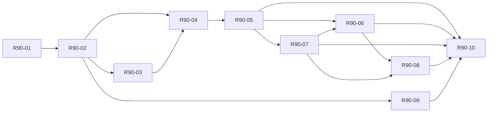

# Adopted readiness plan · full-stack improvement requirements

The existing plan and standards plus this additive convention govern intended work. R90 IDs are improvement groupings, never replacement engine tasks or a second editable task ledger. Existing acceptance predicates and mandatory gates remain controlling. Completed independently admitted code owns implemented facts at its admitted subject; no module is admitted by this adoption.

**State:** adopted into the maintained plan; engine proof remains pending. Luke must actually instruct `start coding` before engine implementation. No task, module, security finding or score is promoted here. See the [adoption and transformation record](file:///var/home/Louranicas/planning/herdr-engine-vision-20260915/evidence/readiness-adoption-20260915/ADOPTION.md).

[Adopted readiness requirements and evidence roadmap](obsidian://open?vault=herdr-engineering-engine-v3.vault&file=Delivery%2FReadiness%2FIndex) · [Codebase readiness plan](file:///var/home/herdr-engineering-engine-v3/docs/readiness-plan.md) · [Six resolved design contracts](obsidian://open?vault=herdr-engineering-engine-v3.vault&file=Delivery%2FContracts%2FIndex) · [Concrete contract decisions](file:///var/home/herdr-engineering-engine-v3/docs/contract-decisions.md) ↔ [Vault master](obsidian://open?vault=herdr-engineering-engine-v3.vault&file=00%20-%20Master%20Index) ↔ [Ultra map](obsidian://open?vault=herdr-engineering-engine-v3.vault&file=Ultra%20Map%2FIndex) ↔ [Atlas master](file:///var/home/Louranicas/planning/herdr-engine-vision-20260915/MASTER_INDEX_habitat_engine.md) ↔ [Codebase master](file:///var/home/herdr-engineering-engine-v3/README.md)

The earlier advisory proposal is retained as immutable historical input at [the captured recommendation report](obsidian://open?vault=herdr-engineering-engine-v3.vault&file=Atlas%2Fevidence%2Freadiness-adoption-20260915%2FPLAN_readiness). This convention is its current adopted owner. The original JSON plan and reviewed testing/interface/completion/security baselines retain their bytes; this additive source supplies the integrated clauses. R90 records contain no competing task state.

## Scores and minimum milestone

| Facet | Recorded /100 | Conditional target /100 |
| --- | --- | --- |
| [F1 · Vision, requirements and scope](obsidian://open?vault=herdr-engineering-engine-v3.vault&file=Delivery%2FReadiness%2FF1) | 92 | 95 |
| [F2 · Architecture, modularity and maintainability](obsidian://open?vault=herdr-engineering-engine-v3.vault&file=Delivery%2FReadiness%2FF2) | 89 | 93 |
| [F3 · Public interfaces and integration](obsidian://open?vault=herdr-engineering-engine-v3.vault&file=Delivery%2FReadiness%2FF3) | 87 | 94 |
| [F4 · Testing, verification and completion evidence](obsidian://open?vault=herdr-engineering-engine-v3.vault&file=Delivery%2FReadiness%2FF4) | 86 | 93 |
| [F5 · Security and hardening](obsidian://open?vault=herdr-engineering-engine-v3.vault&file=Delivery%2FReadiness%2FF5) | 83 | 92 |
| [F6 · Build, deployment, migration and operations](obsidian://open?vault=herdr-engineering-engine-v3.vault&file=Delivery%2FReadiness%2FF6) | 78 | 92 |
| [F7 · Traceability, cohesion and controlled change](obsidian://open?vault=herdr-engineering-engine-v3.vault&file=Delivery%2FReadiness%2FF7) | 94 | 96 |

Recorded mean **87/100**; contextual coding-capacity estimate **85/100**. Preserve F1/F7 above 90 and reach at least 90 in F2–F6 with actual independent evidence. Stretch targets are conditional; no measured top-7% claim is made.

## Sequence and original task authority

T01 release/measurement contract precedes T25/T26 quality and threat contracts, then T02/T03 and T04/T05 enable T06 and T07. R90-04 specifies collection only; R90-05 implements and bootstraps it at T06 after original prerequisites. R90-07 supplies T08/T10/T14 before R90-06 reaches T15. T17/T18/T27 obligations precede T19/T20 under the original graph. These package edges cannot override the original task DAG. R90-09 is a bounded planning/maintenance branch after R90-02. T01 foundation readiness is assessed against its contract artifacts and independent review, not full module admission. The check-owned collector is implemented and bootstrapped at T06; its absence is not a reverse dependency on T01. Full benchmark materialization belongs to T12 before routing-policy training/tuning/comparison, with the fixed schema/split policy and first immutable development workload/oracle established at T01. Module qualification and integrated release admission retain all applicable gates.



| Grouping | Original task references | Action class |
| --- | --- | --- |
| [R90-01 · Set the first release workload and scorecard](obsidian://open?vault=herdr-engineering-engine-v3.vault&file=Delivery%2FReadiness%2FR90-01) | T01, T12, T19 | planning |
| [R90-02 · Settle the narrow architecture and release profile](obsidian://open?vault=herdr-engineering-engine-v3.vault&file=Delivery%2FReadiness%2FR90-02) | T01, T03, T04, T25, T26 | planning |
| [R90-03 · Specify executable boundary and compatibility contracts](obsidian://open?vault=herdr-engineering-engine-v3.vault&file=Delivery%2FReadiness%2FR90-03) | T01, T02, T03, T21, T28, T29 | planning |
| [R90-04 · Specify trustworthy collection and quality controls](obsidian://open?vault=herdr-engineering-engine-v3.vault&file=Delivery%2FReadiness%2FR90-04) | T25, T26 | planning |
| [R90-05 · Prove one durable execute–verify–repair slice](obsidian://open?vault=herdr-engineering-engine-v3.vault&file=Delivery%2FReadiness%2FR90-05) | T25, T26, T02, T03, T04, T05, T06, T07 | coding authorization required |
| [R90-06 · Qualify adversarial execution boundaries](obsidian://open?vault=herdr-engineering-engine-v3.vault&file=Delivery%2FReadiness%2FR90-06) | T15, T26 | coding authorization required |
| [R90-07 · Prove a second adapter, cross-language and cohort seams](obsidian://open?vault=herdr-engineering-engine-v3.vault&file=Delivery%2FReadiness%2FR90-07) | T08, T09, T10, T11, T12, T13, T14, T16, T21, T22, T28, T29 | coding authorization required |
| [R90-08 · Rehearse the packaged release and recovery](obsidian://open?vault=herdr-engineering-engine-v3.vault&file=Delivery%2FReadiness%2FR90-08) | T04, T14, T17, T18, T27 | coding and scoped release authority required |
| [R90-09 · Exercise context handoff, relocation and change propagation](obsidian://open?vault=herdr-engineering-engine-v3.vault&file=Delivery%2FReadiness%2FR90-09) | T01, T11, T20, T22, T29 | planning and later bounded maintenance drills |
| [R90-10 · Run the constrained pilot and independently reassess](obsidian://open?vault=herdr-engineering-engine-v3.vault&file=Delivery%2FReadiness%2FR90-10) | T12, T19, T20 | commissioning authority required |

### F1 · Vision, requirements and scope

**Recorded score:** 92/100. **Conditional target:** 95/100; no promotion from documentation adoption.

**Primary owners:** [task](obsidian://open?vault=herdr-engineering-engine-v3.vault&file=Ultra%20Map%2FModules%2FUM-task), [route](obsidian://open?vault=herdr-engineering-engine-v3.vault&file=Ultra%20Map%2FModules%2FUM-route), [budget](obsidian://open?vault=herdr-engineering-engine-v3.vault&file=Ultra%20Map%2FModules%2FUM-budget), [numerical](obsidian://open?vault=herdr-engineering-engine-v3.vault&file=Ultra%20Map%2FModules%2FUM-numerical), [julia](obsidian://open?vault=herdr-engineering-engine-v3.vault&file=Ultra%20Map%2FModules%2FUM-julia), [app](obsidian://open?vault=herdr-engineering-engine-v3.vault&file=Ultra%20Map%2FModules%2FUM-app).

**Owning task contracts:** [T01](obsidian://open?vault=herdr-engineering-engine-v3.vault&file=Delivery%2FTasks%2FTASK-T01), [T12](obsidian://open?vault=herdr-engineering-engine-v3.vault&file=Delivery%2FTasks%2FTASK-T12), [T19](obsidian://open?vault=herdr-engineering-engine-v3.vault&file=Delivery%2FTasks%2FTASK-T19), [T20](obsidian://open?vault=herdr-engineering-engine-v3.vault&file=Delivery%2FTasks%2FTASK-T20).

**Governing standard/procedure routes:** [TASK-T01](obsidian://open?vault=herdr-engineering-engine-v3.vault&file=Delivery%2FTasks%2FTASK-T01). These are generated views of the same adopted clauses; edit the convention once.

- **F1-C01:** Write one release charter in the existing T01 contract: intended users, supported development task, accepted output, supported machine/profile and explicit exclusions. Separate routing to an eligible model from proving that model is the best choice.
- **F1-C02:** Define a representative workload catalogue with defect repair, bounded feature work, tests/refactoring, repository analysis, failed/cancelled work and numerical jobs only where relevant. Each case needs input identity, an independent oracle, allowed resources and data-handling class.
- **F1-C03:** Predeclare selection objectives: acceptance quality first; hard privacy/capability/budget constraints; then the declared cost/latency tradeoff. Compare against a fixed-model baseline and the simple deterministic router under the same verifier.
- **F1-C04:** Select numeric budgets and service targets from the actual pilot workload and host measurements before the trial: complete-task cost, wall time, p50/p95/p99 where sample size supports them, cancellation/cleanup deadlines, resource bounds and restore objectives. Unknown values remain blocking contract fields; do not invent attractive targets.
- **F1-C05:** Keep benchmark selection, tuning and held-out evaluation separate. Include failed, abandoned and cancelled attempts, verifier cost, context preparation, retries, rework and human review; disclose missing usage, censoring and uncertainty.

**Required future proof:**

- A fresh reviewer can classify a proposed task as supported, unsupported or awaiting a named decision using the charter alone.
- T12 comparisons use the frozen workload/oracles and report per-class outcomes and uncertainty; T19 meets the predeclared release targets under the concrete commissioning scope.

**Reassessment:** 94 becomes reasonable when the workload, release profile and measurable targets are settled and independently reviewed; 95 requires pilot evidence confirming that the intended outcome and evaluation method are usable.

**Complexity guard:** Do not multiply personas, objective documents or benchmark dashboards. Extend the existing T01 contract and evaluation corpus.


### F2 · Architecture, modularity and maintainability

**Recorded score:** 89/100. **Conditional target:** 93/100; no promotion from documentation adoption.

**Primary owners:** [contracts](obsidian://open?vault=herdr-engineering-engine-v3.vault&file=Ultra%20Map%2FModules%2FUM-contracts), [task](obsidian://open?vault=herdr-engineering-engine-v3.vault&file=Ultra%20Map%2FModules%2FUM-task), [store](obsidian://open?vault=herdr-engineering-engine-v3.vault&file=Ultra%20Map%2FModules%2FUM-store), [roster](obsidian://open?vault=herdr-engineering-engine-v3.vault&file=Ultra%20Map%2FModules%2FUM-roster), [route](obsidian://open?vault=herdr-engineering-engine-v3.vault&file=Ultra%20Map%2FModules%2FUM-route), [budget](obsidian://open?vault=herdr-engineering-engine-v3.vault&file=Ultra%20Map%2FModules%2FUM-budget), [worker](obsidian://open?vault=herdr-engineering-engine-v3.vault&file=Ultra%20Map%2FModules%2FUM-worker), [check](obsidian://open?vault=herdr-engineering-engine-v3.vault&file=Ultra%20Map%2FModules%2FUM-check), [recovery](obsidian://open?vault=herdr-engineering-engine-v3.vault&file=Ultra%20Map%2FModules%2FUM-recovery), [cohort](obsidian://open?vault=herdr-engineering-engine-v3.vault&file=Ultra%20Map%2FModules%2FUM-cohort), [context](obsidian://open?vault=herdr-engineering-engine-v3.vault&file=Ultra%20Map%2FModules%2FUM-context), [notify](obsidian://open?vault=herdr-engineering-engine-v3.vault&file=Ultra%20Map%2FModules%2FUM-notify), [service](obsidian://open?vault=herdr-engineering-engine-v3.vault&file=Ultra%20Map%2FModules%2FUM-service), [herdr](obsidian://open?vault=herdr-engineering-engine-v3.vault&file=Ultra%20Map%2FModules%2FUM-herdr), [numerical](obsidian://open?vault=herdr-engineering-engine-v3.vault&file=Ultra%20Map%2FModules%2FUM-numerical), [julia](obsidian://open?vault=herdr-engineering-engine-v3.vault&file=Ultra%20Map%2FModules%2FUM-julia), [app](obsidian://open?vault=herdr-engineering-engine-v3.vault&file=Ultra%20Map%2FModules%2FUM-app), [actions](obsidian://open?vault=herdr-engineering-engine-v3.vault&file=Ultra%20Map%2FModules%2FUM-actions), [bash](obsidian://open?vault=herdr-engineering-engine-v3.vault&file=Ultra%20Map%2FModules%2FUM-bash), [pi_extension](obsidian://open?vault=herdr-engineering-engine-v3.vault&file=Ultra%20Map%2FModules%2FUM-pi_extension), [skills](obsidian://open?vault=herdr-engineering-engine-v3.vault&file=Ultra%20Map%2FModules%2FUM-skills), [workflows](obsidian://open?vault=herdr-engineering-engine-v3.vault&file=Ultra%20Map%2FModules%2FUM-workflows).

**Owning task contracts:** [T01](obsidian://open?vault=herdr-engineering-engine-v3.vault&file=Delivery%2FTasks%2FTASK-T01), [T03](obsidian://open?vault=herdr-engineering-engine-v3.vault&file=Delivery%2FTasks%2FTASK-T03), [T04](obsidian://open?vault=herdr-engineering-engine-v3.vault&file=Delivery%2FTasks%2FTASK-T04), [T06](obsidian://open?vault=herdr-engineering-engine-v3.vault&file=Delivery%2FTasks%2FTASK-T06), [T21](obsidian://open?vault=herdr-engineering-engine-v3.vault&file=Delivery%2FTasks%2FTASK-T21), [T22](obsidian://open?vault=herdr-engineering-engine-v3.vault&file=Delivery%2FTasks%2FTASK-T22), [T20](obsidian://open?vault=herdr-engineering-engine-v3.vault&file=Delivery%2FTasks%2FTASK-T20).

**Governing standard/procedure routes:** [Module Completion](obsidian://open?vault=herdr-engineering-engine-v3.vault&file=Standards%2FModule%20Completion). These are generated views of the same adopted clauses; edit the convention once.

- **F2-C01:** Give each existing module one concise boundary contract: state owned, invariants, dependencies, consumers, public operations, errors, resource lifetime and prohibited responsibilities. Reuse the module cards and completion contracts; avoid a second module taxonomy.
- **F2-C02:** Specify concrete composition and dependency rules. Rust owns operational authority; Julia owns bounded analysis. Keep SQLite as the one proposed task ledger and app as the composition root. A module is not automatically a crate, daemon or socket.
- **F2-C03:** Keep policy logic deterministic and separate from provider/process/filesystem effects. Pass typed identities and observations into route/budget/check policy; return explicit decisions instead of reading ambient global state.
- **F2-C04:** Choose and record async cancellation, task ownership, error propagation, transaction boundaries and shutdown semantics before broad adapter work. Retain task, effect, cleanup, evidence and delivery state as separate dimensions.
- **F2-C05:** Plan two maintainability exercises: add an adapter without changing task lifecycle ownership; add an action or evolve one schema with a deliberate compatibility path. Predict the affected modules before implementation and compare actual changes afterwards.
- **F2-C06:** Record complexity cost per change: new runtime processes, storage authorities, dependencies, configuration knobs, touched owners, review effort and rework. Introduce an abstraction only after a concrete second use or a demonstrated safety boundary.

**Required future proof:**

- A first integrated slice respects the declared dependency/ownership rules and proves cancellation, failed verification and lost-reply behavior.
- The two controlled change exercises preserve unaffected consumer contracts; unexpected cross-module edits have a documented cause and repair. No parallel task ledger or scheduler appears.

**Reassessment:** 90–91 requires a tested first slice with clear ownership. 93 requires evidence from a materially different slice or change exercise; documentation size alone earns no increase.

**Complexity guard:** Keep all 22 boundaries available, but implement dependency-ready slices. Defer optional capabilities explicitly instead of building empty frameworks for them.


### F3 · Public interfaces and integration

**Recorded score:** 87/100. **Conditional target:** 94/100; no promotion from documentation adoption.

**Primary owners:** [contracts](obsidian://open?vault=herdr-engineering-engine-v3.vault&file=Ultra%20Map%2FModules%2FUM-contracts), [task](obsidian://open?vault=herdr-engineering-engine-v3.vault&file=Ultra%20Map%2FModules%2FUM-task), [worker](obsidian://open?vault=herdr-engineering-engine-v3.vault&file=Ultra%20Map%2FModules%2FUM-worker), [actions](obsidian://open?vault=herdr-engineering-engine-v3.vault&file=Ultra%20Map%2FModules%2FUM-actions), [app](obsidian://open?vault=herdr-engineering-engine-v3.vault&file=Ultra%20Map%2FModules%2FUM-app), [numerical](obsidian://open?vault=herdr-engineering-engine-v3.vault&file=Ultra%20Map%2FModules%2FUM-numerical), [julia](obsidian://open?vault=herdr-engineering-engine-v3.vault&file=Ultra%20Map%2FModules%2FUM-julia), [herdr](obsidian://open?vault=herdr-engineering-engine-v3.vault&file=Ultra%20Map%2FModules%2FUM-herdr), [bash](obsidian://open?vault=herdr-engineering-engine-v3.vault&file=Ultra%20Map%2FModules%2FUM-bash), [pi_extension](obsidian://open?vault=herdr-engineering-engine-v3.vault&file=Ultra%20Map%2FModules%2FUM-pi_extension), [skills](obsidian://open?vault=herdr-engineering-engine-v3.vault&file=Ultra%20Map%2FModules%2FUM-skills), [workflows](obsidian://open?vault=herdr-engineering-engine-v3.vault&file=Ultra%20Map%2FModules%2FUM-workflows).

**Owning task contracts:** [T01](obsidian://open?vault=herdr-engineering-engine-v3.vault&file=Delivery%2FTasks%2FTASK-T01), [T02](obsidian://open?vault=herdr-engineering-engine-v3.vault&file=Delivery%2FTasks%2FTASK-T02), [T03](obsidian://open?vault=herdr-engineering-engine-v3.vault&file=Delivery%2FTasks%2FTASK-T03), [T21](obsidian://open?vault=herdr-engineering-engine-v3.vault&file=Delivery%2FTasks%2FTASK-T21), [T28](obsidian://open?vault=herdr-engineering-engine-v3.vault&file=Delivery%2FTasks%2FTASK-T28), [T29](obsidian://open?vault=herdr-engineering-engine-v3.vault&file=Delivery%2FTasks%2FTASK-T29).

**Governing standard/procedure routes:** [Module Public Contracts](obsidian://open?vault=herdr-engineering-engine-v3.vault&file=Interfaces%2FModule%20Public%20Contracts). These are generated views of the same adopted clauses; edit the convention once.

- **F3-C01:** Resolve the existing 66 semantic operations into concrete versioned request/result/error schemas and Rust/Julia signatures as their owning slices are implemented. Record which interfaces are supported externally and which are internal module calls.
- **F3-C02:** For every supported boundary specify caller capability, authenticated identity, operation/request key, correlation ID, attempt generation, canonical request digest, deadlines, cancellation, bounded sizes, backpressure and retry/readback behavior.
- **F3-C03:** Complete each Unix-socket/pipe custody record: owner, runtime path, creation/bind readiness, access policy, peer identity limits, framing and maximum length, disconnect/reconnect, stale-socket detection and shutdown cleanup. Refuse unlinking a socket without proven custody.
- **F3-C04:** Use the one action definition for CLI, Unix API and LLM-tool projections. Commands, Bash, Pi extensions, skills and workflows preserve literal values and effect authority. A model-supplied approval or risk field never grants permission.
- **F3-C05:** Create a shared versioned compatibility fixture corpus with independent expected outcomes: valid round trips, malformed/oversized/truncated frames, missing/unknown fields, incompatible versions, nonfinite numerical data, cancellation, duplicate requests and lost acknowledgements.
- **F3-C06:** For Rust–Julia exchange specify numeric types, units, shape/layout, tolerances, missingness, dataset cutoff and report provenance. A Julia timeout or stale report leaves the approved operational policy unchanged.

**Required future proof:**

- Two real consumer projections produce the same typed decision, identity and error for each shared fixture; denial remains denial across CLI/API/tool surfaces.
- The Rust–Julia exchange passes independently defined expected results and failure controls; protocol changes invalidate affected compatibility evidence.
- All supported initial-release operations have concrete documentation/examples and tested compatibility. Planned optional operations stay visibly unavailable.

**Reassessment:** 90–91 follows a real cross-transport slice; 94 needs the supported release surface and Rust–Julia boundary qualified against the shared fixture corpus.

**Complexity guard:** Do not add endpoints to improve an API count. Reuse the ten API crossings, seven IPC mappings and 21 command/tool entries unless a reviewed requirement changes.


### F4 · Testing, verification and completion evidence

**Recorded score:** 86/100. **Conditional target:** 93/100; no promotion from documentation adoption.

**Primary owners:** [check](obsidian://open?vault=herdr-engineering-engine-v3.vault&file=Ultra%20Map%2FModules%2FUM-check), [contracts](obsidian://open?vault=herdr-engineering-engine-v3.vault&file=Ultra%20Map%2FModules%2FUM-contracts), [app](obsidian://open?vault=herdr-engineering-engine-v3.vault&file=Ultra%20Map%2FModules%2FUM-app), [task](obsidian://open?vault=herdr-engineering-engine-v3.vault&file=Ultra%20Map%2FModules%2FUM-task), [julia](obsidian://open?vault=herdr-engineering-engine-v3.vault&file=Ultra%20Map%2FModules%2FUM-julia).

**Owning task contracts:** [T01](obsidian://open?vault=herdr-engineering-engine-v3.vault&file=Delivery%2FTasks%2FTASK-T01), [T25](obsidian://open?vault=herdr-engineering-engine-v3.vault&file=Delivery%2FTasks%2FTASK-T25), [T26](obsidian://open?vault=herdr-engineering-engine-v3.vault&file=Delivery%2FTasks%2FTASK-T26), [T06](obsidian://open?vault=herdr-engineering-engine-v3.vault&file=Delivery%2FTasks%2FTASK-T06), [T17](obsidian://open?vault=herdr-engineering-engine-v3.vault&file=Delivery%2FTasks%2FTASK-T17).

**Governing standard/procedure routes:** [Module Testing](obsidian://open?vault=herdr-engineering-engine-v3.vault&file=Standards%2FModule%20Testing). These are generated views of the same adopted clauses; edit the convention once.

- **F4-C01:** Specify a small trusted launch/collection boundary owned by check. Pin the criterion-to-oracle map and evidence schema before implementation; candidate test programs and their structured reports remain untrusted claims.
- **F4-C02:** Bind a receipt to source/tree and dirty-state digest, interface/schema, dependency lockfiles, toolchain/profile, fixture/oracle/harness identities, exact invocation/environment, selected and executed case IDs, raw stdout/stderr, actual exit/signal and observation time.
- **F4-C03:** Separate qualifying baseline results from deliberately failing controls. Zero selected tests, skipped mandatory cases, missing diagnostics, stale artifacts, ambiguous producer outcomes or an unavailable validator must refuse qualification.
- **F4-C04:** Keep the minimum of 50 distinct meaningful primary-owned cases for every accepted module. Map cases to obligations and risk classes; parameter repetitions, seeds, assertions, profiles, retries and mutant runs do not create extra case credit. All 22 completed modules imply at least 1,100 distinct primary credits.
- **F4-C05:** Define assimilation controls from actual adopted lessons: reproduce the hazard in a valid fixture, observe the intended detector, and pass its benign counterpart. A formatting failure before the behavioral fault does not establish behavioral detection.
- **F4-C06:** Qualify mutation operators against real invariants. Retain killed, surviving, equivalent, invalid, timed-out and unexecuted dispositions with denominator and review reasons. Require intended fault detection; never choose an unsupported universal mutation percentage to inflate confidence.
- **F4-C07:** Define the complete Rust/Julia feature, target and optimization matrix. Pedantic Clippy and all other required baseline diagnostics must be clean; no blanket suppression, output filtering, ignored failures or automatic baseline acceptance.

**Required future proof:**

- Bootstrap the collector against a small independently reviewed reference fixture: known pass/fail, benign near-neighbor, forged PASS, wrong subject, changed fixture, missing log, verifier crash and post-check mutation. The collector cannot admit its own trust.
- T06 produces a failed candidate, repairs it and re-verifies the exact repaired subject. Independent acceptance rejects worker exit-zero and unrelated evidence.
- The first admitted module has at least 50 qualifying cases, zero baseline diagnostics and nonempty, valid mutation/assimilation evidence; repeat on a second materially different module or integrated seam.

**Reassessment:** 90–91 requires qualified collection plus one admitted module slice. 93 requires repeatability on another meaningful seam. Whole-release qualification still requires every included module and all integration obligations.

**Complexity guard:** Start with a narrow collector/library or CLI and retained files. Do not create a verification service, second ledger or generic workflow framework.


### F5 · Security and hardening

**Recorded score:** 83/100. **Conditional target:** 92/100; no promotion from documentation adoption.

**Primary owners:** [worker](obsidian://open?vault=herdr-engineering-engine-v3.vault&file=Ultra%20Map%2FModules%2FUM-worker), [check](obsidian://open?vault=herdr-engineering-engine-v3.vault&file=Ultra%20Map%2FModules%2FUM-check), [service](obsidian://open?vault=herdr-engineering-engine-v3.vault&file=Ultra%20Map%2FModules%2FUM-service), [actions](obsidian://open?vault=herdr-engineering-engine-v3.vault&file=Ultra%20Map%2FModules%2FUM-actions), [app](obsidian://open?vault=herdr-engineering-engine-v3.vault&file=Ultra%20Map%2FModules%2FUM-app), [store](obsidian://open?vault=herdr-engineering-engine-v3.vault&file=Ultra%20Map%2FModules%2FUM-store), [context](obsidian://open?vault=herdr-engineering-engine-v3.vault&file=Ultra%20Map%2FModules%2FUM-context), [bash](obsidian://open?vault=herdr-engineering-engine-v3.vault&file=Ultra%20Map%2FModules%2FUM-bash), [pi_extension](obsidian://open?vault=herdr-engineering-engine-v3.vault&file=Ultra%20Map%2FModules%2FUM-pi_extension), [skills](obsidian://open?vault=herdr-engineering-engine-v3.vault&file=Ultra%20Map%2FModules%2FUM-skills), [workflows](obsidian://open?vault=herdr-engineering-engine-v3.vault&file=Ultra%20Map%2FModules%2FUM-workflows).

**Owning task contracts:** [T26](obsidian://open?vault=herdr-engineering-engine-v3.vault&file=Delivery%2FTasks%2FTASK-T26), [T15](obsidian://open?vault=herdr-engineering-engine-v3.vault&file=Delivery%2FTasks%2FTASK-T15), [T17](obsidian://open?vault=herdr-engineering-engine-v3.vault&file=Delivery%2FTasks%2FTASK-T17), [T27](obsidian://open?vault=herdr-engineering-engine-v3.vault&file=Delivery%2FTasks%2FTASK-T27).

**Governing standard/procedure routes:** [Daybreak Profile](obsidian://open?vault=herdr-engineering-engine-v3.vault&file=Security%2FDaybreak%20Profile) · [RB05](obsidian://open?vault=herdr-engineering-engine-v3.vault&file=Operations%2FRunbooks%2FRB05). These are generated views of the same adopted clauses; edit the convention once.

- **F5-C01:** Complete a threat model of principals, assets and grants across agent prompts, context sources, code workspaces, credentials, sockets, model/provider transports, evidence, dependency updates and service controls.
- **F5-C02:** Treat build.rs, procedural macros, generated scripts, test binaries, doctests and Julia package hooks as candidate-controlled execution. A trusted wrapper cannot confer trust on these subprocesses.
- **F5-C03:** Specify separate trusted-host development and adversarial qualification profiles. State writable/readable mounts, permitted network destinations, environment/secret allowlist, process/resource limits, cancellation, descendant cleanup and the evidence return channel. Same-UID permissions alone cannot substantiate hostile-code isolation.
- **F5-C04:** Keep the trusted collector, protected fixtures, evidence store, ledger and operator socket outside candidate write authority. Give each worker only its admitted workspace and scoped capability; do not deliver the operator socket as a general tool channel.
- **F5-C05:** Use the existing Daybreak profile/RB05: verify actual effective model identity and review overrides for the scoped review, retain the reviewer evidence and independently reproduce findings. Model choice grants neither execution authority nor acceptance.
- **F5-C06:** Specify exact dependency/source/license inventory, update review and advisory dispositions for the eventual locked package. Record finding impact, reproduction, repair, regression, pre/post-fix identities, residual owner and invalidation trigger.

**Required future proof:**

- A valid packaged slice runs under the declared isolation profile, while hostile build/test hooks fail to alter protected paths, steal unintended secrets, misuse sockets, impersonate the collector, contact forbidden destinations or retain writable descendants.
- Each security fault reaches its intended boundary and produces a meaningful refusal/readback; successful benign cases prove the fixture was viable.
- T27 independently reproduces and closes material findings against the integrated packaged subject; dependency and prompt/context attacks are included, with excluded or unmeasured scope explicit.

**Reassessment:** 90 requires demonstrated hostile controls on a packaged slice. 92 requires integrated finding closure and no unresolved material finding in the claimed profile.

**Complexity guard:** Select controls from actual threats. Do not add a security platform, permanent scanner daemon or permissions merely because a tool can use them.


### F6 · Build, deployment, migration and operations

**Recorded score:** 78/100. **Conditional target:** 92/100; no promotion from documentation adoption.

**Primary owners:** [app](obsidian://open?vault=herdr-engineering-engine-v3.vault&file=Ultra%20Map%2FModules%2FUM-app), [store](obsidian://open?vault=herdr-engineering-engine-v3.vault&file=Ultra%20Map%2FModules%2FUM-store), [recovery](obsidian://open?vault=herdr-engineering-engine-v3.vault&file=Ultra%20Map%2FModules%2FUM-recovery), [service](obsidian://open?vault=herdr-engineering-engine-v3.vault&file=Ultra%20Map%2FModules%2FUM-service), [notify](obsidian://open?vault=herdr-engineering-engine-v3.vault&file=Ultra%20Map%2FModules%2FUM-notify), [check](obsidian://open?vault=herdr-engineering-engine-v3.vault&file=Ultra%20Map%2FModules%2FUM-check).

**Owning task contracts:** [T04](obsidian://open?vault=herdr-engineering-engine-v3.vault&file=Delivery%2FTasks%2FTASK-T04), [T14](obsidian://open?vault=herdr-engineering-engine-v3.vault&file=Delivery%2FTasks%2FTASK-T14), [T17](obsidian://open?vault=herdr-engineering-engine-v3.vault&file=Delivery%2FTasks%2FTASK-T17), [T18](obsidian://open?vault=herdr-engineering-engine-v3.vault&file=Delivery%2FTasks%2FTASK-T18), [T19](obsidian://open?vault=herdr-engineering-engine-v3.vault&file=Delivery%2FTasks%2FTASK-T19), [T20](obsidian://open?vault=herdr-engineering-engine-v3.vault&file=Delivery%2FTasks%2FTASK-T20), [T27](obsidian://open?vault=herdr-engineering-engine-v3.vault&file=Delivery%2FTasks%2FTASK-T27).

**Governing standard/procedure routes:** [Justfiles and Runbooks](obsidian://open?vault=herdr-engineering-engine-v3.vault&file=Operations%2FJustfiles%20and%20Runbooks) · [RB04](obsidian://open?vault=herdr-engineering-engine-v3.vault&file=Operations%2FRunbooks%2FRB04) · [Configuration](obsidian://open?vault=herdr-engineering-engine-v3.vault&file=Operations%2FConfiguration). These are generated views of the same adopted clauses; edit the convention once.

- **F6-C01:** Write a supported release profile identifying host versus Toolbx responsibilities, Rust/Julia toolchain and package versions, dependency locks, configuration schema, state/artifact paths and lifecycle owner. Production start must not depend accidentally on an authoring shell.
- **F6-C02:** Specify package identity and repeatable build inputs. Distinguish a repeatable build procedure from byte-identical reproducibility; investigate and disclose nondeterministic inputs instead of asserting equivalence.
- **F6-C03:** Define migration 001 ownership and freeze policy before release: ordered version/checksum, exclusive writer, transactional application, supported readers/writers and immutable released bytes. Freeze its comments or move later navigation to a sidecar.
- **F6-C04:** Define artifact/ledger durability ordering, idempotency conflict behavior and outbox coupling. Cover interruption between writing an artifact, making it durable, committing its database reference and delivering completion.
- **F6-C05:** Extend the existing runbooks with exact implemented commands only when available: preconditions, authority/effects, expected outputs, decisive checks, timeout, rollback/forward recovery, cleanup and retained evidence. Keep Justfile wrappers thin and test producer failure propagation.
- **F6-C06:** Specify a disposable rehearsal matrix: fresh install, populated upgrade, duplicate/concurrent startup, incompatible schema/checksum, disk full, process crash, login/reboot behavior, shutdown, backup, restore and rollback/forward recovery.
- **F6-C07:** Before restoring older state, preserve the current/failed ledger and reconcile every post-backup operation, external effect, resource obligation and usage record. Changing an event epoch cannot prevent replay of an external effect erased by restoring a database.
- **F6-C08:** Define useful health and recovery objectives from the actual workload. Read back answering interfaces, installed artifact/config/schema, outstanding obligations and residual processes; file copying, process existence or a listener alone is insufficient.

**Required future proof:**

- One versioned package completes the whole disposable installation/migration/recovery cycle, including intended-fault and benign controls and immutable-history refusal.
- An independent operator or clean environment repeats the procedure and verifies expected task/artifact/evidence/service inventory; an omitted-service fixture is detected.
- Restore preserves or explicitly reconciles post-backup effects and proof retention; the exact assembled release receives separate acceptance and deployment observation.

**Reassessment:** 90 follows one fully rehearsed disposable package/migration/recovery cycle. 92 requires repeatability or independent environment readback plus integrated release evidence.

**Complexity guard:** Use the established systemd/Podman ownership where qualified. Do not build another deployer, supervisor or backup service merely to raise this score.


### F7 · Traceability, cohesion and controlled change

**Recorded score:** 94/100. **Conditional target:** 96/100; no promotion from documentation adoption.

**Primary owners:** [contracts](obsidian://open?vault=herdr-engineering-engine-v3.vault&file=Ultra%20Map%2FModules%2FUM-contracts), [task](obsidian://open?vault=herdr-engineering-engine-v3.vault&file=Ultra%20Map%2FModules%2FUM-task), [store](obsidian://open?vault=herdr-engineering-engine-v3.vault&file=Ultra%20Map%2FModules%2FUM-store), [roster](obsidian://open?vault=herdr-engineering-engine-v3.vault&file=Ultra%20Map%2FModules%2FUM-roster), [route](obsidian://open?vault=herdr-engineering-engine-v3.vault&file=Ultra%20Map%2FModules%2FUM-route), [budget](obsidian://open?vault=herdr-engineering-engine-v3.vault&file=Ultra%20Map%2FModules%2FUM-budget), [worker](obsidian://open?vault=herdr-engineering-engine-v3.vault&file=Ultra%20Map%2FModules%2FUM-worker), [check](obsidian://open?vault=herdr-engineering-engine-v3.vault&file=Ultra%20Map%2FModules%2FUM-check), [recovery](obsidian://open?vault=herdr-engineering-engine-v3.vault&file=Ultra%20Map%2FModules%2FUM-recovery), [cohort](obsidian://open?vault=herdr-engineering-engine-v3.vault&file=Ultra%20Map%2FModules%2FUM-cohort), [context](obsidian://open?vault=herdr-engineering-engine-v3.vault&file=Ultra%20Map%2FModules%2FUM-context), [notify](obsidian://open?vault=herdr-engineering-engine-v3.vault&file=Ultra%20Map%2FModules%2FUM-notify), [service](obsidian://open?vault=herdr-engineering-engine-v3.vault&file=Ultra%20Map%2FModules%2FUM-service), [herdr](obsidian://open?vault=herdr-engineering-engine-v3.vault&file=Ultra%20Map%2FModules%2FUM-herdr), [numerical](obsidian://open?vault=herdr-engineering-engine-v3.vault&file=Ultra%20Map%2FModules%2FUM-numerical), [julia](obsidian://open?vault=herdr-engineering-engine-v3.vault&file=Ultra%20Map%2FModules%2FUM-julia), [app](obsidian://open?vault=herdr-engineering-engine-v3.vault&file=Ultra%20Map%2FModules%2FUM-app), [actions](obsidian://open?vault=herdr-engineering-engine-v3.vault&file=Ultra%20Map%2FModules%2FUM-actions), [bash](obsidian://open?vault=herdr-engineering-engine-v3.vault&file=Ultra%20Map%2FModules%2FUM-bash), [pi_extension](obsidian://open?vault=herdr-engineering-engine-v3.vault&file=Ultra%20Map%2FModules%2FUM-pi_extension), [skills](obsidian://open?vault=herdr-engineering-engine-v3.vault&file=Ultra%20Map%2FModules%2FUM-skills), [workflows](obsidian://open?vault=herdr-engineering-engine-v3.vault&file=Ultra%20Map%2FModules%2FUM-workflows).

**Owning task contracts:** [T01](obsidian://open?vault=herdr-engineering-engine-v3.vault&file=Delivery%2FTasks%2FTASK-T01), [T11](obsidian://open?vault=herdr-engineering-engine-v3.vault&file=Delivery%2FTasks%2FTASK-T11), [T20](obsidian://open?vault=herdr-engineering-engine-v3.vault&file=Delivery%2FTasks%2FTASK-T20), [T22](obsidian://open?vault=herdr-engineering-engine-v3.vault&file=Delivery%2FTasks%2FTASK-T22), [T29](obsidian://open?vault=herdr-engineering-engine-v3.vault&file=Delivery%2FTasks%2FTASK-T29).

**Governing standard/procedure routes:** [Corpus Assimilation](obsidian://open?vault=herdr-engineering-engine-v3.vault&file=Workflows%2FCorpus%20Assimilation) · [Update Protocol](obsidian://open?vault=herdr-engineering-engine-v3.vault&file=Ultra%20Map%2FUpdate%20Protocol). These are generated views of the same adopted clauses; edit the convention once.

- **F7-C01:** Use bounded task context packets containing the active objective/criteria, owned module and direct neighbors, relevant interfaces, specific lessons, source identities, write/resource custody and exact return obligations. Preserve critical relationships rather than just listing files.
- **F7-C02:** Derive only affected reading routes and projections from the owning catalogues. Keep accepted code facts, desired requirements, observations and publication status separate; invalidate applicability when any bound source/profile/oracle changes.
- **F7-C03:** Test context adequacy with a fresh executor: it must locate the governing requirement, owner, callable boundary, failure case and proof without inventing a missing decision. If necessary narrow the assignment or request the specific missing source.
- **F7-C04:** Plan one bounded relocation/restore drill using an explicit root mapping. Confirm the source/corpus/query routes work in a clean workspace without silently rewriting historical evidence or replacing absolute source identity with ambiguous basenames.
- **F7-C05:** Classify existing unresolved references as actionable current gaps, historical unavailable captures, external boundaries or parser limits. Preserve immutable archives; zeroing a link counter by deleting history does not improve quality.
- **F7-C06:** Measure corpus maintenance cost, stale-reference incidents, packet omissions, repeated reading and unnecessary regeneration. Consolidate duplicate procedures and retire demonstrably unused projections with preserved history.

**Required future proof:**

- A fresh context resumes a scoped task correctly using the handoff and packet; a missing-critical-contract negative control is detected.
- A relocation/recovery exercise preserves every required owner/anchor and exact evidence identity; current native routes remain complete and graph copies bind their core generation.
- A controlled change updates all affected facets and makes stale evidence visibly stale, with no competing acceptance state or new background service.

**Reassessment:** 94 already meets the requested band. Preserve it; 96 is conditional on clean-context and relocation/change drills that reduce demonstrated friction.

**Complexity guard:** Avoid a second knowledge graph, acceptance database or perpetual watcher. More links and notes do not themselves improve the score.


## Adopted supplementary requirements

[Adopted readiness requirements and evidence roadmap](obsidian://open?vault=herdr-engineering-engine-v3.vault&file=Delivery%2FReadiness%2FIndex) · [Codebase readiness plan](file:///var/home/herdr-engineering-engine-v3/docs/readiness-plan.md) · [Six resolved design contracts](obsidian://open?vault=herdr-engineering-engine-v3.vault&file=Delivery%2FContracts%2FIndex) · [Concrete contract decisions](file:///var/home/herdr-engineering-engine-v3/docs/contract-decisions.md). These active clauses strengthen the existing owner; none relaxes its baseline or claims implementation.

### Rust/Julia check specifications — unavailable until implemented

Use the following as recipe specifications after a real pinned package exists. They are not currently available engine recipes and were not executed for this proposal. Apply each to the supported feature/target profile, retain its exact identity, and place candidate-controlled build/test processes in the declared qualification domain.

A Rust profile should include formatting, compilation, pedantic Clippy, applicable tests and rustdoc/doctests. Cargo’s explicit `--all-targets` selection covers lib/bins/tests/benches/examples; library doctests need their own route in that arrangement. `--locked` requires an existing unchanged lockfile. See the [Cargo test reference](https://doc.rust-lang.org/cargo/commands/cargo-test.html) and [Clippy usage](https://doc.rust-lang.org/clippy/usage.html).

```text
Proposed Rust recipe bodies, after supported package/profile selection:
cargo fmt --all -- --check
cargo clippy --workspace --all-targets --locked -- -D warnings -D clippy::pedantic
cargo test --workspace --all-targets --locked
cargo test --workspace --doc --locked
```

Do not assume --all-features represents every supported configuration: mutually exclusive features and no-default-feature builds need explicit admissible profiles. Retain complete compiler/build/test diagnostics, compile-doc checks and selected/ignored counts. A zero-warning process from which diagnostics were discarded cannot qualify. Fault-control diagnostics remain separately scoped from the clean baseline.

For Julia, pin the package and manifest, disable startup-file interference, enable bounds checks and treat deprecations as errors in the actual test process. The [Pkg.test API](https://pkgdocs.julialang.org/v1/api/#Pkg.test) supports `allow_reresolve=false` and explicit `julia_args`; select a compatible version and bind the real resolved test environment. Use the [Julia CLI options](https://docs.julialang.org/en/v1/manual/command-line-interface/) to record the exact profile.

A Julia collector must treat required `Broken`/skipped results as nonqualifying. It must collect stderr and structured logs: `@test_nowarn` alone does not check `@warn`; the latter needs `@test_logs` handling. These distinctions are documented in [Julia Test](https://docs.julialang.org/en/v1/stdlib/Test/).

Mutation tooling is a way to challenge an oracle, not a quality score by itself. [cargo-mutants](https://mutants.rs/) is a candidate for Rust; a Julia strategy still needs a scoped, validated choice. Do not pretend that one language’s tool covers both runtimes.

### Qualified fault and benign controls

| Boundary | Intended fault | Benign control | Required observation |
| --- | --- | --- | --- |
| Collector | Candidate prints fabricated PASS and exits zero | Valid candidate with matching independent oracle | Forged report cannot admit; real producer/oracle outcomes retained |
| Identity | Candidate changes after verification | Exact immutable verified subject | Stale subject rejected; matched subject eligible for independent review |
| Submission | Same principal/key with different canonical body | Same principal/key with identical body | Conflict versus same durable task readback |
| Cancellation | Old worker submits after committed cancel intent | Current uncancelled generation returns | No false acceptance; permitted current result can advance |
| IPC | Partial/oversized frame or stale socket generation | Bounded complete frame from admitted peer | Intended parser/custody refusal without loss of task truth |
| Context | Prompt/source requests access beyond grant | Same useful content within admitted scope | Untrusted instructions cannot increase authority |
| Isolation | Build/test hook writes protected evidence | Valid build/test writes only owned outputs | Write refused and independently observed; baseline still runs |
| Restore | Backup omits post-backup external effects or a service | Inventory and effects are fully reconciled | Missing obligation detected; no blind external replay |
| Julia | Stale/nonfinite/missing dataset or timed-out result | Valid immutable dataset with expected tolerance | Typed rejection/advisory failure preserves approved route |
| Cohort | One child done but integrated parent fails | All required joins and parent verifier pass | Parent remains unaccepted until its independent proof |

Each fault must reach its intended detector. If an earlier formatter, compiler or fixture error prevents that observation, classify the experiment as invalid for the deeper gate. Do not turn a negative-control failure into a blanket suppression of the clean release profile.

### Orchestrator and specialist custody

The orchestrator owns the objective, dependency-ready slice, criteria, resource allocations and final integration. Assign implementation owners a narrow write scope; a quality/evidence reviewer owns oracle and receipt review; a security reviewer owns the actual T26/T15/T27 boundary questions; operations owns disposable package/recovery proof. These are roles, not a requirement to keep four agents or services running.

Every thread brief binds objective/criterion revision, exact source subject, owned paths/resources, allowed actions, dependencies, limits, return schema and unresolved liabilities. Shared interfaces, lockfiles and migration bytes have one writer. A waiting parent releases resources needed by children. A child success message is a candidate result; the parent must independently verify the assembled subject.

Use the existing Daybreak security profile when that specialist review is indicated. Verify actual model identity and review overrides without silently substituting models. Independent review requires a different review action and disclosed shared assumptions; merely obtaining a second signature does not authenticate a result.

### Capacity estimate and future evidence

The current estimate stays **85/100**. A provisional 90–92 reassessment becomes reasonable after at least two materially different slices, a controlled adapter/schema change and a recovery exercise demonstrate that the corpus supports accurate implementation with little avoidable rework. It remains a contextual judgment, not a calibrated model-performance benchmark.

Measure escaped defects, independently caught contract violations, repair cycles, blocked/ambiguous decisions, relevant context omitted, compatibility regressions, useful test discrimination and actual maintenance cost. Preserve zero-diagnostic and meaningful-case standards. Do not infer capability gains from self-ratings, token expenditure, more tools or more documentation.

### Promotion, invalidation and stop rules

- Preserve the original assessment and record each later score as a new scoped review with exact source/profile/criteria/evidence identities. Reassess only the facets supported by the new results.
- Every applicable mandatory gate must pass for the claimed module/release. Missing, skipped, stale, excluded or invalid observations remain visible. A preparation score cannot override failed acceptance.
- Re-run affected and integrated checks after source, dependency, compiler, fixture, schema, permission or deployment-profile changes. Treat automatic baseline acceptance as a defect.
- Stop a slice for unresolved ownership, unavailable oracles, unknown external effects, failed security boundaries, exceeded resources or unauthorized scope; repair or explicitly narrow the claim.
- Keep optional PyTorch/neural operators outside mandatory startup. Use T23/T24 only after simple baselines and domain-valid evidence justify their total cost.

## Improvement groupings

### R90-01 · Set the first release workload and scorecard

**Action class:** planning. No action is executed by this adopted plan.

**Grouping prerequisites:** none. The original task DAG also applies.

**Existing tasks:** [T01](obsidian://open?vault=herdr-engineering-engine-v3.vault&file=Delivery%2FTasks%2FTASK-T01), [T12](obsidian://open?vault=herdr-engineering-engine-v3.vault&file=Delivery%2FTasks%2FTASK-T12), [T19](obsidian://open?vault=herdr-engineering-engine-v3.vault&file=Delivery%2FTasks%2FTASK-T19).

**Owners:** [task](obsidian://open?vault=herdr-engineering-engine-v3.vault&file=Ultra%20Map%2FModules%2FUM-task), [route](obsidian://open?vault=herdr-engineering-engine-v3.vault&file=Ultra%20Map%2FModules%2FUM-route), [budget](obsidian://open?vault=herdr-engineering-engine-v3.vault&file=Ultra%20Map%2FModules%2FUM-budget), [numerical](obsidian://open?vault=herdr-engineering-engine-v3.vault&file=Ultra%20Map%2FModules%2FUM-numerical), [julia](obsidian://open?vault=herdr-engineering-engine-v3.vault&file=Ultra%20Map%2FModules%2FUM-julia), [app](obsidian://open?vault=herdr-engineering-engine-v3.vault&file=Ultra%20Map%2FModules%2FUM-app).

**Route:** Orchestrator assigns task, route, budget, numerical, julia, app owners; independent quality/security/operations review as applicable

**Deliverable:** One existing-contract release charter, workload/oracle register and measurement policy.

**Acceptance:** Scope is classifiable; numeric bounds and commissioning choices are resolved before a paid/live trial; held-out data and missingness rules are fixed.

**Validation:** Pending task-specific evidence; no engine qualification validator is supplied by this convention.

**Dependent groupings:** [R90-02](obsidian://open?vault=herdr-engineering-engine-v3.vault&file=Delivery%2FReadiness%2FR90-02). These return links are navigation, not reverse execution dependencies.

### R90-02 · Settle the narrow architecture and release profile

**Action class:** planning. No action is executed by this adopted plan.

**Grouping prerequisites:** [R90-01](obsidian://open?vault=herdr-engineering-engine-v3.vault&file=Delivery%2FReadiness%2FR90-01). The original task DAG also applies.

**Existing tasks:** [T01](obsidian://open?vault=herdr-engineering-engine-v3.vault&file=Delivery%2FTasks%2FTASK-T01), [T03](obsidian://open?vault=herdr-engineering-engine-v3.vault&file=Delivery%2FTasks%2FTASK-T03), [T04](obsidian://open?vault=herdr-engineering-engine-v3.vault&file=Delivery%2FTasks%2FTASK-T04), [T25](obsidian://open?vault=herdr-engineering-engine-v3.vault&file=Delivery%2FTasks%2FTASK-T25), [T26](obsidian://open?vault=herdr-engineering-engine-v3.vault&file=Delivery%2FTasks%2FTASK-T26).

**Owners:** [app](obsidian://open?vault=herdr-engineering-engine-v3.vault&file=Ultra%20Map%2FModules%2FUM-app), [contracts](obsidian://open?vault=herdr-engineering-engine-v3.vault&file=Ultra%20Map%2FModules%2FUM-contracts), [store](obsidian://open?vault=herdr-engineering-engine-v3.vault&file=Ultra%20Map%2FModules%2FUM-store), [worker](obsidian://open?vault=herdr-engineering-engine-v3.vault&file=Ultra%20Map%2FModules%2FUM-worker), [julia](obsidian://open?vault=herdr-engineering-engine-v3.vault&file=Ultra%20Map%2FModules%2FUM-julia), [service](obsidian://open?vault=herdr-engineering-engine-v3.vault&file=Ultra%20Map%2FModules%2FUM-service).

**Route:** Orchestrator assigns app, contracts, store, worker, julia, service owners; independent quality/security/operations review as applicable

**Deliverable:** Existing module contracts plus a decision record for toolchains, process/serialization, persistence, resource and isolation profiles.

**Acceptance:** One state owner per invariant, no build cycle, no extra scheduler; remaining decisions have owner and resolution trigger.

**Validation:** Pending task-specific evidence; no engine qualification validator is supplied by this convention.

**Dependent groupings:** [R90-03](obsidian://open?vault=herdr-engineering-engine-v3.vault&file=Delivery%2FReadiness%2FR90-03), [R90-04](obsidian://open?vault=herdr-engineering-engine-v3.vault&file=Delivery%2FReadiness%2FR90-04), [R90-09](obsidian://open?vault=herdr-engineering-engine-v3.vault&file=Delivery%2FReadiness%2FR90-09). These return links are navigation, not reverse execution dependencies.

### R90-03 · Specify executable boundary and compatibility contracts

**Action class:** planning. No action is executed by this adopted plan.

**Grouping prerequisites:** [R90-02](obsidian://open?vault=herdr-engineering-engine-v3.vault&file=Delivery%2FReadiness%2FR90-02). The original task DAG also applies.

**Existing tasks:** [T01](obsidian://open?vault=herdr-engineering-engine-v3.vault&file=Delivery%2FTasks%2FTASK-T01), [T02](obsidian://open?vault=herdr-engineering-engine-v3.vault&file=Delivery%2FTasks%2FTASK-T02), [T03](obsidian://open?vault=herdr-engineering-engine-v3.vault&file=Delivery%2FTasks%2FTASK-T03), [T21](obsidian://open?vault=herdr-engineering-engine-v3.vault&file=Delivery%2FTasks%2FTASK-T21), [T28](obsidian://open?vault=herdr-engineering-engine-v3.vault&file=Delivery%2FTasks%2FTASK-T28), [T29](obsidian://open?vault=herdr-engineering-engine-v3.vault&file=Delivery%2FTasks%2FTASK-T29).

**Owners:** [contracts](obsidian://open?vault=herdr-engineering-engine-v3.vault&file=Ultra%20Map%2FModules%2FUM-contracts), [actions](obsidian://open?vault=herdr-engineering-engine-v3.vault&file=Ultra%20Map%2FModules%2FUM-actions), [task](obsidian://open?vault=herdr-engineering-engine-v3.vault&file=Ultra%20Map%2FModules%2FUM-task), [worker](obsidian://open?vault=herdr-engineering-engine-v3.vault&file=Ultra%20Map%2FModules%2FUM-worker), [app](obsidian://open?vault=herdr-engineering-engine-v3.vault&file=Ultra%20Map%2FModules%2FUM-app), [numerical](obsidian://open?vault=herdr-engineering-engine-v3.vault&file=Ultra%20Map%2FModules%2FUM-numerical), [julia](obsidian://open?vault=herdr-engineering-engine-v3.vault&file=Ultra%20Map%2FModules%2FUM-julia), [bash](obsidian://open?vault=herdr-engineering-engine-v3.vault&file=Ultra%20Map%2FModules%2FUM-bash), [pi_extension](obsidian://open?vault=herdr-engineering-engine-v3.vault&file=Ultra%20Map%2FModules%2FUM-pi_extension), [skills](obsidian://open?vault=herdr-engineering-engine-v3.vault&file=Ultra%20Map%2FModules%2FUM-skills), [workflows](obsidian://open?vault=herdr-engineering-engine-v3.vault&file=Ultra%20Map%2FModules%2FUM-workflows), [herdr](obsidian://open?vault=herdr-engineering-engine-v3.vault&file=Ultra%20Map%2FModules%2FUM-herdr).

**Route:** Orchestrator assigns contracts, actions, task, worker, app, numerical, julia, bash, pi_extension, skills, workflows, herdr owners; independent quality/security/operations review as applicable

**Deliverable:** Versioned schemas/signature proposal and valid/invalid cross-surface fixture specifications, within existing catalogues.

**Acceptance:** Every initial-release operation names request/result/error, authority, bounds, version and readback; unsupported behavior remains explicit; actual qualification stays pending.

**Validation:** Pending task-specific evidence; no engine qualification validator is supplied by this convention.

**Dependent groupings:** [R90-04](obsidian://open?vault=herdr-engineering-engine-v3.vault&file=Delivery%2FReadiness%2FR90-04). These return links are navigation, not reverse execution dependencies.

### R90-04 · Specify trustworthy collection and quality controls

**Action class:** planning. No action is executed by this adopted plan.

**Grouping prerequisites:** [R90-02](obsidian://open?vault=herdr-engineering-engine-v3.vault&file=Delivery%2FReadiness%2FR90-02), [R90-03](obsidian://open?vault=herdr-engineering-engine-v3.vault&file=Delivery%2FReadiness%2FR90-03). The original task DAG also applies.

**Existing tasks:** [T25](obsidian://open?vault=herdr-engineering-engine-v3.vault&file=Delivery%2FTasks%2FTASK-T25), [T26](obsidian://open?vault=herdr-engineering-engine-v3.vault&file=Delivery%2FTasks%2FTASK-T26).

**Owners:** [check](obsidian://open?vault=herdr-engineering-engine-v3.vault&file=Ultra%20Map%2FModules%2FUM-check), [contracts](obsidian://open?vault=herdr-engineering-engine-v3.vault&file=Ultra%20Map%2FModules%2FUM-contracts), [app](obsidian://open?vault=herdr-engineering-engine-v3.vault&file=Ultra%20Map%2FModules%2FUM-app), [julia](obsidian://open?vault=herdr-engineering-engine-v3.vault&file=Ultra%20Map%2FModules%2FUM-julia).

**Route:** Orchestrator assigns check, contracts, app, julia owners; independent quality/security/operations review as applicable

**Deliverable:** Collector/harness contract and independently reviewed valid/fault/benign fixture specifications; implementation and executable bootstrap belong to R90-05 at T06.

**Acceptance:** Every criterion names its oracle, exact subject, producer result and refusal conditions; no working or qualified collector is claimed by this contract. Candidate code cannot self-admit.

**Validation:** Pending task-specific evidence; no engine qualification validator is supplied by this convention.

**Dependent groupings:** [R90-05](obsidian://open?vault=herdr-engineering-engine-v3.vault&file=Delivery%2FReadiness%2FR90-05). These return links are navigation, not reverse execution dependencies.

### R90-05 · Prove one durable execute–verify–repair slice

**Action class:** coding authorization required. No action is executed by this adopted plan.

**Grouping prerequisites:** [R90-04](obsidian://open?vault=herdr-engineering-engine-v3.vault&file=Delivery%2FReadiness%2FR90-04). The original task DAG also applies.

**Existing tasks:** [T25](obsidian://open?vault=herdr-engineering-engine-v3.vault&file=Delivery%2FTasks%2FTASK-T25), [T26](obsidian://open?vault=herdr-engineering-engine-v3.vault&file=Delivery%2FTasks%2FTASK-T26), [T02](obsidian://open?vault=herdr-engineering-engine-v3.vault&file=Delivery%2FTasks%2FTASK-T02), [T03](obsidian://open?vault=herdr-engineering-engine-v3.vault&file=Delivery%2FTasks%2FTASK-T03), [T04](obsidian://open?vault=herdr-engineering-engine-v3.vault&file=Delivery%2FTasks%2FTASK-T04), [T05](obsidian://open?vault=herdr-engineering-engine-v3.vault&file=Delivery%2FTasks%2FTASK-T05), [T06](obsidian://open?vault=herdr-engineering-engine-v3.vault&file=Delivery%2FTasks%2FTASK-T06), [T07](obsidian://open?vault=herdr-engineering-engine-v3.vault&file=Delivery%2FTasks%2FTASK-T07).

**Owners:** [contracts](obsidian://open?vault=herdr-engineering-engine-v3.vault&file=Ultra%20Map%2FModules%2FUM-contracts), [task](obsidian://open?vault=herdr-engineering-engine-v3.vault&file=Ultra%20Map%2FModules%2FUM-task), [store](obsidian://open?vault=herdr-engineering-engine-v3.vault&file=Ultra%20Map%2FModules%2FUM-store), [roster](obsidian://open?vault=herdr-engineering-engine-v3.vault&file=Ultra%20Map%2FModules%2FUM-roster), [worker](obsidian://open?vault=herdr-engineering-engine-v3.vault&file=Ultra%20Map%2FModules%2FUM-worker), [check](obsidian://open?vault=herdr-engineering-engine-v3.vault&file=Ultra%20Map%2FModules%2FUM-check), [budget](obsidian://open?vault=herdr-engineering-engine-v3.vault&file=Ultra%20Map%2FModules%2FUM-budget), [recovery](obsidian://open?vault=herdr-engineering-engine-v3.vault&file=Ultra%20Map%2FModules%2FUM-recovery), [notify](obsidian://open?vault=herdr-engineering-engine-v3.vault&file=Ultra%20Map%2FModules%2FUM-notify).

**Route:** Orchestrator assigns contracts, task, store, roster, worker, check, budget, recovery, notify owners; independent quality/security/operations review as applicable

**Deliverable:** Implement the quality/threat prerequisites, adapter/common contract and ledger/roster in original task order; then implement and bootstrap the narrow collector at T06 before using it on real candidate acceptance, and prove recovery.

**Acceptance:** Exact repaired subject is reverified, reservations conserve limits, lost reply uses readback and cancellation/stale generations cannot produce false acceptance.

**Validation:** Pending task-specific evidence; no engine qualification validator is supplied by this convention.

**Dependent groupings:** [R90-06](obsidian://open?vault=herdr-engineering-engine-v3.vault&file=Delivery%2FReadiness%2FR90-06), [R90-07](obsidian://open?vault=herdr-engineering-engine-v3.vault&file=Delivery%2FReadiness%2FR90-07), [R90-10](obsidian://open?vault=herdr-engineering-engine-v3.vault&file=Delivery%2FReadiness%2FR90-10). These return links are navigation, not reverse execution dependencies.

### R90-06 · Qualify adversarial execution boundaries

**Action class:** coding authorization required. No action is executed by this adopted plan.

**Grouping prerequisites:** [R90-05](obsidian://open?vault=herdr-engineering-engine-v3.vault&file=Delivery%2FReadiness%2FR90-05), [R90-07](obsidian://open?vault=herdr-engineering-engine-v3.vault&file=Delivery%2FReadiness%2FR90-07). The original task DAG also applies.

**Existing tasks:** [T15](obsidian://open?vault=herdr-engineering-engine-v3.vault&file=Delivery%2FTasks%2FTASK-T15), [T26](obsidian://open?vault=herdr-engineering-engine-v3.vault&file=Delivery%2FTasks%2FTASK-T26).

**Owners:** [worker](obsidian://open?vault=herdr-engineering-engine-v3.vault&file=Ultra%20Map%2FModules%2FUM-worker), [check](obsidian://open?vault=herdr-engineering-engine-v3.vault&file=Ultra%20Map%2FModules%2FUM-check), [service](obsidian://open?vault=herdr-engineering-engine-v3.vault&file=Ultra%20Map%2FModules%2FUM-service), [actions](obsidian://open?vault=herdr-engineering-engine-v3.vault&file=Ultra%20Map%2FModules%2FUM-actions), [app](obsidian://open?vault=herdr-engineering-engine-v3.vault&file=Ultra%20Map%2FModules%2FUM-app), [store](obsidian://open?vault=herdr-engineering-engine-v3.vault&file=Ultra%20Map%2FModules%2FUM-store), [context](obsidian://open?vault=herdr-engineering-engine-v3.vault&file=Ultra%20Map%2FModules%2FUM-context).

**Route:** Orchestrator assigns worker, check, service, actions, app, store, context owners; independent quality/security/operations review as applicable

**Deliverable:** Admitted isolation profile and valid hostile/benign fixtures; integrated T17/T27 closure follows with release qualification.

**Acceptance:** Candidate build/test code cannot alter protected fixtures/evidence/control, disclose unintended secrets or retain writable descendants; final packaged finding closure is required in R90-08.

**Validation:** Pending task-specific evidence; no engine qualification validator is supplied by this convention.

**Dependent groupings:** [R90-08](obsidian://open?vault=herdr-engineering-engine-v3.vault&file=Delivery%2FReadiness%2FR90-08), [R90-10](obsidian://open?vault=herdr-engineering-engine-v3.vault&file=Delivery%2FReadiness%2FR90-10). These return links are navigation, not reverse execution dependencies.

### R90-07 · Prove a second adapter, cross-language and cohort seams

**Action class:** coding authorization required. No action is executed by this adopted plan.

**Grouping prerequisites:** [R90-05](obsidian://open?vault=herdr-engineering-engine-v3.vault&file=Delivery%2FReadiness%2FR90-05). The original task DAG also applies.

**Existing tasks:** [T08](obsidian://open?vault=herdr-engineering-engine-v3.vault&file=Delivery%2FTasks%2FTASK-T08), [T09](obsidian://open?vault=herdr-engineering-engine-v3.vault&file=Delivery%2FTasks%2FTASK-T09), [T10](obsidian://open?vault=herdr-engineering-engine-v3.vault&file=Delivery%2FTasks%2FTASK-T10), [T11](obsidian://open?vault=herdr-engineering-engine-v3.vault&file=Delivery%2FTasks%2FTASK-T11), [T12](obsidian://open?vault=herdr-engineering-engine-v3.vault&file=Delivery%2FTasks%2FTASK-T12), [T13](obsidian://open?vault=herdr-engineering-engine-v3.vault&file=Delivery%2FTasks%2FTASK-T13), [T14](obsidian://open?vault=herdr-engineering-engine-v3.vault&file=Delivery%2FTasks%2FTASK-T14), [T16](obsidian://open?vault=herdr-engineering-engine-v3.vault&file=Delivery%2FTasks%2FTASK-T16), [T21](obsidian://open?vault=herdr-engineering-engine-v3.vault&file=Delivery%2FTasks%2FTASK-T21), [T22](obsidian://open?vault=herdr-engineering-engine-v3.vault&file=Delivery%2FTasks%2FTASK-T22), [T28](obsidian://open?vault=herdr-engineering-engine-v3.vault&file=Delivery%2FTasks%2FTASK-T28), [T29](obsidian://open?vault=herdr-engineering-engine-v3.vault&file=Delivery%2FTasks%2FTASK-T29).

**Owners:** [roster](obsidian://open?vault=herdr-engineering-engine-v3.vault&file=Ultra%20Map%2FModules%2FUM-roster), [route](obsidian://open?vault=herdr-engineering-engine-v3.vault&file=Ultra%20Map%2FModules%2FUM-route), [budget](obsidian://open?vault=herdr-engineering-engine-v3.vault&file=Ultra%20Map%2FModules%2FUM-budget), [cohort](obsidian://open?vault=herdr-engineering-engine-v3.vault&file=Ultra%20Map%2FModules%2FUM-cohort), [context](obsidian://open?vault=herdr-engineering-engine-v3.vault&file=Ultra%20Map%2FModules%2FUM-context), [notify](obsidian://open?vault=herdr-engineering-engine-v3.vault&file=Ultra%20Map%2FModules%2FUM-notify), [numerical](obsidian://open?vault=herdr-engineering-engine-v3.vault&file=Ultra%20Map%2FModules%2FUM-numerical), [julia](obsidian://open?vault=herdr-engineering-engine-v3.vault&file=Ultra%20Map%2FModules%2FUM-julia), [actions](obsidian://open?vault=herdr-engineering-engine-v3.vault&file=Ultra%20Map%2FModules%2FUM-actions), [bash](obsidian://open?vault=herdr-engineering-engine-v3.vault&file=Ultra%20Map%2FModules%2FUM-bash), [pi_extension](obsidian://open?vault=herdr-engineering-engine-v3.vault&file=Ultra%20Map%2FModules%2FUM-pi_extension), [skills](obsidian://open?vault=herdr-engineering-engine-v3.vault&file=Ultra%20Map%2FModules%2FUM-skills), [workflows](obsidian://open?vault=herdr-engineering-engine-v3.vault&file=Ultra%20Map%2FModules%2FUM-workflows), [herdr](obsidian://open?vault=herdr-engineering-engine-v3.vault&file=Ultra%20Map%2FModules%2FUM-herdr), [service](obsidian://open?vault=herdr-engineering-engine-v3.vault&file=Ultra%20Map%2FModules%2FUM-service).

**Route:** Orchestrator assigns the listed module owners; independent quality/security/operations review as applicable.

**Deliverable:** Second supported adapter, scoped service/presentation seams, shared action fixtures, bounded Julia exchange and parent/child integration outcomes.

**Acceptance:** No duplicated task owner; same action semantics across consumers; Julia failure preserves baseline; child success cannot bypass parent verification; conserved allocations and truthful cohort comparison.

**Validation:** Pending task-specific evidence; no engine qualification validator is supplied by this convention.

**Dependent groupings:** [R90-06](obsidian://open?vault=herdr-engineering-engine-v3.vault&file=Delivery%2FReadiness%2FR90-06), [R90-08](obsidian://open?vault=herdr-engineering-engine-v3.vault&file=Delivery%2FReadiness%2FR90-08), [R90-10](obsidian://open?vault=herdr-engineering-engine-v3.vault&file=Delivery%2FReadiness%2FR90-10). These return links are navigation, not reverse execution dependencies.

### R90-08 · Rehearse the packaged release and recovery

**Action class:** coding and scoped release authority required. No action is executed by this adopted plan.

**Grouping prerequisites:** [R90-06](obsidian://open?vault=herdr-engineering-engine-v3.vault&file=Delivery%2FReadiness%2FR90-06), [R90-07](obsidian://open?vault=herdr-engineering-engine-v3.vault&file=Delivery%2FReadiness%2FR90-07). The original task DAG also applies.

**Existing tasks:** [T04](obsidian://open?vault=herdr-engineering-engine-v3.vault&file=Delivery%2FTasks%2FTASK-T04), [T14](obsidian://open?vault=herdr-engineering-engine-v3.vault&file=Delivery%2FTasks%2FTASK-T14), [T17](obsidian://open?vault=herdr-engineering-engine-v3.vault&file=Delivery%2FTasks%2FTASK-T17), [T18](obsidian://open?vault=herdr-engineering-engine-v3.vault&file=Delivery%2FTasks%2FTASK-T18), [T27](obsidian://open?vault=herdr-engineering-engine-v3.vault&file=Delivery%2FTasks%2FTASK-T27).

**Owners:** [app](obsidian://open?vault=herdr-engineering-engine-v3.vault&file=Ultra%20Map%2FModules%2FUM-app), [store](obsidian://open?vault=herdr-engineering-engine-v3.vault&file=Ultra%20Map%2FModules%2FUM-store), [recovery](obsidian://open?vault=herdr-engineering-engine-v3.vault&file=Ultra%20Map%2FModules%2FUM-recovery), [service](obsidian://open?vault=herdr-engineering-engine-v3.vault&file=Ultra%20Map%2FModules%2FUM-service), [notify](obsidian://open?vault=herdr-engineering-engine-v3.vault&file=Ultra%20Map%2FModules%2FUM-notify), [check](obsidian://open?vault=herdr-engineering-engine-v3.vault&file=Ultra%20Map%2FModules%2FUM-check).

**Route:** Orchestrator assigns app, store, recovery, service, notify, check owners; independent quality/security/operations review as applicable

**Deliverable:** Versioned package/configuration, immutable migration guard and clean install/upgrade/restore/rollback or forward-recovery records.

**Acceptance:** Independent readback confirms answering interfaces and expected inventories, post-backup effects are reconciled, wrong migration is refused and residual processes/evidence liabilities remain visible.

**Validation:** Pending task-specific evidence; no engine qualification validator is supplied by this convention.

**Dependent groupings:** [R90-10](obsidian://open?vault=herdr-engineering-engine-v3.vault&file=Delivery%2FReadiness%2FR90-10). These return links are navigation, not reverse execution dependencies.

### R90-09 · Exercise context handoff, relocation and change propagation

**Action class:** planning and later bounded maintenance drills. No action is executed by this adopted plan.

**Grouping prerequisites:** [R90-02](obsidian://open?vault=herdr-engineering-engine-v3.vault&file=Delivery%2FReadiness%2FR90-02). The original task DAG also applies.

**Existing tasks:** [T01](obsidian://open?vault=herdr-engineering-engine-v3.vault&file=Delivery%2FTasks%2FTASK-T01), [T11](obsidian://open?vault=herdr-engineering-engine-v3.vault&file=Delivery%2FTasks%2FTASK-T11), [T20](obsidian://open?vault=herdr-engineering-engine-v3.vault&file=Delivery%2FTasks%2FTASK-T20), [T22](obsidian://open?vault=herdr-engineering-engine-v3.vault&file=Delivery%2FTasks%2FTASK-T22), [T29](obsidian://open?vault=herdr-engineering-engine-v3.vault&file=Delivery%2FTasks%2FTASK-T29).

**Owners:** [contracts](obsidian://open?vault=herdr-engineering-engine-v3.vault&file=Ultra%20Map%2FModules%2FUM-contracts), [task](obsidian://open?vault=herdr-engineering-engine-v3.vault&file=Ultra%20Map%2FModules%2FUM-task), [store](obsidian://open?vault=herdr-engineering-engine-v3.vault&file=Ultra%20Map%2FModules%2FUM-store), [roster](obsidian://open?vault=herdr-engineering-engine-v3.vault&file=Ultra%20Map%2FModules%2FUM-roster), [route](obsidian://open?vault=herdr-engineering-engine-v3.vault&file=Ultra%20Map%2FModules%2FUM-route), [budget](obsidian://open?vault=herdr-engineering-engine-v3.vault&file=Ultra%20Map%2FModules%2FUM-budget), [worker](obsidian://open?vault=herdr-engineering-engine-v3.vault&file=Ultra%20Map%2FModules%2FUM-worker), [check](obsidian://open?vault=herdr-engineering-engine-v3.vault&file=Ultra%20Map%2FModules%2FUM-check), [recovery](obsidian://open?vault=herdr-engineering-engine-v3.vault&file=Ultra%20Map%2FModules%2FUM-recovery), [cohort](obsidian://open?vault=herdr-engineering-engine-v3.vault&file=Ultra%20Map%2FModules%2FUM-cohort), [context](obsidian://open?vault=herdr-engineering-engine-v3.vault&file=Ultra%20Map%2FModules%2FUM-context), [notify](obsidian://open?vault=herdr-engineering-engine-v3.vault&file=Ultra%20Map%2FModules%2FUM-notify), [service](obsidian://open?vault=herdr-engineering-engine-v3.vault&file=Ultra%20Map%2FModules%2FUM-service), [herdr](obsidian://open?vault=herdr-engineering-engine-v3.vault&file=Ultra%20Map%2FModules%2FUM-herdr), [numerical](obsidian://open?vault=herdr-engineering-engine-v3.vault&file=Ultra%20Map%2FModules%2FUM-numerical), [julia](obsidian://open?vault=herdr-engineering-engine-v3.vault&file=Ultra%20Map%2FModules%2FUM-julia), [app](obsidian://open?vault=herdr-engineering-engine-v3.vault&file=Ultra%20Map%2FModules%2FUM-app), [actions](obsidian://open?vault=herdr-engineering-engine-v3.vault&file=Ultra%20Map%2FModules%2FUM-actions), [bash](obsidian://open?vault=herdr-engineering-engine-v3.vault&file=Ultra%20Map%2FModules%2FUM-bash), [pi_extension](obsidian://open?vault=herdr-engineering-engine-v3.vault&file=Ultra%20Map%2FModules%2FUM-pi_extension), [skills](obsidian://open?vault=herdr-engineering-engine-v3.vault&file=Ultra%20Map%2FModules%2FUM-skills), [workflows](obsidian://open?vault=herdr-engineering-engine-v3.vault&file=Ultra%20Map%2FModules%2FUM-workflows).

**Route:** Orchestrator assigns contracts, task, store, roster, route, budget, worker, check, recovery, cohort, context, notify, service, herdr, numerical, julia, app, actions, bash, pi_extension, skills, workflows owners; independent quality/security/operations review as applicable

**Deliverable:** Minimal packet/roots contract and scoped no-engine corpus recovery/change exercises using existing owners.

**Acceptance:** Fresh reader finds criteria and neighbors, missing-critical-context control fails, every required anchor returns and stale evidence stays stale; published source bodies and history remain intact.

**Validation:** Pending task-specific evidence; no engine qualification validator is supplied by this convention.

**Dependent groupings:** [R90-10](obsidian://open?vault=herdr-engineering-engine-v3.vault&file=Delivery%2FReadiness%2FR90-10). These return links are navigation, not reverse execution dependencies.

### R90-10 · Run the constrained pilot and independently reassess

**Action class:** commissioning authority required. No action is executed by this adopted plan.

**Grouping prerequisites:** [R90-05](obsidian://open?vault=herdr-engineering-engine-v3.vault&file=Delivery%2FReadiness%2FR90-05), [R90-06](obsidian://open?vault=herdr-engineering-engine-v3.vault&file=Delivery%2FReadiness%2FR90-06), [R90-07](obsidian://open?vault=herdr-engineering-engine-v3.vault&file=Delivery%2FReadiness%2FR90-07), [R90-08](obsidian://open?vault=herdr-engineering-engine-v3.vault&file=Delivery%2FReadiness%2FR90-08), [R90-09](obsidian://open?vault=herdr-engineering-engine-v3.vault&file=Delivery%2FReadiness%2FR90-09). The original task DAG also applies.

**Existing tasks:** [T12](obsidian://open?vault=herdr-engineering-engine-v3.vault&file=Delivery%2FTasks%2FTASK-T12), [T19](obsidian://open?vault=herdr-engineering-engine-v3.vault&file=Delivery%2FTasks%2FTASK-T19), [T20](obsidian://open?vault=herdr-engineering-engine-v3.vault&file=Delivery%2FTasks%2FTASK-T20).

**Owners:** [contracts](obsidian://open?vault=herdr-engineering-engine-v3.vault&file=Ultra%20Map%2FModules%2FUM-contracts), [task](obsidian://open?vault=herdr-engineering-engine-v3.vault&file=Ultra%20Map%2FModules%2FUM-task), [store](obsidian://open?vault=herdr-engineering-engine-v3.vault&file=Ultra%20Map%2FModules%2FUM-store), [roster](obsidian://open?vault=herdr-engineering-engine-v3.vault&file=Ultra%20Map%2FModules%2FUM-roster), [route](obsidian://open?vault=herdr-engineering-engine-v3.vault&file=Ultra%20Map%2FModules%2FUM-route), [budget](obsidian://open?vault=herdr-engineering-engine-v3.vault&file=Ultra%20Map%2FModules%2FUM-budget), [worker](obsidian://open?vault=herdr-engineering-engine-v3.vault&file=Ultra%20Map%2FModules%2FUM-worker), [check](obsidian://open?vault=herdr-engineering-engine-v3.vault&file=Ultra%20Map%2FModules%2FUM-check), [recovery](obsidian://open?vault=herdr-engineering-engine-v3.vault&file=Ultra%20Map%2FModules%2FUM-recovery), [cohort](obsidian://open?vault=herdr-engineering-engine-v3.vault&file=Ultra%20Map%2FModules%2FUM-cohort), [context](obsidian://open?vault=herdr-engineering-engine-v3.vault&file=Ultra%20Map%2FModules%2FUM-context), [notify](obsidian://open?vault=herdr-engineering-engine-v3.vault&file=Ultra%20Map%2FModules%2FUM-notify), [service](obsidian://open?vault=herdr-engineering-engine-v3.vault&file=Ultra%20Map%2FModules%2FUM-service), [herdr](obsidian://open?vault=herdr-engineering-engine-v3.vault&file=Ultra%20Map%2FModules%2FUM-herdr), [numerical](obsidian://open?vault=herdr-engineering-engine-v3.vault&file=Ultra%20Map%2FModules%2FUM-numerical), [julia](obsidian://open?vault=herdr-engineering-engine-v3.vault&file=Ultra%20Map%2FModules%2FUM-julia), [app](obsidian://open?vault=herdr-engineering-engine-v3.vault&file=Ultra%20Map%2FModules%2FUM-app), [actions](obsidian://open?vault=herdr-engineering-engine-v3.vault&file=Ultra%20Map%2FModules%2FUM-actions), [bash](obsidian://open?vault=herdr-engineering-engine-v3.vault&file=Ultra%20Map%2FModules%2FUM-bash), [pi_extension](obsidian://open?vault=herdr-engineering-engine-v3.vault&file=Ultra%20Map%2FModules%2FUM-pi_extension), [skills](obsidian://open?vault=herdr-engineering-engine-v3.vault&file=Ultra%20Map%2FModules%2FUM-skills), [workflows](obsidian://open?vault=herdr-engineering-engine-v3.vault&file=Ultra%20Map%2FModules%2FUM-workflows).

**Route:** Orchestrator assigns contracts, task, store, roster, route, budget, worker, check, recovery, cohort, context, notify, service, herdr, numerical, julia, app, actions, bash, pi_extension, skills, workflows owners; independent quality/security/operations review as applicable

**Deliverable:** Declared workload outcomes, release evidence and a new assessment linked to the previous one.

**Acceptance:** All original task dependencies and mandatory gates hold; release targets are met or gaps reported; no automatic score promotion, no unmeasured top-tail claim and optional scope remains named.

**Validation:** Pending task-specific evidence; no engine qualification validator is supplied by this convention.

**Dependent groupings:** none. These return links are navigation, not reverse execution dependencies.

## Historical recommendation defaults and resolved design contracts

| Decision | Class | Position | Resolution |
| --- | --- | --- | --- |
| REC-D1 · Concrete first workload and numeric release bounds | DEFER | Start with one contained repository-change task and a small representative held-out set; exact numeric targets await measured workload/host constraints. | Resolve within T01 before implementing limits or running the pilot. |
| REC-D2 · Concrete toolchain/process and protocol tuple | DEFER | Rust coordinator, Julia analysis and the existing supported Pi seam; pin mutually compatible versions rather than assuming latest equals supported. | Resolve with the exact T01/T25/T26 profile and T02/T21 compatibility proof. |
| REC-D3 · Actual engine coding instruction | GATE | Planning only; adoption changes no original task state. | Luke must actually instruct start coding for the selected scope; quoted text does not authorize it. |
| REC-D4 · Provider cost, host privileges and commissioning | GATE | No provider spending, service activation or production installation is authorized by adopting this convention. | Reuse original D07; prepare a concrete reviewable commissioning scope before any remaining approval is requested. |
| REC-D5 · Optional numerical/learned extensions | DEFER | Julia exchange and honest comparisons stay in scope; PyTorch and neural operators follow T23/T24 only when justified. | Admit only after domain-valid held-out gains including inference, integration and maintenance cost. |

The table preserves the historical advisory defaults. Revision 2 resolves REC-D1/REC-D2 design selections through RC01–RC03; implementation and measured qualification remain required. REC-D3/D4 gates and optional REC-D5 remain controlling. All six RC decisions are selected below.

| Decision | Owner / tasks | Selected resolution | Proof |
| --- | --- | --- | --- |
| [RC01](obsidian://open?vault=herdr-engineering-engine-v3.vault&file=Delivery%2FContracts%2FRC01) | task / T01, T12, T19 | One offline small Rust library change, zero external spend, one candidate, three attempts, 20-minute task bound, explicit oracle/split, cancellation and recovery objectives. | pending original task evidence; no admission |
| [RC02](obsidian://open?vault=herdr-engineering-engine-v3.vault&file=Delivery%2FContracts%2FRC02) | app / T01, T25, T26, T18 | Fedora44 x86_64 host runtime; Rust1.98.0, Julia1.12.7, Node24.21.0, Pi0.85.1 and private static SQLite3.53.4; Toolbx for authoring/build only. | pending original task evidence; no admission |
| [RC03](obsidian://open?vault=herdr-engineering-engine-v3.vault&file=Delivery%2FContracts%2FRC03) | contracts / T02, T03, T21, T28, T29 | HEE3-Control/1 LF JSON and HEE3-Analysis/1 EOF JSON, exact-byte SHA256, peer-bound grants, durable idempotency/readback, explicit numeric shapes/tolerances. | pending original task evidence; no admission |
| [RC04](obsidian://open?vault=herdr-engineering-engine-v3.vault&file=Delivery%2FContracts%2FRC04) | check / T25, T26, T06 | One check-owned collector, protected raw evidence and immutable exact-byte manifests; qualified independent oracles, explicit non-pass outcomes and separate admission. | pending original task evidence; no admission |
| [RC05](obsidian://open?vault=herdr-engineering-engine-v3.vault&file=Delivery%2FContracts%2FRC05) | worker / T26, T15, T27 | TH-DEV explicitly lacks hostile isolation; ADV-BWRAP uses ephemeral namespaces and transient cgroup custody, offline grants, fixed RC01 bounds and hostile/benign qualification. | pending original task evidence; no admission |
| [RC06](obsidian://open?vault=herdr-engineering-engine-v3.vault&file=Delivery%2FContracts%2FRC06) | store / T04, T18, T27 | One store-owned WAL/FULL ledger, frozen whole-file migration checksum, durable artifacts before atomic ledger/outbox commit, verified quiesced backups and preserved-state reconciliation. | pending original task evidence; no admission |

## Module coverage and return anchors

| Module | Scoped obligation | Stem / source |
| --- | --- | --- |
| contracts | Own typed identities, capability boundaries and request/result/error compatibility. Bind every supported operation and shared fixture to a version; do not become a second task ledger. | [Module stem](obsidian://open?vault=herdr-engineering-engine-v3.vault&file=Ultra%20Map%2FModules%2FUM-contracts) ↔ [src/contracts.rs](file:///var/home/herdr-engineering-engine-v3/src/contracts.rs) |
| task | Own task intent, generation and acceptance transitions. Specify the T01 release charter and rejection of stale or cancelled candidates; keep task, effect, cleanup and evidence dimensions separate. | [Module stem](obsidian://open?vault=herdr-engineering-engine-v3.vault&file=Ultra%20Map%2FModules%2FUM-task) ↔ [src/task.rs](file:///var/home/herdr-engineering-engine-v3/src/task.rs) |
| store | Own the single SQLite ledger, transaction/outbox ordering and immutable migration history. Preserve failed/current state and reconcile post-backup effects before restore; never infer exactly-once external effects from a DB key. | [Module stem](obsidian://open?vault=herdr-engineering-engine-v3.vault&file=Ultra%20Map%2FModules%2FUM-store) ↔ [src/store.rs](file:///var/home/herdr-engineering-engine-v3/src/store.rs) |
| roster | Own versioned model/agent capability and provenance snapshots. Eligibility must use a bounded, current snapshot; an advertised capability or model name alone is not observed competence. | [Module stem](obsidian://open?vault=herdr-engineering-engine-v3.vault&file=Ultra%20Map%2FModules%2FUM-roster) ↔ [src/roster.rs](file:///var/home/herdr-engineering-engine-v3/src/roster.rs) |
| route | Own deterministic eligible-model selection and uncertainty/fallback reporting. Freeze objectives and held-out comparisons; do not learn a policy before the simple baseline has useful evidence. | [Module stem](obsidian://open?vault=herdr-engineering-engine-v3.vault&file=Ultra%20Map%2FModules%2FUM-route) ↔ [src/route.rs](file:///var/home/herdr-engineering-engine-v3/src/route.rs) |
| budget | Own reservations, usage reconciliation and conserved limits. Include retries, verifier/context/rework and missing usage; cancellation does not erase unsettled consumption. | [Module stem](obsidian://open?vault=herdr-engineering-engine-v3.vault&file=Ultra%20Map%2FModules%2FUM-budget) ↔ [src/budget.rs](file:///var/home/herdr-engineering-engine-v3/src/budget.rs) |
| worker | Own admitted adapter execution, literal argument boundaries and lifecycle. Build/test hooks remain candidate-controlled; isolate effects, cancel descendants and retain authoritative producer outcomes. | [Module stem](obsidian://open?vault=herdr-engineering-engine-v3.vault&file=Ultra%20Map%2FModules%2FUM-worker) ↔ [src/worker/mod.rs](file:///var/home/herdr-engineering-engine-v3/src/worker/mod.rs) |
| check | Own criterion/oracle mapping and the narrow trusted collector boundary. Specify at T25/T26, implement/bootstrap at dependency-ready T06; forged PASS cannot self-admit the collector or candidate. | [Module stem](obsidian://open?vault=herdr-engineering-engine-v3.vault&file=Ultra%20Map%2FModules%2FUM-check) ↔ [src/check.rs](file:///var/home/herdr-engineering-engine-v3/src/check.rs) |
| recovery | Own reconciliation of interrupted work and unresolved effects. Restore preserves evidence and current liabilities before replay decisions; an event epoch cannot reconstruct erased external effects. | [Module stem](obsidian://open?vault=herdr-engineering-engine-v3.vault&file=Ultra%20Map%2FModules%2FUM-recovery) ↔ [src/recovery.rs](file:///var/home/herdr-engineering-engine-v3/src/recovery.rs) |
| cohort | Own bounded specialist joins, resource allocations and parent cohesion. Waiting parents release child-needed resources; child success cannot substitute for integrated parent verification. | [Module stem](obsidian://open?vault=herdr-engineering-engine-v3.vault&file=Ultra%20Map%2FModules%2FUM-cohort) ↔ [src/cohort.rs](file:///var/home/herdr-engineering-engine-v3/src/cohort.rs) |
| context | Own bounded context packets with criteria, exact subject, neighbors, lessons and custody. Missing critical relationships fail the context drill; untrusted content cannot expand grants. | [Module stem](obsidian://open?vault=herdr-engineering-engine-v3.vault&file=Ultra%20Map%2FModules%2FUM-context) ↔ [src/context.rs](file:///var/home/herdr-engineering-engine-v3/src/context.rs) |
| notify | Own durable completion delivery/readback and outbox consumption. Lost replies, duplicate delivery and restore preserve obligation identity without repeating accepted external effects. | [Module stem](obsidian://open?vault=herdr-engineering-engine-v3.vault&file=Ultra%20Map%2FModules%2FUM-notify) ↔ [src/notify.rs](file:///var/home/herdr-engineering-engine-v3/src/notify.rs) |
| service | Own registry/lifecycle bridges to existing systemd/Podman authorities. Verify answering interfaces, expected inventory, residual processes and cleanup; a listener or process is insufficient health proof. | [Module stem](obsidian://open?vault=herdr-engineering-engine-v3.vault&file=Ultra%20Map%2FModules%2FUM-service) ↔ [src/service.rs](file:///var/home/herdr-engineering-engine-v3/src/service.rs) |
| herdr | Own presentation of the actual task/evidence/service state. Distinguish desired, observed, stale and accepted states; UI controls use the same action authority and readback contract. | [Module stem](obsidian://open?vault=herdr-engineering-engine-v3.vault&file=Ultra%20Map%2FModules%2FUM-herdr) ↔ [src/herdr.rs](file:///var/home/herdr-engineering-engine-v3/src/herdr.rs) |
| numerical | Own the Rust numerical exchange boundary and dataset/report provenance. Enforce units, shapes, finiteness, cutoff and tolerances; stale or absent advisory results leave approved policy unchanged. | [Module stem](obsidian://open?vault=herdr-engineering-engine-v3.vault&file=Ultra%20Map%2FModules%2FUM-numerical) ↔ [src/numerical.rs](file:///var/home/herdr-engineering-engine-v3/src/numerical.rs) |
| julia | Own bounded Julia analysis, compatible locked test environment and independent numerical oracles. Required Broken/skips cannot qualify; collect stderr and structured logs, and validate language-specific mutation strategy. | [Module stem](obsidian://open?vault=herdr-engineering-engine-v3.vault&file=Ultra%20Map%2FModules%2FUM-julia) ↔ [julia/src/HabitatAnalysis.jl](file:///var/home/herdr-engineering-engine-v3/julia/src/HabitatAnalysis.jl) |
| app | Own composition, supported release profile and public entry points. Keep one state authority per invariant; package operation must not depend accidentally on an authoring shell or Toolbx. | [Module stem](obsidian://open?vault=herdr-engineering-engine-v3.vault&file=Ultra%20Map%2FModules%2FUM-app) ↔ [src/main.rs](file:///var/home/herdr-engineering-engine-v3/src/main.rs) |
| actions | Own one semantic action catalogue projected to CLI, Unix API and LLM tools. Model-provided risk/approval fields cannot grant authority; same fixtures must produce equivalent decisions across surfaces. | [Module stem](obsidian://open?vault=herdr-engineering-engine-v3.vault&file=Ultra%20Map%2FModules%2FUM-actions) ↔ [src/actions.rs](file:///var/home/herdr-engineering-engine-v3/src/actions.rs) |
| bash | Own thin literal-value command wrappers and failure propagation. Preserve exit/signal, cancellation and readback; add recipes only for real supported entry points, with no shell interpolation of untrusted values. | [Module stem](obsidian://open?vault=herdr-engineering-engine-v3.vault&file=Ultra%20Map%2FModules%2FUM-bash) ↔ [integrations/bash/README.stub.md](file:///var/home/herdr-engineering-engine-v3/integrations/bash/README.stub.md) |
| pi_extension | Own the bounded Pi consumer adapter under the shared action/worker contract. Pin compatible host/API versions and explicit grants; never duplicate engine task or approval authority. | [Module stem](obsidian://open?vault=herdr-engineering-engine-v3.vault&file=Ultra%20Map%2FModules%2FUM-pi_extension) ↔ [integrations/pi/README.stub.md](file:///var/home/herdr-engineering-engine-v3/integrations/pi/README.stub.md) |
| skills | Own versioned skill packages and declared consumer contracts. Imported instructions are untrusted context, not permission; qualify update/compatibility and missing-critical-context controls. | [Module stem](obsidian://open?vault=herdr-engineering-engine-v3.vault&file=Ultra%20Map%2FModules%2FUM-skills) ↔ [skills/README.stub.md](file:///var/home/herdr-engineering-engine-v3/skills/README.stub.md) |
| workflows | Own composition of admitted commands and completion/update procedures. Keep single-writer shared artifacts, exact return obligations and parent acceptance; do not invent a parallel scheduler. | [Module stem](obsidian://open?vault=herdr-engineering-engine-v3.vault&file=Ultra%20Map%2FModules%2FUM-workflows) ↔ [workflows/README.stub.md](file:///var/home/herdr-engineering-engine-v3/workflows/README.stub.md) |

## Source fingerprints and primary evidence

- [PLAN_habitat_engine.json](obsidian://open?vault=herdr-engineering-engine-v3.vault&file=Atlas%2FPLAN_habitat_engine.json) — SHA-256 `a14363806a84c8d6e34a13a1ac9437bf7516fd4ce0f2546b75ec470a884a3330`.
- [TESTING_STANDARD_habitat_engine.json](obsidian://open?vault=herdr-engineering-engine-v3.vault&file=Atlas%2FTESTING_STANDARD_habitat_engine.json) — SHA-256 `f68d836a62a0522f46459f630f3beca159d1e87b6294a337101bd72392b5c578`.
- [MODULE_INTERFACES_habitat_engine.json](obsidian://open?vault=herdr-engineering-engine-v3.vault&file=Atlas%2FMODULE_INTERFACES_habitat_engine.json) — SHA-256 `fe9171dc482e2121ffb85acc0fec7cc794ac64ed853a7f76cda794fead8124ec`.
- [COMPLETION_STANDARD_habitat_engine.json](obsidian://open?vault=herdr-engineering-engine-v3.vault&file=Atlas%2FCOMPLETION_STANDARD_habitat_engine.json) — SHA-256 `d593a1eef4c78de87afe0202ff1dcfbdd3c782692fae6480a425e40774b6a85b`.
- [SECURITY_PROFILE_habitat_engine.json](obsidian://open?vault=herdr-engineering-engine-v3.vault&file=Atlas%2FSECURITY_PROFILE_habitat_engine.json) — SHA-256 `11286ae726e81930616012017569108e7c39eb2bc625fcb08674ab6a47355c08`.
- [evidence/final-review-20260915/assessment.md](obsidian://open?vault=herdr-engineering-engine-v3.vault&file=Atlas%2Fevidence%2Ffinal-review-20260915%2Fassessment) — SHA-256 `2b01b4a81e77929738c21adc43181881dffe05b9dfe66fb989d31ee8afed5b1d`.
- [evidence/readiness-adoption-20260915/PLAN_readiness.json](obsidian://open?vault=herdr-engineering-engine-v3.vault&file=Atlas%2Fevidence%2Freadiness-adoption-20260915%2FPLAN_readiness.json) — SHA-256 `e9e113691d00d77794af09a092a425d0a2cd30406dee9461045b334de13997ec`.
- [evidence/readiness-adoption-20260915/PLAN_readiness.md](obsidian://open?vault=herdr-engineering-engine-v3.vault&file=Atlas%2Fevidence%2Freadiness-adoption-20260915%2FPLAN_readiness) — SHA-256 `e795395ba7e7f000caaf8156058c863c6bbecc8eee0837306c062ab114633073`.
- [evidence/readiness-adoption-20260915/VERIFICATION.json](obsidian://open?vault=herdr-engineering-engine-v3.vault&file=Atlas%2Fevidence%2Freadiness-adoption-20260915%2FVERIFICATION.json) — SHA-256 `fd1cb5d5d63e9daff6f3387c1bae56b937d79f9c23f05f550b1b5163e701c795`.
- [evidence/readiness-adoption-20260915/QA.md](obsidian://open?vault=herdr-engineering-engine-v3.vault&file=Atlas%2Fevidence%2Freadiness-adoption-20260915%2FQA) — SHA-256 `f9457801a7c84dc49bb9494ae3e671a094d9c22e1c9616e9891b62deb7bec7c1`.
- [evidence/contract-resolution-20260915/HOST_OBSERVATION.json](obsidian://open?vault=herdr-engineering-engine-v3.vault&file=Atlas%2Fevidence%2Fcontract-resolution-20260915%2FHOST_OBSERVATION.json) — SHA-256 `cf92d6b22c7263354534c8a3a7382f0dba67fe5f2a5853083eab0f991fae68a7`.
- [evidence/contract-resolution-20260915/TOOLBX_AND_PI.json](obsidian://open?vault=herdr-engineering-engine-v3.vault&file=Atlas%2Fevidence%2Fcontract-resolution-20260915%2FTOOLBX_AND_PI.json) — SHA-256 `2b9724284df1126e5b18e7c2f8398949aa9e626db171c5696da8e0839b3a6de6`.
- [evidence/contract-resolution-20260915/REGISTRY_SUMMARY.json](obsidian://open?vault=herdr-engineering-engine-v3.vault&file=Atlas%2Fevidence%2Fcontract-resolution-20260915%2FREGISTRY_SUMMARY.json) — SHA-256 `582f1749d0f3a639c21d87c86e3f2961b4433eda5a13cf6d660bb51a85657a62`.
- [evidence/contract-resolution-20260915/SQLITE_DEPENDENCY_SELECTION.json](obsidian://open?vault=herdr-engineering-engine-v3.vault&file=Atlas%2Fevidence%2Fcontract-resolution-20260915%2FSQLITE_DEPENDENCY_SELECTION.json) — SHA-256 `f45e5e8f40f9d2b47db6ad975edd473aa291a85f63650819ff9524d333056e6e`.
- [evidence/contract-resolution-20260915/SQLITE_UPSTREAM_SELECTION.json](obsidian://open?vault=herdr-engineering-engine-v3.vault&file=Atlas%2Fevidence%2Fcontract-resolution-20260915%2FSQLITE_UPSTREAM_SELECTION.json) — SHA-256 `d2d062658ee0073ee285b312f87aa78e338281bd90049194eafa7c31f3b9a9dc`.
- [evidence/contract-resolution-20260915/RC01-review.md](obsidian://open?vault=herdr-engineering-engine-v3.vault&file=Atlas%2Fevidence%2Fcontract-resolution-20260915%2FRC01-review) — SHA-256 `5c00ff9f7961cb4dbf2db868cec97d29e8878523dddd2b84af9f9f3ad9d2df60`.
- [evidence/contract-resolution-20260915/RC02-review.md](obsidian://open?vault=herdr-engineering-engine-v3.vault&file=Atlas%2Fevidence%2Fcontract-resolution-20260915%2FRC02-review) — SHA-256 `7c6e99164db91d4beedf98011a014c236e1a82363296f6722b2917a1b614746e`.
- [evidence/contract-resolution-20260915/RC04-RC05-review.md](obsidian://open?vault=herdr-engineering-engine-v3.vault&file=Atlas%2Fevidence%2Fcontract-resolution-20260915%2FRC04-RC05-review) — SHA-256 `d88da953caf17892b322873132e5a31943d06fefa42115e1e0ea8016ea73ab00`.
- [evidence/contract-resolution-20260915/RC03-review.txt](obsidian://open?vault=herdr-engineering-engine-v3.vault&file=Atlas%2Fevidence%2Fcontract-resolution-20260915%2FRC03-review.txt) — SHA-256 `a13f6de0f1acc3a371767d9123d3da97f01b902d99ea837a213d2f0d3247938f`.
- [evidence/contract-resolution-20260915/RC06-review.txt](obsidian://open?vault=herdr-engineering-engine-v3.vault&file=Atlas%2Fevidence%2Fcontract-resolution-20260915%2FRC06-review.txt) — SHA-256 `3ea17b57d34711fa033f0790370bbe240b5a5ef834e533264bbc538f1755568c`.
- [evidence/consolidation-20260915/scope-decision.json](obsidian://open?vault=herdr-engineering-engine-v3.vault&file=Atlas%2Fevidence%2Fconsolidation-20260915%2Fscope-decision.json) — SHA-256 `401336adcc8d9a708f6243a1ab6010fd846b1e199ee517d49a6451f10c48f6a8`.
- [evidence/consolidation-20260915/T01-development-results.json](obsidian://open?vault=herdr-engineering-engine-v3.vault&file=Atlas%2Fevidence%2Fconsolidation-20260915%2FT01-development-results.json) — SHA-256 `4a62fd4035c04b30bbc6867685f72d710e64f0b0880ccd05ac69e7c8361704c4`.
- [evidence/consolidation-20260915/scope-decision-v2.json](obsidian://open?vault=herdr-engineering-engine-v3.vault&file=Atlas%2Fevidence%2Fconsolidation-20260915%2Fscope-decision-v2.json) — SHA-256 `1e4645e9bf49882a5b4b1309a8c6a6967d4f7ebdaccdd53b7997285097cdac46`.
- [evidence/foundation-T01-20260915/T01-closure.json](obsidian://open?vault=herdr-engineering-engine-v3.vault&file=Atlas%2Fevidence%2Ffoundation-T01-20260915%2FT01-closure.json) — SHA-256 `3eb43ba5bee1d5972e2252c0c6e838295f37935cb6bdc4c8c10671f0fa9b7cd4`.
- [evidence/consolidation-20260915/T25-development-results.json](obsidian://open?vault=herdr-engineering-engine-v3.vault&file=Atlas%2Fevidence%2Fconsolidation-20260915%2FT25-development-results.json) — SHA-256 `e14b2148248a80fed96b5257e4d1f53e959e1e0f3879fb12f164dbdab7d4adbe`.
- [evidence/consolidation-20260915/T26-development-results.json](obsidian://open?vault=herdr-engineering-engine-v3.vault&file=Atlas%2Fevidence%2Fconsolidation-20260915%2FT26-development-results.json) — SHA-256 `ae456c596fcabeb538062d516e7d8c482919655c4ae91d82922c333a4ae3a30c`.
- [evidence/consolidation-20260915/T26-model-runtime-observation.json](obsidian://open?vault=herdr-engineering-engine-v3.vault&file=Atlas%2Fevidence%2Fconsolidation-20260915%2FT26-model-runtime-observation.json) — SHA-256 `09c8180cd8f32b4cda7a29b9193b000eaebf085d847627930f0f2de3b1f79c7f`.
- [evidence/consolidation-20260915/receipt-contract-addendum.md](obsidian://open?vault=herdr-engineering-engine-v3.vault&file=Atlas%2Fevidence%2Fconsolidation-20260915%2Freceipt-contract-addendum) — SHA-256 `93116bb5568a7061e915ca40bd1fe4e745eec662a07d850b50c2bbc9e1b00bc2`.
- [evidence/foundation-T25-20260915/T25-closure.json](obsidian://open?vault=herdr-engineering-engine-v3.vault&file=Atlas%2Fevidence%2Ffoundation-T25-20260915%2FT25-closure.json) — SHA-256 `2985ed835d7860e46f7b9834d8fd508c2f895d53b808c31f25003804904f52e7`.
- [evidence/foundation-T26-20260915/T26-closure.json](obsidian://open?vault=herdr-engineering-engine-v3.vault&file=Atlas%2Fevidence%2Ffoundation-T26-20260915%2FT26-closure.json) — SHA-256 `6625551bdde48d4ccf140232653c652260b2d7259ad253e59c50fcdfc519b82f`.
- [evidence/implementation-T06-20260921/progress.json](obsidian://open?vault=herdr-engineering-engine-v3.vault&file=Atlas%2Fevidence%2Fimplementation-T06-20260921%2Fprogress.json) — SHA-256 `73a29c010c2f9505bf5eb0bb06664dfd81ca42f7f82bdfcee0a14a9c32c607d2`.
- [evidence/implementation-T06-20260921/closure-final/T06-closure.json](obsidian://open?vault=herdr-engineering-engine-v3.vault&file=Atlas%2Fevidence%2Fimplementation-T06-20260921%2Fclosure-final%2FT06-closure.json) — SHA-256 `ebf5c49c1b3e82d8bb9a960d8739b323ceeb6b0716b2e6fe3a3817081c876a07`.
- [evidence/implementation-T13-20260921/progress.json](obsidian://open?vault=herdr-engineering-engine-v3.vault&file=Atlas%2Fevidence%2Fimplementation-T13-20260921%2Fprogress.json) — SHA-256 `101bdbadd08e7ff3db89ce66749042cedd7ea03ef34571361a6f06f7b1cc1561`.
- [evidence/implementation-T21-20260921/progress.json](obsidian://open?vault=herdr-engineering-engine-v3.vault&file=Atlas%2Fevidence%2Fimplementation-T21-20260921%2Fprogress.json) — SHA-256 `4e3eeefb42e0e1d40b64cf9570612092453b20f1614c995c03077eec58a9e351`.
- [evidence/implementation-T13-20260921/closure-final/T13-closure.json](obsidian://open?vault=herdr-engineering-engine-v3.vault&file=Atlas%2Fevidence%2Fimplementation-T13-20260921%2Fclosure-final%2FT13-closure.json) — SHA-256 `9e94b785f5dbaeedf9c12ab08777d9e7774ca21531b55b413f00fa1346688df7`.
- [evidence/implementation-T21-20260921/closure-final/T21-closure.json](obsidian://open?vault=herdr-engineering-engine-v3.vault&file=Atlas%2Fevidence%2Fimplementation-T21-20260921%2Fclosure-final%2FT21-closure.json) — SHA-256 `173d7d77b728a54ad4b3377b962deff6bdd7248a59c2cec32a16bc7d3bd097fd`.
- [evidence/implementation-T07-20260921/progress.json](obsidian://open?vault=herdr-engineering-engine-v3.vault&file=Atlas%2Fevidence%2Fimplementation-T07-20260921%2Fprogress.json) — SHA-256 `fe3c93a8aa1bd4f74c670adc3fae92b534acf41a7c2224904d32caf9855f9445`.
- [evidence/implementation-T08-20260921/progress.json](obsidian://open?vault=herdr-engineering-engine-v3.vault&file=Atlas%2Fevidence%2Fimplementation-T08-20260921%2Fprogress.json) — SHA-256 `d0fd634618a3c56ab565b4e7d4296bb3716d0d0640bf737a368266bed9c4fe5f`.
- [evidence/implementation-T07-20260921/progress-pid-reuse.json](obsidian://open?vault=herdr-engineering-engine-v3.vault&file=Atlas%2Fevidence%2Fimplementation-T07-20260921%2Fprogress-pid-reuse.json) — SHA-256 `26bb44665194c191d5ce7ff8b379805047a6c4784c9381ac4a78fd20adb4d641`.
- [evidence/implementation-T08-20260921/progress-overbound.json](obsidian://open?vault=herdr-engineering-engine-v3.vault&file=Atlas%2Fevidence%2Fimplementation-T08-20260921%2Fprogress-overbound.json) — SHA-256 `2e5e020371e27b18e40478952426b7dfda48104aa5f63e8a1b27d4ff60650573`.
- [evidence/foundation-T02-20260915/T02-closure.json](obsidian://open?vault=herdr-engineering-engine-v3.vault&file=Atlas%2Fevidence%2Ffoundation-T02-20260915%2FT02-closure.json) — SHA-256 `f8dd4178289eee9d8e0efe6186babe6308808ed1aafc5f4a3048899b337a38bb`.
- [evidence/foundation-T03-20260915/T03-closure.json](obsidian://open?vault=herdr-engineering-engine-v3.vault&file=Atlas%2Fevidence%2Ffoundation-T03-20260915%2FT03-closure.json) — SHA-256 `3a4ca83839dd38c939be66440939015ed9bb14ac337290e10b0e3d9eb459be79`.
- [evidence/foundation-T04-20260915/T04-closure.json](obsidian://open?vault=herdr-engineering-engine-v3.vault&file=Atlas%2Fevidence%2Ffoundation-T04-20260915%2FT04-closure.json) — SHA-256 `752066ca3e930b4e9612cc815f8a4f56dc0ae943b0ce6d330f7f6352c9600d69`.
- [evidence/foundation-T05-20260915/T05-closure.json](obsidian://open?vault=herdr-engineering-engine-v3.vault&file=Atlas%2Fevidence%2Ffoundation-T05-20260915%2FT05-closure.json) — SHA-256 `b26693e3a30d628f1b1cb4658d9b6ba59faf79c9ed99bc42ca4bd7573e8b5dc6`.
- [evidence/implementation-T07-20260921/progress-3.json](obsidian://open?vault=herdr-engineering-engine-v3.vault&file=Atlas%2Fevidence%2Fimplementation-T07-20260921%2Fprogress-3.json) — SHA-256 `4e26b521365e5e69de0e63f6f3667ba96b9a25c7b6cf0fb7e3b5ff81387c07f0`.
- [evidence/implementation-T08-20260921/closure-final/T08-closure.json](obsidian://open?vault=herdr-engineering-engine-v3.vault&file=Atlas%2Fevidence%2Fimplementation-T08-20260921%2Fclosure-final%2FT08-closure.json) — SHA-256 `8047176b2c07203dfa89909fc23c04f5a02f24a02f99fbd7c31726a435dd53c0`.
- [evidence/implementation-T10-20260922/progress.json](obsidian://open?vault=herdr-engineering-engine-v3.vault&file=Atlas%2Fevidence%2Fimplementation-T10-20260922%2Fprogress.json) — SHA-256 `f2c91f4cad414c67f44a1f9d2fbb15eb2c16c9fabfececc155a19d121b5a278f`.
- [evidence/implementation-T11-20260922/progress.json](obsidian://open?vault=herdr-engineering-engine-v3.vault&file=Atlas%2Fevidence%2Fimplementation-T11-20260922%2Fprogress.json) — SHA-256 `37fee8762915d1aa1e381e40a847127213b4563944d957b398bd853a5da81700`.
- [evidence/implementation-T22-20260922/progress.json](obsidian://open?vault=herdr-engineering-engine-v3.vault&file=Atlas%2Fevidence%2Fimplementation-T22-20260922%2Fprogress.json) — SHA-256 `52581890273ef104b38ab29093d51872e1378d9b3989e3f1e5ce3c6b2da0e443`.
- [evidence/implementation-T28-20260922/progress.json](obsidian://open?vault=herdr-engineering-engine-v3.vault&file=Atlas%2Fevidence%2Fimplementation-T28-20260922%2Fprogress.json) — SHA-256 `b37953dfabfceef80d1eea7aebe0e250158c88b30aeb0a5d6e06c76cff226a1e`.
- [evidence/implementation-T16-20260922/progress.json](obsidian://open?vault=herdr-engineering-engine-v3.vault&file=Atlas%2Fevidence%2Fimplementation-T16-20260922%2Fprogress.json) — SHA-256 `07d9a882b30922ebdb5526220ec0bf620f3731b6a8dd3c0fdd2ca14b39fb2ac7`.
- [evidence/implementation-T29-20260922/progress.json](obsidian://open?vault=herdr-engineering-engine-v3.vault&file=Atlas%2Fevidence%2Fimplementation-T29-20260922%2Fprogress.json) — SHA-256 `d23d0145a056cf3dd3a3f86f534734826a3e52e4c47157162ee1e3af2dd13461`.
- [evidence/implementation-T28-20260923/progress.json](obsidian://open?vault=herdr-engineering-engine-v3.vault&file=Atlas%2Fevidence%2Fimplementation-T28-20260923%2Fprogress.json) — SHA-256 `682d846a3eff4c408bff6599a3138afa7a0e8d5b1ecda4d83ac72b30541b9302`.
- [evidence/implementation-T29-20260923/progress.json](obsidian://open?vault=herdr-engineering-engine-v3.vault&file=Atlas%2Fevidence%2Fimplementation-T29-20260923%2Fprogress.json) — SHA-256 `ade2ec8420dad66f7bff7e507144dd64abd1058db9e1ca65057389cae60bf941`.
- [evidence/implementation-T07-20260923/progress.json](obsidian://open?vault=herdr-engineering-engine-v3.vault&file=Atlas%2Fevidence%2Fimplementation-T07-20260923%2Fprogress.json) — SHA-256 `b231848e1c29113a7a091b13a409d565239294ef8e861e11bc9bfb66662c3634`.
- [evidence/implementation-T09-20260923/progress.json](obsidian://open?vault=herdr-engineering-engine-v3.vault&file=Atlas%2Fevidence%2Fimplementation-T09-20260923%2Fprogress.json) — SHA-256 `5ed90915f7ba0ba7fdef724683972011b673f0a263dde55d650d5bb772e8d403`.
- [evidence/implementation-T09-20260924/closure/T09-closure.json](obsidian://open?vault=herdr-engineering-engine-v3.vault&file=Atlas%2Fevidence%2Fimplementation-T09-20260924%2Fclosure%2FT09-closure.json) — SHA-256 `746b0caf65a908befb6f6ab1a3689a14204598f12b054625d169418237a32343`.
- [Clippy usage](https://doc.rust-lang.org/clippy/usage.html) — Workspace/all-target selection and warnings-as-errors controls; pinned project profiles still require qualification. Reviewed 2026-09-15.
- [Cargo test](https://doc.rust-lang.org/cargo/commands/cargo-test.html) — Explicit all-target selection does not substitute for a separate library doctest route; locked resolution needs an existing lockfile. Reviewed 2026-09-15.
- [Julia Test](https://docs.julialang.org/en/v1/stdlib/Test/) — @test_skip is reported as Broken; @test_nowarn covers stderr, while @warn requires @test_logs handling. Reviewed 2026-09-15.
- [Julia Pkg test](https://pkgdocs.julialang.org/v1/api/#Pkg.test) — allow_reresolve=false and julia_args are available for the test environment/process; pin a compatible Julia version. Reviewed 2026-09-15.
- [Julia command line](https://docs.julialang.org/en/v1/manual/command-line-interface/) — Bounds-check, startup and deprecation options must be explicit for the admitted test process. Reviewed 2026-09-15.
- [cargo-mutants](https://mutants.rs/) — Candidate Rust mutation tool; qualify it against actual invariant-breaking faults before gate use. Reviewed 2026-09-15.
- [Just manual](https://just.systems/man/en/) — Recipe discovery and thin command orchestration; no implementation or permission is supplied by a recipe name. Reviewed 2026-09-15.

Update this owning JSON deliberately, review the semantic baseline and exact bound sources, regenerate all owners and module/task projections, refresh Graphify, then require complete corpus and graph readback. A source or requirement change invalidates affected future proof. See [the publication protocol](obsidian://open?vault=herdr-engineering-engine-v3.vault&file=Ultra%20Map%2FUpdate%20Protocol) and [the restart pointer](obsidian://open?vault=herdr-engineering-engine-v3.vault&file=Context%20Handoff).
